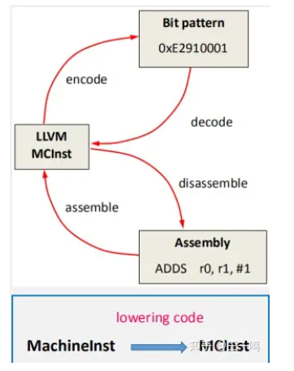

# 教程1

https://blog.csdn.net/LF_AI/article/details/129053608

## 1. 整体介绍

LLVM MC (machine code) 层位于LLVM的底层，主要功能是负责汇编 (assembly)、反汇编 (disassembly)、以及生成二进制文件。作为LLVM的子项目，可以通过llvm-mc、llvm-objudump等工具直接操纵MC层。LLVM MC 的核心是引入了新的'MCInst'类来表示一个带有操作数的指令，这与代码生成器现有的指令概念'MachineInstr'不同。LLVM MC 整体框架如下图所示：



按照输入不同主要分为两条路径： *输入为汇编文件，经过Assembly Parser将汇编文件中的指令解析成Operand，然后通过MCTargetAsmParser将Operand转换成对应的MCInst,最终进入到MCStreamer,通过Instruction Encoder生成二进制文件。* 输入为二进制文件，经过Instruction Decoder，将二进制代码反汇编生成MCInst, 最终进入到MCStreamer按照需要生成汇编文件。

LLVM MC的主要构成部分包括： *Instruction Encoder* Instruction Decoder * Assembly Parser

其中Instruction Encoder主要提供汇编接口，各个后端 (Target) 需要根据自己需求来实现具体的反汇编功能; Assembly Parser负责对汇编文件中的指令进行解析。

下面以LLVM的后端Cpu0为例介绍这三个组件。

## 2. LLVM MC 构成部分介绍

### (1) Assembly Parser

Cpu0后端的Assembly Parser的作用是将汇编文件中的指令解析为LLVM MCInst，其由一个源文件'Cpu0AsmParser.cpp'组成，该文件包含从'MCTargetAsmParser'继承的‘Cpu0AsmParser’类：

```cpp
public:
  Cpu0AsmParser(const MCSubtargetInfo &sti, MCAsmParser &parser,
                const MCInstrInfo &MII, const MCTargetOptions &Options)
    : MCTargetAsmParser(Options, sti, MII), Parser(parser) {
    setAvailableFeatures(ComputeAvailableFeatures(getSTI().getFeatureBits()));
  }

  MCAsmParser &getParser() const { return Parser; }
  MCAsmLexer &getLexer() const { return Parser.getLexer(); }
```

在类声明中出现了以下两行，用于导入TableGen中与汇编的相关指令生成的函数。

```c
#define GET_ASSEMBLER_HEADER
#include "Cpu0GenAsmMatcher.inc"
```

在'Cpu0AsmParser.cpp'中定义了Cpu0Operand类，包含了需要被解析的机器指令的操作数类型和内容信息。

```cpp
class Cpu0Operand : public MCParsedAsmOperand {
  enum KindTy {
    k_Immediate,
    k_Memory,
    k_Register,
    k_Token
  } Kind;
```

### (2) Instruction Encoder

Cpu0后端的Instruction encoder的作用是通过Cpu0MCCodeEmitter类将LLVM MCInst编码为二进制码。其具体实现位于'Cpu0MCCodeEmitter.cpp'中:

```text
void Cpu0MCCodeEmitter::encodeInstruction(const MCInst &MI, raw_ostream &OS,
                                          SmallVectorImpl<MCFixup> &Fixups,
                                          const MCSubtargetInfo &STI) const {
  uint64_t Binary = getBinaryCodeForInstr(MI, Fixups, STI);

  // Check for unimplemented opcodes.
  unsigned Opcode = MI.getOpcode();
  if ((Opcode != Cpu0::NOP) && !Binary)
    llvm_unreachable("unimplemented opcode in encodeInstruction()");

  const MCInstrDesc &Desc = MCII.get(MI.getOpcode());
  uint64_t TSFlags = Desc.TSFlags;

  // Pseudo instruction don't get encoded
  // and shouldn't be here in the first place.
  if ((TSFlags & Cpu0II::FrmMask) == Cpu0II::Pseudo)
    llvm_unreachable("Pseudo opcode found in encodeInstruction()");

  // For now all instruction are 4 bytes or 8 bytes
  int Size = Desc.getSize(); // FIXME: Have Desc.getSize() return the correct value

  EmitInstruction(Binary, Size, OS);
}
```

### (3) Instruction Decoder

Cpu0后端的Instruction Decoder的作用是将一个抽象的字节序列转化成一个'MCInst'和一个'Size'，其由一个源文件'Cpu0Disassembler.cpp'组成，扩展了'MCDisassembler'类，并以'getInstruction'函数为中心。此函数对字节序列进行解码，并将此信息储存在提供的'MCInst'中：

```text
DecodeStatus Cpu0Disassembler::getInstruction(MCInst &Instr, uint64_t &Size,
                                              ArrayRef<uint8_t> Bytes,
                                              uint64_t Address,
                                              raw_ostream &VStream,
                                              raw_ostream &CStream) const {
  DecodeStatus Result;
  const unsigned MaxInstBytesNum = (std::min)((size_t)8, Bytes.size());
  Bytes_ = Bytes.slice(0, MaxInstBytesNum);

  do {
    if (Bytes_.size() >= 8) {
      uint64_t Insn;
      Result = readInstruction64(Bytes_, Address, Size, Insn, IsBigEndian);
      if (Result == MCDisassembler::Fail)
        return Result;

      // Calling the auto-generated decoder function
      Result = decodeInstruction(DecoderTableCpu064, Instr, Insn, Address, this,
                                 STI);
      if (Result != MCDisassembler::Fail) {
        Size = 8;
        break;
      }
    }

    if (Bytes_.size() < 4)
      break;

    Bytes_ = Bytes_.slice(0, 4);
    uint32_t Insn;
    Result = readInstruction32(Bytes_, Address, Size, Insn, IsBigEndian);
    if (Result == MCDisassembler::Fail)
      return Result;
    // Calling the auto-generated decoder function
    Result = decodeInstruction(DecoderTableCpu032, Instr, Insn, Address, this, STI);
    if (Result != MCDisassembler::Fail) {
      Size = 4;
      break;
    }
  } while (false);
  return Result;
}
```

'Cpu0Disassembler.cpp'提供了获取指令操作数类型、编码的寄存器值、以及内存中可以找到该指令的地址的函数。这些函数的名称由TableGen在构建解码表时定义但遵循'DecodeRegClassRegisterClass'的形式：

```text
static DecodeStatus DecodeGPROutRegisterClass(MCInst &Inst,
                                              unsigned RegNo,
                                              uint64_t Address,
                                              const void *Decoder) {
  return DecodeCPURegsRegisterClass(Inst, RegNo, Address, Decoder);
}

static DecodeStatus DecodeSRRegisterClass(MCInst &Inst,
                                          unsigned RegNo,
                                          uint64_t Address,
                                          const void *Decoder) {
  return DecodeCPURegsRegisterClass(Inst, RegNo, Address, Decoder);
}

static DecodeStatus DecodeSimm14(MCInst &Inst,
                                 unsigned Insn,
                                 uint64_t Address,
                                 const void *Decoder) {
  Inst.addOperand(MCOperand::createImm(SignExtend32<14>(Insn)));
  return MCDisassembler::Success;
}

static DecodeStatus DecodeSimm32(MCInst &Inst,
                                 unsigned Insn,
                                 uint64_t Address,
                                 const void *Decoder) {
  Inst.addOperand(MCOperand::createImm(SignExtend32<32>(Insn)));
  return MCDisassembler::Success;
}
```

## 3. 总结

LLVM MC 引入 MCInst 类，使得能够在合适位置添加指令描述 (instruction
description)，而同时获得汇编器 (assembler)、反汇编器 (disassembler) 和编译器后端支持 (compiler backend support)。对于新的LLVM后端如果要实现MC层的功能，需要添加与具体后端相关的AsmParser,以及实现与具体后端相关的反汇编功能。

# 教程2

https://www.cnblogs.com/wujianming-110117/p/17439328.html

## 1. MC 层概述

MC 层被用来表示机器编码级别的代码，相比于更高层的表示形式，它去除了像常量池、跳转表、全局变量等概念。在这一层上，LLVM 处理如 Label 名称、机器指令、目标文件段信息。这一层的代码在一些阶段非常重要，比如代码生成的最后阶段（也就是写入 .s 或 .o 文件时），或者被 llvm-mc 工具用来作为独立汇编器和反汇编器使用。

描述一些很重要的类，在之后的内容，还会描述和这一层交互的其他很重要的子系统。

### 2. MCStreamer API

MCStreamer API 被认为是汇编器中设计最好的 API。它作为一个抽象的接口，被实现为不同的功能（比如输出 .s 文件、输出 ELF 格式的 .o 文件等），但是它的 API 直接对应于在 .s 文件中对应的内容。MCStreamer 类中，对于每一类指示符（directive，和 instruction 有区分）都有一个对应的方法来处理，比如 EmitLabel，EmitSymbolAttribute，SwitchSection，EmitValue 等，这些都是汇编级别的指示符。它还提供一个 EmitInstruction 方法，用来将 MCInst 结构的代码输出到流。

对于 llvm-mc 独立汇编器和代码生成器来说，这个类都非常重要。llvm-mc 工具实际上就是一个汇编解析器加 MCStreamer 的输出；而在代码生成器中，Code Emission 阶段利用 MCStreamer 将高级别的 LLVM IR 和 Machine* 结构构造成低层次的 MC 层结构，同时也是通过 MCStreamer 类发出指令。

从 MCStreamer 的实现角度看，有两大块非常重要的部分：一个是写出 .s 文件（子类 MCAsmStreamer），另一个是写出 .o 文件（子类 MCObjectStreamer）。MCAsmStreamer 通过每一个 Emit* 方法直接输出指令，但对于 MCObjectStreamer，还需要实现一个完整的汇编器的功能。

对于目标相关的指令，MCStreamer 会依赖于一个 MCTargetStreamer 实例。每一个目标都会继承这个类来实现一个子类，每一个方法都会有两种多态的继承实现，也就是一个输出 object 的 streamer 和一个输出 asm 的 streamer。通过后者发射指示符（比如 EmitFnStart 发射 .fnstart），通过前者发射汇编的逻辑代码。

为了让 LLVM 顺利使用这个类，在目标初始化时，必须通过 TargetRegistry::RegisterAsmStreamer 和 TargetRegistry::RegisterMCObjectStreamer 两个回调函数来分配 MCStreamer 的 streamer 基类对象，并将其传递给 createAsmStreamer 等位置来构造目标 streamer 子对象。

### 3. MCContext 类

MCContext 类拥有 MC 层很多唯一性的数据结构，包括 symbols、sections 等。所以，可以与这个类来进行交互，实现创建 symbols 和 sections 的目的。这个类没有子类继承。

### 4. MCSymbol 类

MCSymbol 类用来表示一个汇编文件中 symbol 的结构（也就是 label）。有两种类型，一种是汇编器临时的符号，另一种是普通符号。汇编器临时符号被汇编器用来做一些处理，但会在输出目标文件时被删去。通常这种符号会在 label 开头名字加一个前缀符号，比如在 MachO 平台下，会有一个 L 前缀符号的 label 用来表示临时符号。

MCSymbols 只被 MCContext 使用来创建符号。这意味着可以通过指针运算来检查两个符号是否是同一个。但需要注意，两个指针不相等并不表示两个符号被放在不同的地址（两个符号可能在同一个目标文件地址），比如在汇编文件中有如下结构：

```
foo:
bar:
  .byte 4
```

foo 和 bar 这两个 label 是在同一个目标文件地址的（但他们是不同符号）。

### 5. MCSection 类

MCSection 类用来表示目标文件中的 section段，对于不同的目标文件，这个类会被继承为不同的子类（比如 MCSectionMachO，MCSectionCOFF，MCSectionELF）。同样的，它也只被 MCContext 使用来创建段。MCStreamer 有一个对于当前段的标记，可以通过 SwitchToSection 来改变段标记。

### 6. MCInst 类

MCInst 类是目标无关的指令表示，相比于 MachineInstr，它更为简单，它维护着每一条机器指令的指令码和指令操作数的 vector。MCOperand（指令操作数）有三种不同的类型：一个简单立即数、一个目标寄存器的 ID 或一个符号表示（MCExpr 类型，比如 "Lfoo-Lbar+42"）。

MCInst 现在通常被用来表示 MC 层的机器指令。它被指令编码、指令输出、汇编 parser 的类型生成和反汇编器使用。
