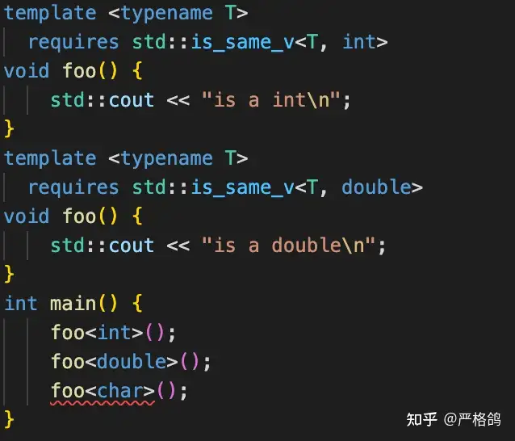
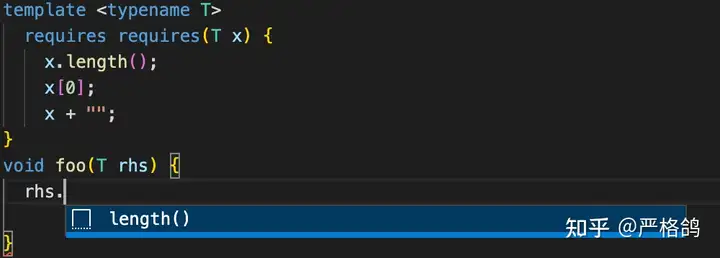

https://www.cnblogs.com/QG-whz/p/4952980.html

# decltype

## decltype简介

我们之前使用的typeid运算符来查询一个变量的类型，这种类型查询在运行时进行。RTTI机制为每一个类型产生一个type_info类型的数据，而typeid查询返回的变量相应type_info数据，通过name成员函数返回类型的名称。同时在C++11中typeid还提供了hash_code这个成员函数，用于返回类型的唯一哈希值。RTTI会导致运行时效率降低，且在泛型编程中，我们更需要的是编译时就要确定类型，RTTI并无法满足这样的要求。编译时类型推导的出现正是为了泛型编程，在非泛型编程中，我们的类型都是确定的，根本不需要再进行推导。

而编译时类型推导，除了我们说过的auto关键字，还有本文的decltype。

decltype与auto关键字一样，用于进行编译时类型推导，不过它与auto还是有一些区别的。decltype的类型推导并不是像auto一样是从变量声明的初始化表达式获得变量的类型，而是总是**以一个普通表达式作为参数**，返回该表达式的类型,而且decltype并不会对表达式进行求值。

## decltype用法

### 推导出表达式类型

```cpp
    int i = 4;
    decltype(i) a; //推导结果为int。a的类型为int。
```

### 与using/typedef合用，用于定义类型。

```cpp
    using size_t = decltype(sizeof(0));//sizeof(a)的返回值为size_t类型
    using ptrdiff_t = decltype((int*)0 - (int*)0);
    using nullptr_t = decltype(nullptr);
    vector<int >vec;
    typedef decltype(vec.begin()) vectype;
    for (vectype i = vec.begin; i != vec.end(); i++)
    {
        //...
    }
```

这样和auto一样，也提高了代码的可读性。

### 重用匿名类型

在C++中，我们有时候会遇上一些匿名类型，如:

```cpp
struct 
{
    int d ;
    doubel b;
}anon_s;
```

而借助decltype，我们可以重新使用这个匿名的结构体：

```cpp
decltype(anon_s) as ;//定义了一个上面匿名的结构体
```

### 泛型编程中结合auto，用于追踪函数的返回值类型

这也是decltype最大的用途了。

```cpp
template <typename _Tx, typename _Ty>
auto multiply(_Tx x, _Ty y)->decltype(_Tx*_Ty)
{
    return x*y;
}
```

## decltype推导四规则

1. 如果e是一个没有带括号的标记符表达式或者类成员访问表达式，那么的decltype（e）就是e所命名的实体的类型。此外，如果e是一个被重载的函数，则会导致编译错误。
2. 否则 ，假设e的类型是T，如果e是一个将亡值，那么decltype（e）为T&&
3. 否则，假设e的类型是T，如果e是一个左值，那么decltype（e）为T&。
4. 否则，假设e的类型是T，则decltype（e）为T。

标记符指的是除去关键字、字面量等编译器需要使用的标记之外的程序员自己定义的标记，而单个标记符对应的表达式即为标记符表达式。例如：

```cpp
int arr[4]
```

则arr为一个标记符表达式，而arr[3]+0不是。

我们来看下面这段代码：

```cpp
    int i=10;
    decltype(i) a; //a推导为int
    decltype((i))b=i;//b推导为int&，必须为其初始化，否则编译错误
```

仅仅为i加上了()，就导致类型推导结果的差异。这是因为，i是一个标记符表达式，根据推导规则1，类型被推导为int。而(i)为一个左值表达式，所以类型被推导为int&。

通过下面这段代码可以对推导四个规则作进一步了解

```cpp
    int i = 4;
    int arr[5] = { 0 };
    int *ptr = arr;
    struct S{ double d; }s ;
    void Overloaded(int);
    void Overloaded(char);//重载的函数
    int && RvalRef();
    const bool Func(int);
 
    //规则一：推导为其类型
    decltype (arr) var1; //int 标记符表达式
 
    decltype (ptr) var2;//int *  标记符表达式
 
    decltype(s.d) var3;//doubel 成员访问表达式
 
    //decltype(Overloaded) var4;//重载函数。编译错误。
 
    //规则二：将亡值。推导为类型的右值引用。
 
    decltype (RvalRef()) var5 = 1;
 
    //规则三：左值，推导为类型的引用。
 
    decltype ((i))var6 = i;     //int&
 
    decltype (true ? i : i) var7 = i; //int&  条件表达式返回左值。
 
    decltype (++i) var8 = i; //int&  ++i返回i的左值。
 
    decltype(arr[5]) var9 = i;//int&. []操作返回左值
 
    decltype(*ptr)var10 = i;//int& *操作返回左值
 
    decltype("hello")var11 = "hello"; //const char(&)[9]  字符串字面常量为左值，且为const左值。

 
    //规则四：以上都不是，则推导为本类型
 
    decltype(1) var12;//const int
 
    decltype(Func(1)) var13=true;//const bool
 
    decltype(i++) var14 = i;//int i++返回右值
```

这里需要提示的是，字符串字面值常量是个左值，且是const左值，而非字符串字面值常量则是个右值。
这么多规则，对于我们写代码的来说难免太难记了，特别是规则三。我们可以利用C++11标准库中添加的模板类is_lvalue_reference来判断表达式是否为左值：

```cpp
    cout << is_lvalue_reference<decltype(++i)>::value << endl;
```

结果1表示为左值，结果为0为非右值。
同样的，也有is_rvalue_reference这样的模板类来判断decltype推断结果是否为右值。

# SFINAE

SFINAE可以说是C++模板进阶的门槛之一，如果选择一个论题来测试对C++模板机制的熟悉程度，那么在我这里，首选就应当是SFINAE机制。

我们不用纠结这个词的发音，它来自于 Substitution failure is not an error 的首字母缩写。这一句之乎者也般难懂的话，由之乎者 —— 啊，不，Substitution，Failure和Error三个词构成。

我们从最简单的词“Error”开始理解。Error就是一般意义上的[编译错误](https://zhida.zhihu.com/search?q=编译错误&zhida_source=entity&is_preview=1)。一旦出现编译错误，大家都知道，编译器就会中止编译，并且停止接下来的[代码生成](https://zhida.zhihu.com/search?q=代码生成&zhida_source=entity&is_preview=1)和链接等后续活动。

其次，我们再说“Failure”。很多时候光看字面意思，很多人会把 Failure 和 Error 等同起来。但是实际上Failure很多场合下只是一个**中性词**。比如我们看下面这个虚构的例子就知道这两者的区别了。

假设我们有一个[语法分析器](https://zhida.zhihu.com/search?q=语法分析器&zhida_source=entity&is_preview=1)，其中某一个规则需要匹配一个token，它可以是[标识符](https://zhida.zhihu.com/search?q=标识符&zhida_source=entity&is_preview=1)，字面量或者是字符串，那么我们会有下面的代码：

```cpp
switch(token)
{
case IDENTIFIER:
    // do something
    break;
case LITERAL_NUMBER:
    // do something
    break;
case LITERAL_STRING:
    // do something
    break;
default:
    throw WrongToken(token);
}
```

假如我们当前的token是LITERAL_STRING的时候，那么第一步，它在匹配IDENTIFIER时，我们可以认为它**failure**了。

但是如果这个Token既不是标识符，也不是数字字面量，也不是字符串字面量的时候，并且，我们的[语法规则](https://zhida.zhihu.com/search?q=语法规则&zhida_source=entity&is_preview=1)认为这一条件是无论如何都不可接受的，这时我们就认为它是一个**error**。

比如大家所熟知的[函数重载](https://zhida.zhihu.com/search?q=函数重载&zhida_source=entity&is_preview=1)，也是如此。比如说下面这个例子：

```cpp
struct A {};
struct B: public A {};
struct C {};

void foo(A const&) {}
void foo(B const&) {}

void callFoo() {
  foo( A() );
  foo( B() );
  foo( C() );
}
```

那么 foo( A() ) 虽然匹配 foo(B const&) 会失败，但是它起码能匹配 foo(A const&)，所以它是正确的； foo( B() ) 能同时匹配两个[函数原型](https://zhida.zhihu.com/search?q=函数原型&zhida_source=entity&is_preview=1)，但是B&要更好一些，因此它选择了B。而foo( C() ); 因为两个函数都匹配失败（**Failure**）了，所以它找不到相应的原型，这时才会爆出一个编译器错误（**Error**）。

所以到这里我们就明白了，**在很多情况下，**Failure is not an error，因为编译器在遇到Failure的时候，往往还需要尝试其他的可能性。

好，现在我们把最后一个词，Substitution，加入到我们的字典中。现在这句话的意思就是说，我们要把 Failure is not an error 的概念，推广到Substitution阶段。

所谓substitution，就是将函数模板中的形参，替换成实参的过程。C++标准中对这一概念的解释比较拗口，它分别指出了以下几点：

- 什么时候函数模板会发生实参 替代（Substitute） 形参的行为
- 什么样的行为被称作 Substitution
- 什么样的行为**不**可以被称作 Substitution Failure —— 他们叫SFINAE error。

我们在此不再详述，有兴趣的同学可以参照 [SFINAE - cppreference.com](https://link.zhihu.com/?target=http%3A//en.cppreference.com/w/cpp/language/sfinae) ，这是标准的一个精炼版本。如果只总结最常见的情况，那就是假设我们有这么个函数签名：

```cpp
template <
  typename T0, 
  // 一大坨其他模板参数
  typename U = /* 和前面T有关的一大坨 */
>
RType /* 和模板参数有关的一大坨 */
functionName (
   PType0 /* PType0 是和模板参数有关的一大坨 */,
   PType1 /* PType1 是和模板参数有关的一大坨 */,
   // ... 其他参数
) {
  // 实现，和模板参数有关的一大坨
}
```

那么，所有函数签名上的“和模板参数有关的一大坨”，基本都是Substitution时要处理的东西（当然也有一些例外）。一个更具体的例子来解释上面的“一大坨”：

```cpp
template <
  typename T, 
  typenname U = typename vector<T>::iterator // 1
>
typename vector<T>::value_type  // 1
  foo( 
      T*, // 1
      T&, // 1
      typename T::internal_type, // 1
      typename add_reference<T>::type, // 1
      int // 这里都不需要 substitution
  )
{
   // 整个实现部分，都没有 substitution。这个很关键。
}
```

嗯，粗糙的介绍完SFINAE之后，我们先来看一个最常见的例子看看它是什么个行为：

```cpp
struct X {
  typedef int type;
};

struct Y {
  typedef int type2;
};

template <typename T> void foo(typename T::type);    // Foo0
template <typename T> void foo(typename T::type2);   // Foo1
template <typename T> void foo(T);                   // Foo2

void callFoo() {
   foo<X>(5);    // Foo0: Succeed, Foo1: Failed,  Foo2: Failed
   foo<Y>(10);   // Foo0: Failed,  Foo1: Succeed, Foo2: Failed
   foo<int>(15); // Foo0: Failed,  Foo1: Failed,  Foo2: Succeed
}
```

在这个例子中，当我们指定 foo<Y> 的时候，substitution就开始工作了，而且会同时工作在三个不同的foo签名上。如果我们仅仅因为Y没有type，就在匹配Foo0时宣布出错，那显然是武断的，因为我们起码能保证，也希望将这个函数匹配到Foo1上。

实际上，std/boost库中的enable_if也是借用了这个原理。

我们来看enable_if的一个应用：假设我们有两个不同类型的counter，一种counter是普通的整数类型，另外一种counter是一个复杂对象，它有一个成员叫做increase。现在，我们想把这两种类型的counter封装一个统一的调用：inc_counter。那么，我们直觉会简单粗暴的写出下面的代码：

```cpp
struct ICounter {
  virtual void increase() = 0;
  virtual ~ICounter() {}
};

struct Counter: public ICounter {
   void increase() override {
      // Implements
   }
};

template <typename T>
void inc_counter(T& counterObj) {
  counterObj.increase();
}

template <typename T>
void inc_counter(T& intTypeCounter){
  ++intTypeCounter;
}

void doSomething() {
  Counter cntObj;
  uint32_t cntUI32;

  // blah blah blah
  inc_counter(cntObj);
  inc_counter(cntUI32);
}
```

我们非常希望它可以如我们所愿的work —— 因为其实我们是知道对于任何一个调用，两个inc_counter只有一个是正常工作的。“**有且唯一**”，我们理应当期望编译器能够挑出那个唯一来。

可惜编译器做不到这一点。首先，它就告诉我们，这两个签名其实是一模一样的，我们遇到了redefinition。

```cpp
template <typename T> void inc_counter(T& counterObj);
template <typename T> void inc_counter(T& intTypeCounter);
```

所以我们要借助于enable_if这个T对于不同的实例做个限定：

```cpp
template <typename T> void inc_counter(
  T& counterObj, 
  typename std::enable_if<
    is_base_of<T, ICounter>::value
  >::type* = nullptr );

template <typename T> void inc_counter(
  T& counterInt,
  typename std::enable_if<
    std::is_integral<T>::value
  >::type* = nullptr );
```

关于这个 enable_if 是怎么工作的，语法为什么这么丑，我来解释一下：

首先，substitution只有在推断函数类型的时候，才会起作用。推断函数类型需要参数的类型，所以，typename std::enable_if<std::is_integral<T>::value>::type 这么一长串代码，就是为了让enable_if参与到函数类型中；

其次，is_integral<T>::value返回一个布尔类型的编译器常数，告诉我们它是或者不是一个integral，enable_if<C>的作用就是，如果这个C值为True，那么type就会被推断成一个void或者是别的什么类型，让整个函数匹配后的类型变成 void inc_counter<int>(int & counterInt, void* dummy = nullptr); 如果这个值为False，那么enable_if<false>这个特化形式中，压根就没有这个::type，于是substitution就失败了 —— 所以这个函数原型根本就不会被产生出来。

所以我们能保证，无论对于int还是counter类型的实例，我们都只有一个函数原型是通过了substitution —— 这样就保证了它的“有且唯一”，编译器也不会因为你某个替换失败而无视成功的那个实例。

这个例子说到了这里，熟悉C++的你，一定会站出来说我们只要把第一个签名改成如下的形式：

```cpp
void inc_counter(ICounter& counterObj);
```

就能完美解决这个问题了，根本不需要这么复杂的编译器机制。

嗯，你说的没错，在这里这个特性一点都没用。

这也提醒我们，当你觉得需要写enable_if的时候，首先要考虑到以下可能性：

- 重载（对模板函数）
- 偏特化（对模板类而言）
- 虚函数

但是问题到了这里并没有结束。因为，increase毕竟是个虚函数。假如counter需要调用的地方实在是太多了，这个时候我们会非常期望 increase 不再是个[虚函数](https://zhida.zhihu.com/search?q=虚函数&zhida_source=entity&is_preview=1)以提高性能。此时我们会调整继承层级：

```text
struct ICounter {};
struct Counter: public ICounter {
  void increase() {
    // impl
  }
};
```

那么原有的void inc_counter(ICounter& counterObj) 就无法再执行下去了。这个时候你可能会考虑一些变通的办法：

```cpp
template <typename T>
void inc_counter(ICounter& c) {};

template <typename T>
void inc_counter(T& c) { ++c; };

void doSomething() {
  Counter cntObj;
  uint32_t cntUI32;

  // blah blah blah
  inc_counter(cntObj); // 1
  inc_counter(static_cast<ICounter&>(cntObj)); // 2
  inc_counter(cntUI32); // 3
}
```

对于1，因为cntObj到ICounter是需要类型转换的，所以比 void inc_counter(T&) [T = Counter]要更差一些。然后它会直接实例化后者，结果实现变成了++cntObj，BOOM！

那么我们做2试试看？嗯，工作的很好。但是等等，我们的初衷是什么来着？不就是让inc_counter对不同的计数器类型透明吗？这不是又[一夜回到解放前](https://zhida.zhihu.com/search?q=一夜回到解放前&zhida_source=entity&is_preview=1)了？

所以这个时候，就能看到 enable_if 是如何通过 SFINAE 发挥威力的了。

那么为什么我们还要ICounter作为基类呢？ 这是个好问题。在本例中，我们用它来区分一个counter是不是继承自ICounter。最终目的，是希望知道counter有没有increase这个函数。

所以ICounter只是相当于一个标签。而于情于理这个标签都是个累赘。但是在C++11之前，我们并没有办法去写类似于：

```cpp
template <typename T> void foo(T& c, decltype(c.increase())* = nullptr);
```

这样的函数签名，因为加入T是int，那么 c.increase() 这个函数调用并不属于Type Failure，它是一个Expression Failure，会导致编译器出错。所以我们才退而求其次，用一个类似于标签的形式来提供足够的信息。

到了C++11，它正式提供了 Expression SFINAE，这时我们就能抛开ICounter这个无用的Tag，直接写出我们要写的东西：

```cpp
struct Counter {
   void increase() {
      // Implements
   }
};

template <typename T>
void inc_counter(T& intTypeCounter, std::decay_t<decltype(++intTypeCounter)>* = nullptr) {
  ++intTypeCounter;
}

template <typename T>
void inc_counter(T& counterObj, std::decay_t<decltype(counterObj.increase())>* = nullptr) {
  counterObj.increase();
}

void doSomething() {
  Counter cntObj;
  uint32_t cntUI32;

  // blah blah blah
  inc_counter(cntObj);
  inc_counter(cntUI32);
}
```

此外，还有一种情况只能使用 SFINAE，而无法使用包括继承、重载在内的任何方法，这就是Universal Reference。比如，

```cpp
// 这里的a是个通用引用，可以准确的处理左右值引用的问题。
template <typename ArgT> void foo(ArgT&& a);
```

加入我们要限定ArgT只能是 float 的衍生类型，那么写成下面这个样子是不对的，它实际上只能接受 float 的[右值引用](https://zhida.zhihu.com/search?q=右值引用&zhida_source=entity&is_preview=1)。

```cpp
void foo(float&& a);
```

此时的[唯一选择](https://zhida.zhihu.com/search?q=唯一选择&zhida_source=entity&is_preview=1)，就是使用通用引用，并增加enable_if限定类型，如下面这样：

```cpp
template <typename ArgT>
void foo(
  ArgT&& a, 
  typename std::enabled_if<
    is_same< std::decay_t<ArgT>, float>::value
  >::type* = nullptr
);
```

从上面这些例子可以看到，SFINAE最主要的作用，是保证编译器在泛型函数、[偏特化](https://zhida.zhihu.com/search?q=偏特化&zhida_source=entity&is_preview=1)、及一般重载函数中遴选函数原型的候选列表时不被打断。除此之外，它还有一个很重要的[元编程](https://zhida.zhihu.com/search?q=元编程&zhida_source=entity&is_preview=1)作用就是实现部分的编译期自省和反射。

虽然它写起来并不直观，但是对于既没有编译器自省、也没有Concept的C++1y来说，已经是最好的选择了。

# is_base_of

std::is_base_of_v 是一个常见的type_traits内容。

例如我们有以下继承关系

```cpp
struct A {};
struct B : A {};
struct C: B{};
struct D{};
```

则有

```cpp
static_assert(std::is_base_of_v<A, B> == true);
static_assert(std::is_base_of_v<A, C> == true);
static_assert(std::is_base_of_v<A, D> == false);
```

考虑一下如何实现？

有一个经典的面试题目，[多态](https://zhida.zhihu.com/search?q=多态&zhida_source=entity&is_preview=1)是如何使用的。也就是父类的指针可以指向子类，那么我们可以利用这个操作来判断，

```cpp
A *a;
B *b;
void *p;
a = b;
p = b;
```

void * 和 A * 都可以指向一个 B * 。

但是二者是有优先级的，B * 会 优先匹配上 A * 。

所以我们可以利用这一点来进行一波判断

```cpp
namespace ygg {
template <typename Base, typename Derived>
struct isBase {
    constexpr static bool foo(void *) {
        return false;
    }
    constexpr static bool foo(Base *) {
        return true;
    }
    constexpr static bool check() {
        Derived *ptr{nullptr};
        return foo(ptr);
    }
};

template <typename T, typename S>
constexpr bool isBasev = isBase<T, S>::check();
} // namespace ygg
```

我们利用了constexpr 的函数来进行一个匹配，但是这是比较高版本的写法了，C++11是如何写的呢？

我是可以利用SFINAE的机制

[严格鸽：现代C++学习——模板SFINAE](https://zhuanlan.zhihu.com/p/604736053)

```cpp
namespace other {
template <class Base, class Derived, class = void>
struct isBase {
        static const bool value = false;
};

template <class Base, class Derived>
struct isBase<Base, Derived, typename std::enable_if<(Base *)(Derived *)nullptr == (Derived *)nullptr, void>::type> {
        static const bool value = true;
};
template <typename T, typename S>
constexpr bool isBasev = isBase<T, S>::value;

} // namespace other
```


感谢热心群友提供的代码（


那同理，我们也可以使用C++20的约束来完成这个功能

[严格鸽：现代C++学习——C++20约束与概念](https://zhuanlan.zhihu.com/p/625661005)

```cpp
namespace cpp20 {
template <typename Base, typename Derived>
concept _isBase = requires(Base *p1, Derived *p2) {
    p1 = p2;
};
template <typename T, typename S>
constexpr bool isBasev = _isBase<T,S>;
} // namespace cpp20
```

非常的简洁，非常易读 （当然实际上直接用_isBase就可以了。。。

完整代码

可以感受一下C++20是有多方便

```cpp
struct A {};
struct B : A {};
struct C: B{};
struct D{};
namespace ygg {
template <typename Base, typename Derived>
struct isBase {
    constexpr static bool foo(void *) {
        return false;
    }
    constexpr static bool foo(Base *) {
        return true;
    }
    constexpr static bool check() {
        Derived *ptr{nullptr};
        return foo(ptr);
    }
};

template <typename T, typename S>
constexpr bool isBasev = isBase<T, S>::check();
} // namespace ygg

namespace other {
template <class Base, class Derived, class = void>
struct isBase {
        static const bool value = false;
};

template <class Base, class Derived>
struct isBase<Base, Derived, typename std::enable_if<(Base *)(Derived *)nullptr == (Derived *)nullptr, void>::type> {
        static const bool value = true;
};
template <typename T, typename S>
constexpr bool isBasev = isBase<T, S>::value;

} // namespace other

namespace cpp20 {
template <typename Base, typename Derived>
concept _isBase = requires(Base *p1, Derived *p2) {
    p1 = p2;
};
template <typename T, typename S>
constexpr bool isBasev = _isBase<T,S>;
} // namespace cpp20

int main() {

    {
        static_assert(std::is_base_of_v<A, B> == true);
        static_assert(std::is_base_of_v<A, C> == true);
        static_assert(std::is_base_of_v<A, D> == false);
    }

    {
        static_assert(ygg::isBasev<A, B> == true);
        static_assert(ygg::isBasev<A, C> == true);
        static_assert(ygg::isBasev<A, D> == false);
    }
    {
        static_assert(other::isBasev<A, B> == true);
        static_assert(other::isBasev<A, C> == true);
        static_assert(other::isBasev<A, D> == false);
    }
    {
        static_assert(cpp20::isBasev<A, B> == true);
        static_assert(cpp20::isBasev<A, C> == true);
        static_assert(cpp20::isBasev<A, D> == false);
    }
}
```


当然这个实现是比较简单的，可以看一下cppref上的实现，然后用c++20来写一发

[std::is_base_of - cppreference.com](https://link.zhihu.com/?target=https%3A//zh.cppreference.com/w/cpp/types/is_base_of)

# C++20 约束

在C++20之前，我们有一个概念叫做SFINAE。[严格鸽：现代C++学习——模板SFINAE](https://zhuanlan.zhihu.com/p/604736053)

我们可以用它来约束一个类型，我们可以叫他“[鸭子类型](https://zhida.zhihu.com/search?q=鸭子类型&zhida_source=entity&is_preview=1)”

> “当看到一只鸟走起来像鸭子、游泳起来像鸭子、叫起来也像鸭子，那么这只鸟就可以被称为鸭子。”

约束一个类型是什么，有什么变量，什么函数。。。

------

首先来看看[约束](https://zhida.zhihu.com/search?q=约束&zhida_source=entity&is_preview=1)

requires ：要求

下面是一个简单的例子

```cpp
template <typename T>
  requires std::is_same_v<T, int>
void foo() {
    std::cout << "is a int\n";
}
template <typename T>
  requires std::is_same_v<T, double>
void foo() {
    std::cout << "is a double\n";
}
int main() {
    foo<int>();
    foo<double>();
}
```

输出

> is a int
> is a double

我们简单的要求了，这个类型T，是一个int或者double（如果你学过SFINAE会发现是类似的操作



requires也可以加上[逻辑运算](https://zhida.zhihu.com/search?q=逻辑运算&zhida_source=entity&is_preview=1)

```cpp
template <typename T>
  requires std::is_same_v<T, int> ||
           (std::is_same_v<std::remove_reference_t<T>, char> &&
            std::is_reference_v<T>)
void foo() {}
template <typename T>
  requires std::is_same_v<T, double> && std::is_const_v<T>
void foo() {}
int main() {
    foo<int>();
    foo<double>(); // error
    foo<char>();   // error
    foo<char &>();
}
```

requires还可以嵌套

例如以下代码

```cpp
template <typename T>
  requires requires(T x) { x.length(); } || std::is_same_v<T, int>
void foo(T rhs) {}
int main() {
    foo(1);
    foo(std::vector<int>{}); // error
    foo(std::string{});
}
```

这里我们要求，这个类型需要有length()函数，或者是一个int

而且我们还可以做一些复杂的操作

```cpp
template <typename T>
  requires requires(T x) { 
    x.length(); 
    x[0];
    x + ""; 
}
void foo(T rhs) {}
int main() {
    foo(std::string{});
    struct X {
      int length();
      void operator [] (int id);
      void operator + (const char *);
    };
    foo(X{});
    foo(std::vector<int>{});//error
}
```

可以发现，阅读起来是很简单的。

而且比较重要的是，做好约束后，ide是会给代码提示的



概念可以看成一种确定了[约束条件](https://zhida.zhihu.com/search?q=约束条件&zhida_source=entity&is_preview=1)的类型

例如我们定义了这样的类型

```cpp
template <typename T>
concept Is = requires(T x) {
               x.size();
               x[0];
             } || std::is_same_v<T, int>;

void foo(Is auto x) {}
int main() {
    foo(1);
    foo(std::vector<int>{});
    foo(std::string{});
    foo(std::set<int>{}); // error
}
```

concept可以看成一个编译期的bool值，所以我们可以这样

```cpp
template <typename T>
concept Is = requires(T x) {
               x.size();
               x[0];
             } || std::is_same_v<T, int>;
template <typename T>
requires Is<T>
void foo(T x) {}
int main() {
    foo(1);
    foo(std::vector<int>{});
    foo(std::string{});
    foo(std::set<int>{}); // error
}
```

当然也可以整一个“类型工厂“ （以下代码无任何的实际意义

```cpp
template <typename T> struct TypeFactory {
    using Type = decltype([]() -> auto{
      if constexpr (requires(T x) { x + 1; }) {
        return std::vector<T>{};
      } else if constexpr (requires(T x) { std::sort(x.begin(), x.end()); }) {
        struct Ret {
          T a;
          T b;
        };
        return Ret{T{}, T{}};
      } else {
        return std::map<T, T>{};
      }
    }());
};

int main() {
    TypeFactory<int>::Type ix;
    ix.push_back(1);
    TypeFactory<char>::Type cx;
    cx.push_back('a');
    TypeFactory<std::vector<double>>::Type tx; // tx.a;tx.b;
    TypeFactory<std::mutex>::Type ax;
}
```

不是很难对吧

那么我们看一下过去讲过的东西

[严格鸽：现代C++学习——遍历对象的所有数据成员](https://zhuanlan.zhihu.com/p/624392568)

过去，我们采用的是打表+**SFINAE**的方式，但是现在可以换一种了

```cpp
struct Any {
    template<typename T>
    operator T();
};
template<typename T>
constexpr size_t size(auto&&...Args) {
    if constexpr (!requires{T{ Args... }; }) {
        return sizeof...(Args) - 1;
    }
    else {
        return size<T>(Args..., Any{});
    }
}
int main() {
  struct X{
    int a;
    char b;
    std::map<int,void*>mp;
  };
  std::cout<<size<X>()<<"\n";
}
```