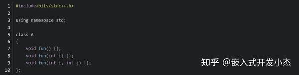
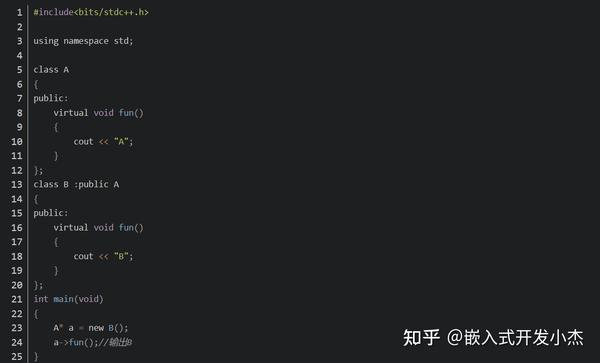

https://zhuanlan.zhihu.com/p/623029910

# 一篇文章带你搞懂C++的重载、覆盖和重写！

**首先我们先了解一下它们之间的区别**

**Overload（重载）：**重载是指不同的函数使用相同的函数名，但是函数的参数个数或类型（参数列表不同）。调用的时候根据函数的参数来区别不同的函数。有以下特征：

（1）相同的范围（在同一个类中）；

（2）函数名字相同；

（3）参数不同；

（4）virtual关键字可有可无；

**Override（覆盖）：**是指派生类函数覆盖基类函数，有以下特征：

（1）不同的范围（分别位于派生类与基类）；

（2）函数名字相同；

（3）参数相同；

（4）基类函数必须有virtual关键字

**Overwrite（重写）：**是值在派生类中重新对基类中的虚函数重新实现。即函数名和参数都一样，只是函数的实现体不一样，规则如下：

（1）如果派生类的函数与基类的函数同名，但是参数不同。此时，不论有无virtual关键字，基类的函数将被隐藏（注意别与重载混淆）

（2）如果派生类的函数与基类的函数同名，并且参数也相同，但是基类函数没有virtual关键字。此时，基类的函数被隐藏（注意别与覆盖混淆）

**总结1：重载和重写主要有以下的区别**

（1）范围区别：重写和被重写的函数在不同的类中，重载和被重载的函数在同一类中。

（2）参数区别：重写与被重写的函数参数列表一定相同，重载和被重载的函数参数列表一定不同。

（3）virtual的区别：重写的基类函数必须要有virtual修饰，重载函数和被重载函数可以被virtual修饰，也可以没有。

**总结2：隐藏和重写、重载有以下的区别**

（1）与重载的范围不同：和重写一样，隐藏函数和被隐藏函数不在同一个类中

（2）参数的区别：隐藏函数和被隐藏的函数参数列表可以相同，也可不同，但是函数名肯定要相同。当参数不相同时，无论基类中的参数是否被virtual修饰，基类的函数都是被异常，而不是被重写。