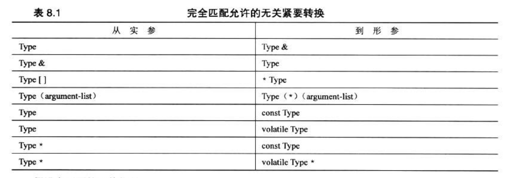

# 显式具体化(explicit specialization)

假设定义了如下结构:

```cpp
struct Test {
	int x;
	int y;
};
```

如果我们希望交换两个`Test`对象, 可以这么写:

```cpp
template <typename T>
void swap(T& a, T& b) {
    T temp = a;
    a = b;
    b = temp;
}

int main() {
    Test a;
    Test b;
    swap(a, b);
}
```

现在的问题是, 如果我们只想交换`Test::x`, `swap`函数又该怎么写呢? 

cpp为这种场景设计了显式具体化特性, 规则如下:

* 对于给定的函数名, 可以有非模板函数, 模板函数和显式实例化函数以及它们的重载版本.
* 显式实例化函数的原型和定义应以template<>开头, 并通过名称来指出具体类型.
* 显式实例化优先于隐式实例化, 非模板函数优先于模板函数的实例化.

因此上述功能可以这样实现:

```cpp
template <typename T>
void swap(T& a, T& b) {
    T temp = a;
    a = b;
    b = temp;
}


template <> void swap(Test& a, Test& b) {
	int temp = a.x;
	a.x = b.x;
	b.x = temp;
}

int main() {
    Test a;
    Test b;
    swap(a, b);
}
```

显式具体化可以把声明和定义分到两个文件中, 正常链接即可.

# 显式实例化(explicit instantiation), 隐式实例化(implicit instantiation)与显式具体化(explicit specialization)

**这三种方式统称为具体化(specialization).**

实例化就是使用模板时编译器根据使用类型自动实例化函数, 编译器一开始也只支持隐式实例化.

我们知道如果使用隐式实例化, 必须同时提供模板函数的声明和定义, 不然链接时会出现符号找不到的问题. 为了方便将模板函数的定义和使用拆分, 编译器设计了显式实例化特性. 例如:

```cpp
template void swap<int>(int&, int&);
```

编译器在遇到这句话时会立即实例化出一个`int`类型的`swap`函数.

> 注意, 显式实例化不允许有函数定义.

这样以来我们就可以将模板函数的定义和使用分开组织:

```cpp
// main.cpp
#include <iostream>
#include "test.h"

int main() {
    int a = 1;
    int b = 2;
    swap(a, b);
    std::cout << a << " " << b << std::endl;
}

// test.h
template <typename T>
void swap(T& a, T& b);

// test.cpp
#include "test.h"

template <typename T>
void swap(T& a, T& b) {
    T temp = a;
    a = b;
    b = temp;
}

template void swap<int>(int &a, int &b);
```

不过也要在`test.cpp`中提前把所有可能用到的类型实例化, 也挺不优雅的.

另外, 模板函数调用时指定类型也叫显式实例化, 比如`swap<char>(x, y);`, 也没什么大用就是了.

显式具体化上面已经介绍过, 注意显式实例化和显式具体化不能同时使用.

最后来看个例子:

```cpp
#include <iostream>

// template prototype
template <typename T> void swap(T& a, T& b) {
    T temp = a;
    a = b;
    b = temp;
}

// explicit specialization for double
template <> void swap<double>(double& a, double& b) {
    a = 1.0;
    b = 1.0;
}

// explict instantiation for char
template void swap<char>(char&, char&);

int main() {
    int a = 1, b = 2;
    swap(a, b); // implicit instantiation for short
    std::cout << a << " " << b << std::endl;

    double c = 3.0, d = 4.0;
    swap(c, d); // use explicit specialization for double
    std::cout << c << " " << d << std::endl;

    char e = '5', f = '6';
    swap(e, f); // use explict instantiation for char
    std::cout << e << " " << f << std::endl;

    return 0;
}
```

# 编译器的函数选择

对于函数重载, 函数模板和函数模板重载, cpp需要有一个定义良好的策略, 来决定为函数调用使用哪一个函数定义, 尤其是有多个参数时. 这个过程成为重载解析 (overloading resolution).

大致如下:

* 创建候选函数列表. 其中包含与被调用函数的名称相同的函数和模板函数.
* 使用候选函数创建列表创建可行函数列表. 这些都是参数数目正确的函数, 为此有一个隐式转换序列, 其中包括实参类型与相应的形参类型完全匹配的情况. 例如, 使用float参数的函数调用可以将该参数转换为double, 从而与double形参匹配, 而模板可以为float生成一个实例.
* 确定是否有最佳的可行函数, 如果有则使用它, 否则报错.

考虑只有一个函数参数的情况, 如:

```cpp
may('B')
```

首先寻找所有名字为may的函数和函数模板, 然后寻找那些可以用一个参数调用的函数, 例如:

```cpp
void may(int); // 1
float may(float, float = 3); // 2
void may(char); // 3
char * may(const char*); // 4
char may(const char &); // 5
template<class T> void may(const T&); // 6
template<class T> void may(T *); // 7
```

注意, 只考虑特征, 不考虑返回类型,  4和7是不可行的, 因为整数类型不能被隐式地转换成指针类型. 对于6,  T会被临时替换成char类型. 这样剩下5个可行的函数.

接下来, 编译器必须确定哪个可行函数是最佳的. 编译器会检查函数参数与候选函数参数的匹配情况, 按以下优先级进行选择:

1. 完全匹配, 但常规函数优先于模板.
2. 提升转换. (例如, char转int, float转double)
3. 标准转换. (例如,  int转char, long转double)
4. 用户定义的转换. (如在类声明中定义的转换)

例如, 1优先于2, 因为char到int的转是提升转换, 而char到float的转换是标准转换.

3,5,和6都优于1和2, 因为它们都是完全匹配. 这里引出一个问题, 如果有多个函数都完全匹配, 应该如何选择? 

进行完全匹配时, cpp允许某些"无关紧要的转换", 如下:



例如, 实参int与形参int&完全匹配的.

如果有多个完全匹配的原型, 编译器会报错. 不过也有一些例外情况:

* 指向非const数据的指针和引用优先与非const指针和引用参数匹配.

* 一个是模板函数, 另一个不是, 则优先选择非模板函数.

  > 我们也可以对编译器做一些适当的引导实现"自定义选择", 比如调用时加个尖号什么的.

* 如果两个都是木板函数, 则较为具体的优先. 例如, 显式具体化会优先于隐式实例化.

  > 注意, 这里的"较为具体"并不一定能意味着显式具体化, 而是指编译器推断使用哪种类型时执行的转换最少. 用于找出最具体的模板的规则被成为函数木板的部分排序规则(partial ordering rules). 相关规则可以参考C++ Primer Plus 6th P291

多个参数的函数匹配起来更加复杂, 不过原理和上面也差不多.

# decltype

考虑这个例子:

```cpp
template<class T1, class T2>
void ft(T1 x, T2 y) {
    T1 z = x + y;
}

int main() {
    ft(1, 2.1);
}
```

`T1 z = x + y`合理吗? 假设x为int, y为double, 那么z将会是一个int, 而一般情况下我们想要的是一个double.

那写`T2 z = x + y`呢? 问题还是存在, 无非是把x和y调换一下.

我们需要编译器自动推断`x+y`的类型, 于是C++11提供了`decltype`关键字(这里其实`auto`也行).

```cpp
#include <iostream>

template<class T1, class T2>
void ft(T1 x, T2 y) {
    decltype(x+y) z;
    z = x + y;
    std::cout << z << std::endl;
}

int main() {
    ft(1, 2.1);
}
```

如果需要把`z`返回怎么办? `decltype`就解决不了了. 可以使用`auto`+后置返回类型来实现:

```cpp
#include <iostream>

template<class T1, class T2>
auto ft(T1 x, T2 y) -> decltype(x + y) {
    return x + y;
}

int main() {
    std::cout << ft(1, 2.1) << std::endl;
}
```

顺便说一句, 对于这种简单的情况, 甚至直接用`auto`编译器就能自动推断出来.

# 模板类

模板类中的函数全部认为是模板函数, 可以省略template, 不过如果拿到类外定义的话必须加template.

## 非类型参数

```cpp
#include <iostream>

template <int n>
int test() {
    return n;
}

int main() {
    std::cout << test<2>() << std::endl;
}
```

表达式参数可以是整型,枚举,引用或指针. 例如, double是不合法的, 但double*是合法的.

再看个实用的例子:

```cpp
template<class T, int n>
class Array {
    T a[n];
};
```

用这种方法创建数组是开辟在栈中的, 效率更高, 很适合小数组的情况.

## specialization

与函数模板相同,类模板也有隐式实例化, 显式实例化和显式具体化, 统称为具体化.

>  注意, 模板类中的函数的具体化也是按需的(创建对象时只会实例化声明, 只有调用时才会实例化定义).

(1) 隐式实例化

```cpp
Array<int, 100> arr; // implicit instantiation

Array<int, 100> *arr2; // a pointer, no object needed yet
arr2 = new Array<int, 100>; // now an object is needed
```

注意编译器在需要对象之前, 不会生成类的隐式实例化.

(2) 显式实例化

```cpp
template class Array<int, 100>;
```

(3) 显式具体化

```cpp
#include <iostream>

template<class T, int n>
class Array {
public:
    T a[n];
};

template <> class Array<int, 100> {
public:
    int a[10];
};

int main() {
    Array<int, 100> arr;
    std::cout << sizeof(arr.a) / sizeof(int) << std::endl; // 10

    Array<int, 101> arr2;
    std::cout << sizeof(arr2.a) / sizeof(int) << std::endl; // 101
    return 0;
}
```

(4) 部分具体化

cpp允许部分具体化, 即部分限制模板的通用性, 例如:

```cpp
#include <iostream>

template<class T1, class T2>
class Test {
public:
    int test() {
        return 1;
    }
};


template <class T1>
class Test<T1, int> {
public:
    int test() {
        return 2;
    }
};

int main() {
    Test<int, double> t1;
    std::cout << t1.test() << std::endl; // 1
    Test<int, int> t2;
    std::cout << t2.test() << std::endl; // 2
    return 0;
}
```

注: 这个特性函数模板无法使用

## 成员模板

模板可以用作结构, 类或模板类的成员, 下述例子将另一个模板类和模板函数作为该模板类的成员:

```cpp
#include <iostream>

template <typename T>
class Outer {
private:
    template <typename V>
    class Inner {
    private:
        V val;
    public:
        Inner(V v = 0) : val(v) {}
        V getV() { return val; }
    };
    Inner<T> inner1;
    Inner<int> inner2;
public:
    Outer(T t, int i) : inner1(t), inner2(i) {}
    template <typename U>
    U test(U u, T t) {
        return (inner2.getV() + inner1.getV()) * u / t;
    }
};

int main() {
    Outer<double> outer(3.5, 3);
    std::cout << outer.test(10, 2.3) << std::endl; // 28
    std::cout << outer.test(10.0, 2.3) << std::endl; // 28.2609
    return 0;
}
```

## 将模板用作参数

上述介绍中, 模板可以包含类型参数(typename T)和非类型参数(int n). 此外, 模板还可以包含本身就是模板的参数. 考虑这个例子:

```cpp
template<class T>
class Array {
public:
    T a[100];
};

template<class T>
class Array2 {
public:
    T arr1;
    T arr2;
};

int main() {
    Array2<Array<int> > arr;
}
```

假设想要让Array2中存储一个int类型的Array, 以及一个double类型的Array, 应该这么写:

```cpp
template<class T>
class Array {
public:
    T a[100];
};

template<template<typename T> typename TT>
class Array2 {
public:
    TT<int> arr1;
    TT<double> arr2;
};

int main() {
    Array2<Array > arr;
}
```

## 模板别名

考虑如下问题:

```cpp
#include <array>

int main() {
    typedef std::array<double, 12> arrd;
    typedef std::array<int, 12> arri;

    arrd arr1;
    arri arr2;
}
```

我们经常会给类型指定别名, 以方便使用, 但类型中包含模板时用typedef写起来就比较冗余.

为此c++11提供了模板别名这个特性:

```cpp
#include <array>

template<typename T>
using arrtype = std::array<T, 12>;

int main() {
    arrtype<double> arr1;
    arrtype<int> arr2;
}
```

