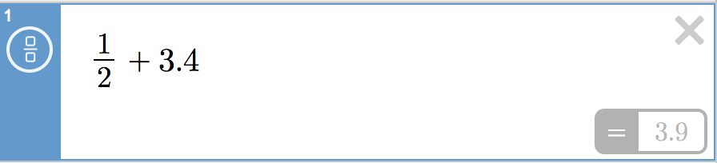

## 算符优先分析法(自底向上)

https://aandds.com/blog/operator-precedence-parser.html

算符优先分析法([Operator-precedence parser](https://en.wikipedia.org/wiki/Operator-precedence_parser))是一种简单直观的自底向上的分析法。算符优先分析法的思路是定义算符之间（确切地说是终结符之间）的某种优先关系，利用这种优先关系寻找“可归约串”进行归约。相对 LR 分析方法，算符优先分析法更易于手工构造移动归约分析器。

由于算符优先分析技术比较简单，很多编译器的语法分析器 **经常采用算符优先分析技术对表达式进行分析** ，对于语句和高级结构的分析则采用递归下降分析法。也有编译的语法分析器甚至对整个语言都采用算符优先技术进行语法分析。

算符优先分析法仅能处理 **“没有相邻的非终结符出现在产生式的右部”的文法（称为算符文法）。**

下面的表达式文法（注：这个文法本身没有体现加减乘除运算的优先级和结合性，它是一个二义性文法） ：

```
E -> EAE | (E) | i
A -> + | - | * | /
```

它不是算符文法。因为第一个产生式中右部 EAE 有 2 个（实际上是 3 个）连续的非终结符。不过，我们可以用 A 的每个候选式替换第一个产生式中的 A，从而得到下面的算符文法（产生式右边不再有相邻的非终结符了）：

```
E -> E + E | E - E | E * E | E / E | (E) | i
```

在算符优先分析中，我们在终结符之间定义如下三种优先关系：

| 关系   | 含义             |
| :----- | :--------------- |
| a <· b | a 的优先级低于 b |
| a =· b | a 的优先级等于 b |
| a ·> b | a 的优先级高于 b |

我们使用这些优先级关系来指导句柄的选取。

下面介绍算符优先法的应用实例

设算符文法为：

```
E -> E + T | T
T -> T * F | F
F -> id
```

下面是对“id+id*id”的语法分析过程。

用 “$” 表示输入字符串的两端（开始和结尾）。这个文法的算符优先关系为：

|      | id   | +    | *    | $      |
| :--- | :--- | :--- | :--- | :----- |
| id   |      | ·>   | ·>   | ·>     |
| +    | <·   | ·>   | <·   | ·>     |
| *    | <·   | ·>   | ·>   | ·>     |
| $    | <·   | <·   | <·   | Accept |

把输入字符串“id+id*id”插入优先关系后，可得到符号串：

```
$ <· id ·> + <· id ·> * <· id ·> $
```

应用下面的过程可以发现句柄：
(1) 从左端开始扫描串，直到遇到第一个“·>”为止。在上面例子中，第一个“·>”出现在第一个 id 和+之间。
(2) 找到“·>”后，向左扫描，跳过所有的“=·”，直到遇到一个“<·”为止。
(3) 句柄包括从第(2)步遇到的“<·”的右部到第一个“·>”的左部之间的所有符号（还要包括介于其间或者两边的非终结符）。
利用上面过程得到的第一个句柄是“id+id*id”中的第一个 id，由于 id 可以归约为 E，从而，我们得到右句型“E + id * id”。按照同样的步骤将剩余的两个 id 归约为 E 之后，可以得到右句型“E + E * E”。现在考虑忽略非终结符后的符号串“$ + * $”。插入优先关系后，可得到：

```
$ <· + <· * ·> $
```

继续按照前面介绍的过程分析，可得，句柄左端位于+和*之间，右端位于*和$之间。即右句型“E + E * E”中，句柄是“E*E”（注意*两边的非终结符 E 也在句柄中）。

如果用栈实现，上面对应的“移进——归约”过程如下：

```
Handle     Stack              Input String    Reason
           (top to the right)
           $                  id+id*id$       Initialized
           $id                +id*id$         $ <· id
id         $E                 +id*id$         id >· +
           $E+                id*id$          $ <· +
           $E+id              *id$            + <· id
id         $E+E               *id$            id >· *
           $E+E*              id$             + <· id
           $E+E*id            $               * <· id
id         $E+E*E             $               id >· $
E * E      $E+E               $               * >· $
E + E      $E                 $               + >· $
RETURN                                        $ =· $
```

算符优先分析算法总结如下（w表示输入字符串）：

```
Initialize: Set  ip  to point to the first symbol of  w$
Repeat:  Let  X  be the top stack symbol, and  a  the symbol pointed to by ip
         if  $ is on the top of the stack and ip points to $  then return
         else
            Let a be the top terminal on the stack, and b the symbol pointed to by ip
            if  a <· b  or  a =· b  then
                push  b  onto the stack
                advance  ip  to the next input symbol
            else if  a ·> b then
                repeat
                    pop the stack
                until the top stack terminal is related by <·
                      to the terminal most recently popped
            else error()
        end
```

算法的主要思想： **比较“栈顶的终结符”（对应上面描述中的 a）和“输入字符串的下一个符号”（对应上面描述中的 b）的优先级，如果“栈顶的终结符”的优先级低，则“移进”输入字符串的下一个符号；如果“栈顶的终结符”的优先级高，则去栈中寻找句柄进行归约。**

## 算符优先分析法 (自顶向下)

https://engineering.desmos.com/articles/pratt-parser/

### What is Parsing?

When you read an expression, like `1/2+3.4`, you can immediately understand some of its meaning. You recognize that there are three numbers, and that the numbers are combined with operators. You may also recall that division has higher precedence than addition, so you would divide `1/2` before adding `+3.4` when evaluating the expression.


Compare this to how you perceive `2H3SGKHJD`. At first glance it appears to be a nonsense sequence of characters. If I told you that letters should be grouped in pairs with `G` being a separator, your mental model might look closer to `2H 3S ; KH JD`, which takes us a step towards understanding that this string represents hands in a card game.

Parsing is the process of taking a string of characters and converting them into an Abstract Syntax Tree (or, AST). This is a representation of the structure of the expression, for example:

```
OperatorNode(
    operator: "+",
    left: OperatorNode(
        operator: "/",
        left: 1,
        right: 2
    ),
    right: 3.4
)
```

or, as a diagram,

```
         "+"
       /     \
    "/"        3.4
  /     \
1         2
```

Such a tree is a first step towards computing the value of the expression, or rendering it beautifully.



So, how does one create an AST? At Desmos we use the approach described by [Vaughan Pratt](https://web.archive.org/web/20151223215421/http://hall.org.ua/halls/wizzard/pdf/Vaughan.Pratt.TDOP.pdf). This article will begin with what is hopefully a clear and concise explanation of how Pratt Parsing works. We will then explain our motivations for adopting this technique at Desmos and compare it to the jison parser generator, our previous approach.

Finally, we provide a [sample implementation of the parser (and a lexer) in Typescript](https://github.com/desmosinc/pratt-parser-blog-code), integrated with [CodeMirror](https://codemirror.net/). We hope this will be a useful reference and starting point for anyone interested in doing parsing in the browser.

### How does it work?

Our parse function will operate over a `tokens` object. This is a sequence of tokens, like `[1, "/", 2, "+", 3.4]` that is generated from our input through a process called lexing. We will not go into the details of lexing here, other than to point you at [our sample implementation](https://github.com/desmosinc/pratt-parser-blog-code/blob/master/src/lexer.ts).

The `tokens` object is a token stream, which allows us to `consume` a token, returning the next token and advancing the stream. We can also peek a token, which gives us the next token without advancing the stream.

```
[1, "/", 2, "+", 3.4].consume() -> 1, ["/", 2, "+", 3.4]
[1, "/", 2, "+", 3.4].peek() -> 1, [1, "/", 2, "+", 3.4]

[].consume() -> empty token, []
[].peek() -> empty token, []
```

Let’s start with a recursive call and fill things out as we go along. We will present our approach in pseudocode, but you are welcome to reference the Typescript implementation as we go along.

```
function parse(tokens):
    firstToken = tokens.consume()

    if firstToken is a number
        leftNode = NumberNode(firstToken)
    otherwise
        Error("Expected a number")

    nextToken = tokens.consume()

    if nextToken is an operator token
        rightNode = parse(tokens)

        return OperatorNode(
            operator: nextToken,
            leftNode,
            rightNode
        )

    otherwise
        return leftNode
```

We expect a number token followed by an optional operator. We then perform a recursive call to find the sub-expression to the right. So far so good – we start getting an idea of how parsing an expression like `3 * 2 + 1` might work:

```
parse [3, "*", 2, "+", 1]
1 consume 3 as a NumberNode into leftNode
1 consume "*" to be nextToken
1 rightNode = parse [2, "+", 1]
    2 consume 2 as a NumberNode into leftNode
    2 consume "+" to be nextToken
    2 rightNode = parse [1]
        3 consume 1    as a NumberNode into leftNode
        3 no next token
        3 return:
            1
    2 combine 2, "+" and 1 into an OperatorNode
    2 return:
            "+"
          /     \
        2         1

1 combine 3, "*" and rightNode into an OperatorNode
1 return:
    "*"
  /     \
3        "+"
       /     \
     2         1
```

### Precedence

If we were to evaluate this expression, we would add `2 + 1` first, and then multiply the result of that sub-tree by `3`, to get `9`. This is not desirable, since conventionally multiplication has higher precedence than addition, and we would like the tree to look like this instead:

```
         "+"
       /     \
    "*"        1
  /     \
3         2
```

Pratt represents this idea with the term *binding power*. Multiplication has a higher binding power than addition, and so the `3 * 2` in the expression above takes precedence. When we perform the recursive call to parse `2 + 1`, we are looking for the node that represents the right side of our product. So, when we see “+”, we want to stop since it binds less strongly than “*”. Let’s add this to our code, noting that this is still incomplete and we will improve things as we go along:

```
function parse(tokens, lastOperator):
    firstToken = tokens.consume()

    if firstToken is a number
        leftNode = NumberNode(firstToken)
    otherwise
        Error("Expected a number")

    nextToken = tokens.peek()

    if nextToken is an operator and greaterBindingPower(nextToken, lastOperator)
        tokens.consume()
        rightNode = parse(tokens, nextToken)
        return OperatorNode(
            operator: nextToken,
            leftNode,
            rightNode
        )

    otherwise
        return leftNode
```

Let’s consider how this changes the execution of parsing `3 * 2 + 1`:

```
parse [3, "*", 2, "+", 1], empty token
1 consume 3 as a NumberNode into leftNode
1 peek "*" to be nextToken
1 greaterBindingPower("*", empty token) is true by default, so continue
1 consume "*"
1 parse [2, "+", 1], "*"
    2 consume 2 as a NumberNode into leftNode
    2 peek "+" to be nextToken
    2 greaterBindingPower("+", "*") is false
    2 return:
        2
1 combine 3, "*" and 2 into an OperatorNode
1 return:
    "*"
  /     \
3         2
```

### Accumulating on the left

As desired, our recursive call stopped before `+` when parsing the sub-expression `2 + 1`. This allowed us to correctly combine `3 * 2` into a product node in the outer call. However, the computation halted prematurely, and we left `+ 1` unprocessed. Let’s remedy this now:

```
function parse(tokens, lastOperator):
    firstToken = tokens.consume()

    if firstToken is a number
        leftNode = NumberNode(firstToken)
    otherwise
        Error("Expected a number")

    repeat
        nextToken = tokens.peek()

        if nextToken is an operator and greaterBindingPower(nextToken, lastOperator)
            tokens.consume()
            rightNode = parse(tokens, nextToken)
            leftNode = OperatorNode(
                operator: nextToken,
                leftNode,
                rightNode
            )
        otherwise
            return leftNode
```

This yields the following computation:

```
parse [3, "*", 2, "+", 1], empty token
1 consume 3 as a NumberNode into leftNode
1 peek "*" to be nextToken
1 greaterBindingPower(*, empty token) is true by default, so continue
1 consume "*"
1 rightNode = parse [2, "+", 1], "*"
    ... returns 2, as above
1 combine 3, "*" and 2 into an OperatorNode, and store it in leftNode

leftNode:
    "*"
  /     \
3         2

1 repeat
1 peek "+" to be nextToken
1 greaterBindingPower(+, empty token) is true by default
1 consume +
1 parse [1], '+'
    ... returns 1
1 combine leftNode, "+" and 1 into an OperatorNode, and store it in leftNode

leftNode:
         "+"
       /     \
    "*"        1
  /     \
3         2

1 repeat
1 nextToken is empty, so return leftNode
```

We now correctly group the `3 * 2` sub-expression as an OperatorNode within our AST!

### Synthesis

We can now see how the binding power guides us to make the right groupings while building our tree. As long as the operators we encounter have higher binding power, we continue to make recursive calls, which builds up our expression on the right hand side of the tree. When we encounter an operator with a lower binding power, we propagate the result up the call chain until we reach the level where the binding power is sufficient to continue grouping. There, we transfer our accumulated term into `leftNode`, and resume building up the right hand side of the expression.

In other words, while the binding power is higher than our context, we associate to the right using the recursive call. When it is lower, we associate to the left using the repeat loop. This is really the crux of understanding how Pratt parsers work, so it’s worth taking a minute to walk yourself through the execution of something like `3 + 4 * 2 ^ 2 * 3 - 1` to get a feel for it.

```shell
parse([3 + 4 * 2 ^ 2 * 3 - 1], empty)
1 consume 3 -> leftNode
1 repeat 0:
1 peek + -> nextToken
1 greaterBindingPower(+, empty) true
1 consume +
1 rightNode = parse([4 * 2 ^ 2 * 3 - 1], +)
  2 consume 4 -> leftNode
  2 repeat 0:
  2 peek * -> nextToken
  2 greaterBindingPower(*, +) true
  2 consume *
  2 rightNode = parse([2 ^ 2 * 3 - 1], *)
    3 consume 2 -> leftNode
    3 repeat 0:
    3 peek ^ -> nextToken
    3 greaterBindingPower(^, *) true
    3 consume ^
    3 rightNode = parse([2 * 3 - 1], ^)
      4 consume 2 -> leftNode
      4 repeat 0:
      4 peek * -> nextToken
      4 greaterBindingPower(*, ^) false
      4 return 2
    3 combine to leftNode:
    |    "^" 
    |  /     \
    |2         2
    3 repeat 1:
    3 peek * -> nextToken
    3 greaterBindingPower(*, *) true
    3 consume *
    3 rightNode = parse([3 - 1], *)
      4 consume 3 -> leftNode
      4 repeat 0:
      4 peek - -> nextToken
      4 greaterBindingPower(-, *) false
      4 return 3
    3 combine to leftNode:
    |          "*"
    |        /     \
    |    "^"         3
    |  /     \
    |2         2
    3 repeat 2:
    3 peek - -> nextToken
    3 greaterBindingPower(-, *) false
    3 return (2^2)*3
  2 combine to leftNode:
  |    "*"
  |  /     \
  |4         "*"
  |        /     \
  |    "^"         3
  |  /     \
  |2         2
  2 repeat 1:
  2 peek - -> nextToken
  2 greaterBindingPower(-, +) true
  2 consume -
  2 rightNode = parse([1], -)
    3 ... return 1
  2 combine to leftNode:
  |          "-"
  |        /     \
  |    "*"         1
  |  /     \
  |4         "*"
  |        /     \
  |    "^"         3
  |  /     \
  |2         2
  2 repeat 2:
  2 ... return (4*((2^2)*3))-1
1 combine to leftNode:
|    "+"
|  /     \
|3         "-"
|        /     \
|    "*"         1
|  /     \
|4         "*"
|        /     \
|    "^"         3
|  /     \
|2         2
1 repeat 1:
1 ... return 3+((4*((2^2)*3))-1)
```

注意上述解析过程没有考虑结合性，不过我们可以通过设置bindingpower的比较规则来控制结合性：

### Associativity and binding power

One thing that we haven’t explicitly mentioned yet is operator associativity. Some operators, like addition and subtraction are left-associative, meaning that when we apply them repeatedly, `3 - 2 - 1`, we associate to the left `(3 - 2) - 1`. Others, like exponentiation associate to the right, so `2 ^ 3 ^ 4` is the same as `2 ^ (3 ^ 4)`.

Hopefully the exposition so far makes it clear how we can implement this using our `greaterBindingPower` function. We want left-associative operators to stop recursion when they encounter the same operator. So, `greaterBindingPower(-, -)` should be false. On the other hand, we want to continue recursing when the operator is right-associative, so `greaterBindingPower(^, ^)` should be true.

In practice, this behavior is implemented by assigning to each operator class a binding power number. So for instance,

```
+, -: 10
*, /: 20
^: 30
```

We pass this number into the parse function, and lookup the binding power of the next token to make our decisions. Right-associative operators are implemented by subtracting `1` from their binding power when making the recursive call.

```
parse(tokens, currentBindingPower):
    ...
    repeat
        ...
        nextToken = tokens.peek()
        if bindingPower[nextToken] <= currentBindingPower
            stop repeating

        nextBindingPower = if nextToken is left-associative then bindingPower otherwise bindingPower - 1
        rightNode = parse(tokens, nextBindingPower)
    ...
```

### Extending the grammar

So far, we can parse numbers and binary operators of the form `<expression> <operator> <expression>`, but we may have to deal with other forms, like `( <expression> )`, `log <expression>`, or even `if <expression> then <expression> otherwise <expression>`.

We have at our disposal the parse call which can give us a sub-expression that binds stronger than a given context. With this, we can parse these different forms in an elegant, readable way. For example, to parse an expression contained in a pair of braces,

```
...
currentToken = tokens.consume()
if currentToken is "("
    expression = parse(tokens, 0) // Note, reset the binding power to 0 so we parse a whole subexpression
    next = tokens.consume()
    if next is not ")"
        Error("Expected a closing brace")
...
```

We can combine these concepts - the parsing of a sub-expression, the adjustment of the binding power passed to the recursive call, the left/right associativity, and error handling into a unit called a *Parselet*.

We have two places in our code where parselets may be called. The first is the one between expressions that we have spent some time looking at (in Pratt parlance, this is referred to as “led”). The other is at the beginning of a new expression (in Pratt’s paper, “nud”). Currently we handle number tokens there, converting them to number nodes. This nicely abstracts into a parselet - one that converts a single token into a node and doesn’t perform any recursive calls to parse sub-expressions. This is also where the above code for parsing braces would go.

In the sample code, we identify these as `initialParselet` and `consequentParselet`. Each set of parselets are stored in a map, keyed by the token type that identifies the parselet.

```
initialPareselets = {
    "number": NumberParselet,
    "(": ParenthesisParselet,
    ...
}

NumberParselet:
    parse(tokens, currentToken):
        return NumberNode(currentToken)


consequentParselets = {
    "+": OperatorParselet("+"),
    "-": OperatorParselet("-"),
    ...
}

OperatorParselet(operator):
    parse(tokens, currentToken, leftNode):
        myBindingPower = bindingPower[operator]
        rightNode = parse(tokens, if operator is left associative then myBindingPower otherwise myBindingPower - 1)

        return OperatorNode(
            operator,
            leftNode,
            rightNode
        )
```

### Putting it all together

With the above changes, we get the following pseudocode for our completed parse function:

```
parse(tokens, currentBindingPower):
    initialToken = tokens.consume()
    initialParselet = initialMap[initialToken.type]
    if we didn't find a initialParselet
        Error("Unexpected token")

    leftNode = initialParselet.parse(tokens, initialToken)
    repeat
        nextToken = tokens.peek()
        if nextToken is empty
            stop repeating

        consequentParselet = consequentMap[nextToken]
        if we didn't find an consequentParselet
            stop repeating

        if bindingPower[nextToken] <= currentBindingPower
            stop repeating

        tokens.consume()
        leftNode = consequentParselet.parse(tokens, leftNode, nextToken)

    return leftNode
```

Or, see the [reference implementation](https://github.com/desmosinc/pratt-parser-blog-code/blob/master/src/parser.ts#L66) in Typescript.

# 