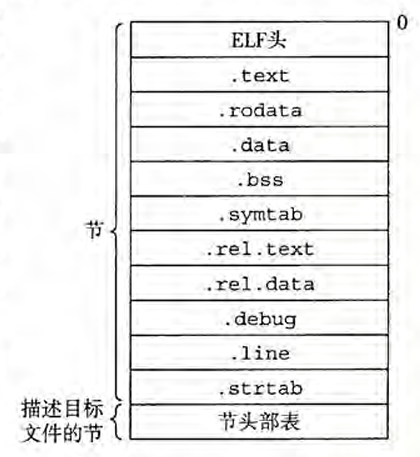
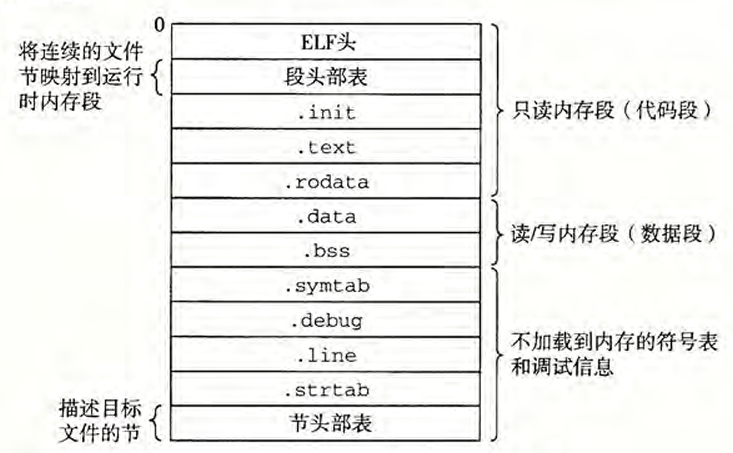
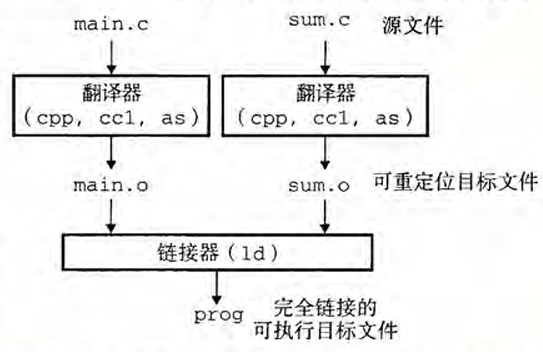
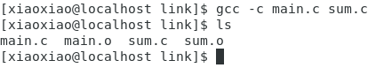
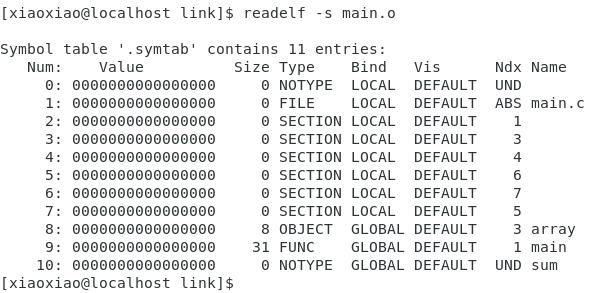
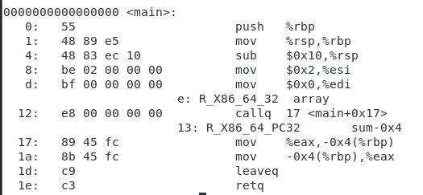
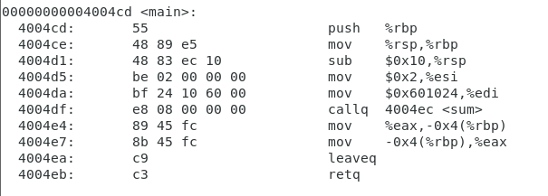
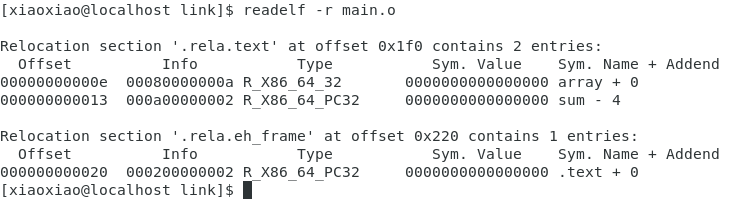

# 链接

- 环境
    - 操作系统系统 CentOS 7
    - GNU编译器
    - 示例程序
        main 函数初始化一个整数数组，然后调用 sum 函数来对数组元素求和。
        
        code/link/main.c
        ```Cpp
        int sum(int *a, int n);
        
        int array[2] = {1, 2};
        
        int main()
        {
            int val = sum(array, 2);
            return val;
        }
        ```
        
        code/link/sum.c
        ```Cpp
        int sum(int *a, int n)
        {
            int i, s = 0;
            
            for (i = 0; i < n; i++)
            {
                s += a[i];
                return s;
            }
        }
        ```        

- **链接**：是将各种代码和数据片段收集并组合成为一个单一文件的过程，这个文件可被加载（复制）到内存并执行。可以发生在编译时，加载时，运行时。
    
    链接器使得分离编译成为可能。

- 目标文件
    按照特定的目标文件格式组织的以文件形式存放在磁盘中的一个字节序列。
    
    目标文件有三种形式：
    - **可重定位目标文件**：包含二进制代码和数据，其形式可以在编译时与其他可重定位目标文件合并起来，创建一个可执行目标文件。
    - **可执行目标文件**：包含二进制代码和数据，其形式可以被直接复制到内存并执行。 
    - **共享目标文件**：一种特殊类型的可重定位目标文件，可以在加载或者运行时被动态地加载进内存并链接。
    
    编译器和汇编器生成可重定位目标文件(包括共享目标文件）。
    **链接器**生成**可执行目标文件**。
    
    各个系统的目标文件格式不同，Windows使用PE格式，MacOS-X使用Mach-O格式，Linux使用ELF。
    
    
    典型的ELF可重定位目标文件如图所示。
    典型的ELF可执行目标文件如图所示。
    ELF文件格式细节详见[ELF文件格式的详解_.elf-CSDN博客](https://blog.csdn.net/pingxiaozhao/article/details/109239221)

- 符号
    对应一个函数、一个全局变量或一个静态变量。
    
    链接器的上下文中的符号与本地程序变量不同（不包括本地非静态程序变量的任何符号），有三种符号：
    1. 由模块m定义并能被其他模块引用的全局符号。全局链接器符号对应于非静态的C函数和全局变量。
    2. 由其他模块定义并被模块m引用的全局符号。这些符号称为外部符号，对应于在其他模块中定义的非静态C函数和全局变量。
    3. 只被模块m定义和引用的局部符号。它们对应于带static属性的C函数和全局变量。这些符号在模块m中任何位置都可见，但是不能被其他模块引用。
    
    每个符号都被分配到目标文件的某个节。

- 静态链接
    以一组**可重定位目标文件**和**命令行参数**作为**输入**，生成一个**完全链接的、可以加载和运行**的**可执行目标文件**作为输出。
    
    两个主要任务
    1. 符号解析：将每个符号引用正好和一个符号定义关联起来。 
    2. 重定位：编译器和汇编器生成从地址0开始的代码和数据节。链接器通过把每个符号定义与一个内存位置关联起来，从而重定位这些节，然后修改所有对这些符号的引用，使得它们指向这个内存位置。链接器使用汇编器产生的重定位条目的详细指令，不加甄别地执行这样的重定位。
    
    静态链接例子如图所示
    

- 将例子中的两个程序编译一下得到main.o以及sum.o
    ```shell
    gcc -c mian.c sum.c
    ```

    

- 符号解析
    链接器解析符号引用的方法是将每个引用与它输入的可重定位目标文件的符号表中的一个确定的符号定义关联起来。
    
    解析多重定义的全局符号，定义函数和已初始化的全局变量是强符号，未初始化的全局变量是弱符号，Linux链接器使用如下规则处理多重定义的符号名：
    1. 不允许有多个同名的强符号。
    2. 如果有一个强符号和多个弱符号同名，那么选择强符号。
    3. 如果有多个弱符号同名，那么从这些弱符号中任意选一个。
    
    利用二进制工具readelf以及可选项`-s`查看main.o的符号表
    
    可以看到sum的类型是UND，说明sum是一个外部符号，暂时无法定义。

- 重定位
    由两步组成：
    1. 重定位节和符号定义：链接器将所有相同类型的节合并为同一类型的新的聚合节。然后，链接器将运行时内存地址赋给新的聚合节，赋给输入模块定义的每个节，以及赋给输入模块定义的每个符号。当这一步完成时，程序中的每条指令和全局变量都有唯一的运行时内存地址了。
    2. 重定位节中的符号引用：链接器修改代码节和数据节中对每个符号的引用，使得它们指向正确的运行时地址。要执行这一步，链接器依赖于可重定位目标模块中称为重定位条目的数据结构。
    
    重定位条目：
    ```Cpp
typetypedef struct {
        long offset; /* 要重定位的引用的偏移量 */
        long type:32, /* 重定位类型 */
            symbol:32; /* 符号表索引 */
        long addend; /* 下一条指令的偏移量 */
    } Elf64_Rela;
    ``` 
    
    重定位算法：
    ADDR(s)表示某个节的地址，或者说main的地址
    ADDR(r.symbol)表示运行时地址
    ```Cpp
    foreach section s {
        foreach relocation entry r { 
            refptr = s + r.offset; /* 要重定位的引用的指针 */
            
            /* 重定位PC相对引用 */ 
            if (r.type == R_X86_64_PC32) { 
                refaddr = ADDR(s) + r.offset; /* 引用的运行时地址 */ 
                *refptr = (unsigned) (ADDR(r.symbol) + r.addend- refaddr);
            }
            
            /* 重定位绝对引用 */
            if (r.type == R_X86_64_32) {
                *refptr = (unsigned) (ADDR(r.symbol) + r.addend);
            }
        }
    }
    ```
    
    利用`objdump -dx main.o`查看main.o的反汇编信息
    
    可以看到此时main的地址还是0，说明目标文件还没有进行重定位。
    接着利用如下指令将链接main.o以及sum.o得到可执行目标文件main，并再次查看main的反汇编结果：
    ```shell
gcc gcc -o main main.o sum.o
objdobjdump -d main
```
    找到main
    
    可以看到main的地址已经不是0，说明进行了重定位。图中可得`ADDR(s)=ADDR（main）=0x4004cd，ADDR(r.symbol) = ADDR(sum)=0x4004ec`
    
    利用`readelf -r main.o`可以查看main.o的重定位信息。
    
    可以得到在我的机器上，sum的重定位条目为：
    ```Cpp
```rr.offset = 0x13
r.syr.symbol = sum
r.y.r.type = R_X86_64_PC32
 radr.addend = -0x4
```
    
    根据算法可以计算得到运行时地址为：`refaddr = ADDR(s) + r.offset = 0x4004e0`
    然后更新该引用，使得它在运行时指向sum程序：`*refptr = (unsigned) (ADDR(r.symbol) + r.addend - refaddr) = (unsigned) 0x8`
    callq的下一条指令的地址为：`refaddr - r.addend = 0x4004e4`
    当CPU在执行callq时，PC值为：`0x4004e4`，更新PC值为：`PC = PC + *refptr = 0x4004e4 + 0x8 = 0x4004ec` ，这个结果与上图中sum的第一条指令地址相同，说明该过程与重定位算法一致。

- 动态链接
    共享库是一个目标模块。在运行或加载时，共享库可以放在内存的任意地址，并和内存中的程序进行链接。这个过程称为动态链接，由动态链接器完成。

- 位置无关代码
    多个进程共享内存中相同的库代码，最大的问题是地址引用。现代系统以一种特别的方式编译共享库模块，使得它可以被加载到内存的任何地址而无需链接器修改，可以加载而无需重定位的代码被称为位置无关代码。
    
    **观察事实：代码段中任何指令和数据段中任何变量之间的距离都是一个运行时常量，与代码段和数据段的绝对内存位置无关。**
    
    - PIC数据引用
        每个引用全局目标的目标模块在其数据段开始的地方创建了一个全局偏移量表GOT，这个表记录了共享模块中所有对于外部符号引用的地址条目。目标模块通过GOT间接加载全局变量的地址。
    - PIC函数调用
        GOT和过程链接表PLT协作完成运行时函数地址的解析。当第一次调用动态库中的函数时，会跳转到PLT表中相关的条目，而每个PLT条目和GOT表中的一个条目对应，因此其跳转至其对应的GOT条目，由于第一次调用函数，GOT表相关条目地址并没有被修正，且其初始值被设置为PLT表条目的下一条指令，之后跳转至`PLT[0]`条目（这个条目是一个特殊条目，其指向动态链接器，动态链接器根据栈中的下标来修正函数在GOT表中的地址），最后再将控制交给函数。后续再调用该函数时，因为其GOT表中条目地址已被修正，因此不需要再执行上述复杂步骤，而是直接执行。

## 参考文献
- 《深入理解计算机系统》机械工业出版社