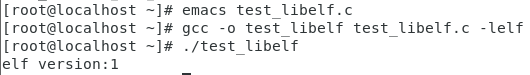
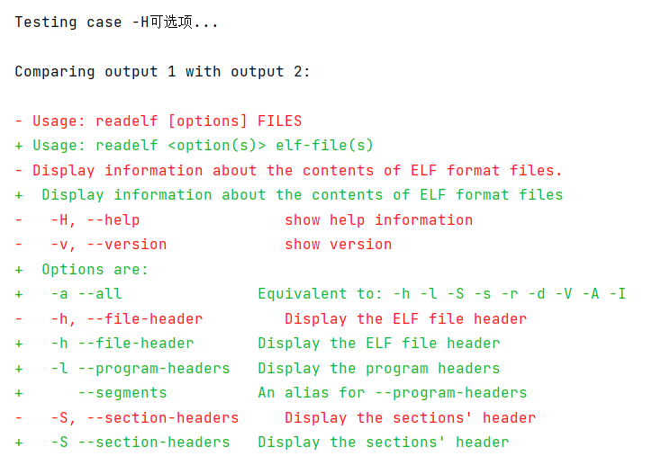

# 基于libelf实现readelf

## 环境

- CentOS 7.6
- gcc-4.8.5 20150623
- cmake-2.8.12.2-2.el7.x86_64
- gcc-c++.x86_64 0:4.8.5-44.el7
- libelf版本：x86_64 0.176-5.el7

## libelf库

libelf库提供了一个API集合，供开发人员读取和写入ELF对象。这个库将ELF文件抽象出来，封装了字节顺序、字长等数据结构在内存中存储时要考虑的内容，也提供方法使得ELF数据结构的文件表示和内存表示之间的转换变得透明，简化了编写跨平台工具任务，使得这些工具可以容易在不同体系结构的计算机上操作ELF对象。

### 安装libelf

CentOS可以直接使用如下命令安装libelf包：
```shell
sudo yum install elfutils-libelf-devel
```

写一个简单的C源程序验证是否安装成功：
```C
#include <stdio.h>  
#include <libelf.h>  
  
int main(void) {  
    printf("elf version:%d\n", elf_version(EV_CURRENT));  
    return 0;  
}
```

注意编译时记得带上选项`-lelf`，以将libelf库链接进可执行文件中，否则会报错。

如果安装成功，程序执行后会输出elf版本，如果没有修改过，版本号应该为1。具体如下图所示：


### 常用API

1. elf_version

    在 `libelf` 编程中，`elf_version` 是一个函数，用于初始化 `libelf` 库并设置它的版本。`libelf` 在使用前必须调用 `elf_version`，以确保应用程序和 `libelf` 使用的 ELF 文件格式版本兼容。
    
    `elf_version` 的定义如下：
    ```C
        unsigned elf_version(unsigned ver);
    ```
    - **参数**：`ver` 表示希望使用的 ELF 版本，通常传入 `EV_CURRENT`，这是 `libelf` 库当前支持的最新版本。
    - **返回值**：如果传入的 `ver` 与库当前支持的版本匹配，则返回当前版本号；否则返回 `EV_NONE`，表示初始化失败。
    
    #### 常见的用法
    
    在 `libelf` 编程中，一般会在任何 `libelf` 调用前使用 `elf_version` 进行初始化，如下所示：
    ```C
    #include <libelf.h>
    
    int main() 
    {     
        if (elf_version(EV_CURRENT) == EV_NONE) 
        {         
            fprintf(stderr, "libelf initialization failed!\n");
            return 1;
        }
        
        // 其他 libelf 的代码
        
    }
    ```
    
    #### 为什么需要 `elf_version` ?
    
    调用 `elf_version` 可以：
    1. 确保 `libelf` 库已被正确初始化，以免后续的函数调用出现意外行为。
    2. 确保使用的 ELF 文件版本和 `libelf` 支持的版本一致。
    
    这是 `libelf` 初始化的必要步骤，通常只需在程序的初始化部分调用一次。

2. elf_begin

    `elf_begin` 是 `libelf` 库中用于打开 ELF 文件并返回 ELF 句柄的一个关键函数。该函数会将文件映射为一个 `Elf` 结构，以便后续可以通过它访问和操作 ELF 文件的内容。
    
    `elf_begin` 的定义如下：
    ```C
        Elf *elf_begin(int fd, Elf_Cmd cmd, Elf *ref);
    ```
    
    #### 参数解释
    - **`fd`**：文件描述符，用于指定要处理的 ELF 文件。通常通过 `open` 函数打开文件，获得的文件描述符可以直接传给 `elf_begin`。
    - **`cmd`**：指定操作类型的命令，常用的值包括：
        - **`ELF_C_READ`**：以只读模式打开 ELF 文件。
        - **`ELF_C_WRITE`**：以写入模式打开 ELF 文件。
        - **`ELF_C_RDWR`**：以读写模式打开 ELF 文件。
    - **`ref`**：通常用于多次打开文件的引用指针。在大多数情况下，首次打开 ELF 文件时可以设置为 `NULL`。
    
    #### 返回值
    - 成功时返回一个指向 `Elf` 结构的指针，用于表示 ELF 文件的句柄，后续操作都将使用这个句柄。
    - 如果失败，则返回 `NULL`，通常表示文件无法打开或参数错误。
    
    #### 常见用法
    
    `elf_begin` 是打开 ELF 文件的第一个步骤。它通常与 `elf_end` 搭配使用，以确保在文件处理完毕后正确关闭文件。
    
    #### 示例代码
    
    以下是一个示例，演示如何使用 `elf_begin` 打开一个 ELF 文件并读取文件头信息：
    
    ```C
    #include <stdio.h>
    #include <fcntl.h>
    #include <stdlib.h>
    #include <libelf.h>
    #include <unistd.h>
    
    int main(int argc, char *argv[])
    {     
        int fd;
        Elf *elf;      
        
        // 检查参数     
        if (argc != 2) 
        {         
            fprintf(stderr, "Usage: %s <ELF-file>\n", argv[0]);  
            return 1;     
        }      
        
        // 打开文件     
        fd = open(argv[1], O_RDONLY);     
        if (fd < 0) 
        {         
            perror("Error opening file");
            return 1;     
        }      
        
        // 初始化 libelf     
        if (elf_version(EV_CURRENT) == EV_NONE) 
        {         
            fprintf(stderr, "libelf initialization failed!\n");
            close(fd);
            return 1;     
        }      
        
        // 使用 elf_begin 打开 ELF 文件     
        elf = elf_begin(fd, ELF_C_READ, NULL);
        if (!elf) 
        {         
            fprintf(stderr, "elf_begin() failed\n");
            close(fd);
            return 1;     
        }      
        
        // 在此可以进行其他操作，例如获取文件头或段头信息     
        // ...      
        
        // 结束对 ELF 文件的处理     
        elf_end(elf);     
        close(fd);
              
        return 0; 
    }
    ```
    
    #### 其他注意事项
    - **`elf_end`**：当文件操作完成时，必须调用 `elf_end` 释放资源。
    - **多次打开**：`elf_begin` 支持通过 `ref` 参数在多个进程间共享或引用 ELF 文件。

3. gelf_getehdr

    `gelf_getehdr` 是 `libelf` 库中的一个函数，用于获取 ELF 文件的 ELF 文件头（`Elf_Ehdr` 结构体）。它通过提供的 `Elf` 句柄读取 ELF 文件的头部信息，并返回一个指向 `Elf32_Ehdr`（对于 32 位 ELF 文件）或 `Elf64_Ehdr`（对于 64 位 ELF 文件）结构体的指针，具体结构体类型取决于 ELF 文件的位宽（32 位或 64 位）。结构体中的各成员就是readelf -h读出的内容。
    
    `gelf_getehdr` 的定义如下：
    ```C
        GElf_Ehdr *gelf_getehdr(Elf *e, GElf_Ehdr *ehdr);
    ```
    
    #### 参数解释
    - **`e`**：指向 `Elf` 结构的指针，这是通过 `elf_begin` 打开 ELF 文件后获得的 ELF 句柄。
    - **`ehdr`**：指向 `GElf_Ehdr` 结构的指针，用来存储返回的 ELF 文件头信息。通常可以传入一个已声明的 `GElf_Ehdr` 变量。
    
    #### 返回值
    - 成功时，`gelf_getehdr` 返回 `ehdr`，即包含 ELF 文件头信息的结构体。
    - 如果失败，返回 `NULL`，通常表示 ELF 文件头无法读取或文件格式有问题。
    
    #### `GElf_Ehdr` 和 `Elf_Ehdr`
    `gelf_getehdr` 返回的是 `GElf_Ehdr` 结构体，而不是直接的 `Elf_Ehdr` 结构体，这是为了提供更好的兼容性和类型安全。`GElf_Ehdr` 是一个兼容结构，它在访问 ELF 文件头时会根据 ELF 文件的位宽（32 位或 64 位）选择正确的类型。
    
    - 对于 32 位的 ELF 文件，`GElf_Ehdr` 会对应 `Elf32_Ehdr` 结构。
    - 对于 64 位的 ELF 文件，`GElf_Ehdr` 会对应 `Elf64_Ehdr` 结构。
    
    #### 例子
    以下是一个简单的示例，展示了如何使用 `gelf_getehdr` 获取 ELF 文件的文件头信息，并输出其中的一些内容：
    
    ```
    #include <stdio.h>
    #include <fcntl.h>
    #include <stdlib.h>
    #include <libelf.h>
    #include <unistd.h>
    #include <gelf.h>
    
    int int main(int argc, char *argv[]) 
    {
        int fd;
        Elf *e;
        GElf_Ehdr ehdr;
    
        // 检查参数
        if (argc != 2) 
        {
            fprintf(stderr, "Usage: %s <ELF-file>\n", argv[0]);
            return 1;
        }
    
        // 打开文件
        fd = open(argv[1], O_RDONLY);
        if (fd < 0) 
        {
            perror("Error opening file");
            return 1;
        }
    
        // 初始化 libelf
        if (elf_version(EV_CURRENT) == EV_NONE) 
        {
            fprintf(stderr, "libelf initialization failed!\n");
            close(fd);
            return 1;
        }
    
        // 使用 elf_begin 打开 ELF 文件
        e = elf_begin(fd, ELF_C_READ, NULL);
        if (!e)
        {
            fprintf(stderr, "elf_begin() failed\n");
            close(fd);
            return 1;
        }
    
        // 使用 gelf_getehdr 获取 ELF 文件头
        if (!gelf_getehdr(e, &ehdr)) 
        {
            fprintf(stderr, "gelf_getehdr() failed\n");
            elf_end(e);
            close(fd);
            return 1;
        }
    
        // 输出 ELF 文件头信息
        printf("ELF Header:\n");
        printf("  Type: %u\n", ehdr.e_type);
        printf("  Machine: %u\n", ehdr.e_machine);
        printf("  Entry point address: 0x%lx\n", ehdr.e_entry);
        printf("  Program header offset: 0x%lx\n", ehdr.e_phoff);
        printf("  Section header offset: 0x%lx\n", ehdr.e_shoff);
        printf("  Flags: 0x%lx\n", ehdr.e_flags);
    
        // 结束对 ELF 文件的处理
        elf_end(e);
        close(fd);
    
        return 0;
    }
    ```
    
    #### ELF 文件头（`GElf_Ehdr`）结构
    
    ELF 文件头 (`Elf_Ehdr` 或 `GElf_Ehdr`) 包含了 ELF 文件的基本信息，它的字段包括（但不限于）：
    - **`e_type`**：表示文件的类型（如 `ET_EXEC`，`ET_DYN` 等）。
    - **`e_machine`**：表示目标机器的架构类型（如 `EM_X86_64`，`EM_386` 等）。
    - **`e_version`**：表示 ELF 文件的版本。
    - **`e_entry`**：程序入口点的地址。
    - **`e_phoff`**：程序头（program header）的偏移位置。
    - **`e_shoff`**：节头（section header）的偏移位置。
    - **`e_flags`**：与文件相关的标志（取决于目标平台）。
    - **`e_ehsize`**：ELF 文件头的大小。
    - **`e_phentsize`**：程序头表项的大小。
    - **`e_shentsize`**：节头表项的大小。

4. elf_nextscn
    
    `elf_nextscn` 是 `libelf` 库中的一个函数，用于迭代 ELF 文件的节（section）表。它允许你逐个访问 ELF 文件中的每个节头（section header），便于获取每个节的详细信息。
    
    `elf_nextscn` 的定义如下：
    ```C
    Elf_Scn *elf_nextscn(Elf *e, Elf_Scn *scn);
    ```
    
    #### 参数解释
    - **`e`**：指向 `Elf` 结构的指针，即由 `elf_begin` 打开的 ELF 文件句柄。
    - **`scn`**：指向当前节的 `Elf_Scn` 结构。如果是获取第一个节，传入 `NULL`；否则，传入上一个节的 `Elf_Scn` 指针，以获取下一个节。
    
    #### 返回值
    - 成功时，返回下一个节的 `Elf_Scn` 指针，可以用于进一步访问该节的信息。
    - 如果已经遍历完所有节，返回 `NULL`，表示没有更多节可供迭代。
    
    ### 使用场景
    `elf_nextscn` 常用于遍历 ELF 文件的所有节，以便逐一读取每个节的头部信息（例如节的名称、类型、大小等）。通常与 `elf_getshdr` 函数结合使用，后者用于获取特定节的头部信息。
    
    ### 常见用法
    在遍历 ELF 文件的所有节时，`elf_nextscn` 通常从第一个节开始，然后依次获取下一个节，直到没有更多节可供处理。
    
    #### 示例代码
    以下是一个示例，演示如何使用 `elf_nextscn` 遍历 ELF 文件的所有节，并获取每个节的头信息：
    ```C
    #include <stdio.h>
    #include <fcntl.h>
    #include <stdlib.h>
    #include <libelf.h>
    #include <unistd.h>
    #include <gelf.h>
    
    int main(int argc, char *argv[]) 
    {
        int fd; Elf *e; Elf_Scn *scn = NULL; GElf_Shdr shdr; 
        
        // 检查参数 
        if (argc != 2) 
        { 
            fprintf(stderr, "Usage: %s <ELF-file>\n", argv[0]); 
            return 1; 
        } 
        
        // 打开文件 
        fd = open(argv[1], O_RDONLY); 
        if (fd < 0) 
        { 
            perror("Error opening file"); 
            return 1; 
        } 
        
        // 初始化 libelf 
        if (elf_version(EV_CURRENT) == EV_NONE) 
        { 
            fprintf(stderr, "libelf initialization failed!\n"); 
            close(fd); 
            return 1; 
        } 
        
        // 使用 elf_begin 打开 ELF 文件 
        e = elf_begin(fd, ELF_C_READ, NULL); 
        if (!e) 
        { 
            fprintf(stderr, "elf_begin() failed\n"); 
            close(fd); 
            return 1; 
        } 
        
        // 遍历每个 section 
        while ((scn = elf_nextscn(e, scn)) != NULL) 
        { 
            // 获取 section header 
            if (gelf_getshdr(scn, &shdr) != &shdr) 
            { 
                fprintf(stderr, "gelf_getshdr() failed\n"); 
                elf_end(e); 
                close(fd); 
                return 1; 
            } 
            
            // 输出 section header 信息 
            printf("Section:\n"); 
            printf(" Name offset: %u\n", shdr.sh_name); 
            printf(" Type: %u\n", shdr.sh_type); 
            printf(" Flags: 0x%lx\n", shdr.sh_flags); 
            printf(" Address: 0x%lx\n", shdr.sh_addr); 
            printf(" Offset: %lu\n", shdr.sh_offset); 
            printf(" Size: %lu\n", shdr.sh_size); 
        } 
        
        // 结束对 ELF 文件的处理 
        elf_end(e); 
        close(fd);
        
        return 0; 
    }
    ```
    
    #### 代码说明
    1. **初始化 `libelf`**：调用 `elf_version` 进行初始化，确保 `libelf` 库兼容。
    2. **打开 ELF 文件**：通过 `elf_begin` 打开 ELF 文件，获得 ELF 文件句柄 `e`。
    3. **遍历节表**：使用 `elf_nextscn` 函数，从第一个节开始逐步迭代，每次返回下一个节的 `Elf_Scn` 指针。
    4. **获取节头信息**：对于每个节，使用 `gelf_getshdr` 获取 `GElf_Shdr` 结构体，包含该节的详细信息（例如名称偏移、类型、地址等）。
    5. **输出信息**：打印每个节头信息的内容，包括名称偏移、类型、地址、大小等。
    6. **释放资源**：调用 `elf_end` 关闭 ELF 文件，释放资源。
    
    #### 相关函数
    - **`gelf_getshdr`**：用于从 `Elf_Scn` 结构体中获取节头信息。
    - **`elf_getdata`**：用于获取特定节的内容数据，常在读取节数据时使用。
    
    #### 注意事项
    - **`elf_nextscn` 起始参数**：传入 `NULL` 可以获取第一个节，此后每次传入上一次返回的 `Elf_Scn` 指针，以获取下一个节。
    - **内存管理**：确保在处理完文件后调用 `elf_end` 释放资源。

5. gelf_getshdr

    `gelf_getshdr` 是 `libelf` 库中的一个函数，用于获取 ELF 文件中某个节（section）的节头信息。这个函数会根据 ELF 文件的位宽（32 位或 64 位）返回对应的结构体，以统一的方式访问节头内容。
    
    `gelf_getshdr` 的定义如下：
    ```C
    GElf_Shdr *gelf_getshdr(Elf_Scn *scn, GElf_Shdr *dst);
    ```
    
    #### 参数解释
    - **`scn`**：指向 `Elf_Scn` 结构的指针，表示当前要获取节头信息的节。`Elf_Scn` 结构可以通过 `elf_nextscn` 函数逐个获取。
    - **`dst`**：指向 `GElf_Shdr` 结构的指针，用于存储获取到的节头信息。
    
    #### 返回值
    - 成功时，返回 `dst`，即包含节头信息的 `GElf_Shdr` 结构体。
    - 如果失败，返回 `NULL`，这通常表示 `scn` 或 `dst` 有误，或指定的节头信息不存在。
    
    #### `GElf_Shdr` 和 `Elf_Shdr`
    在 `libelf` 中，`gelf_getshdr` 返回的是 `GElf_Shdr` 结构，而不是直接的 `Elf32_Shdr` 或 `Elf64_Shdr` 结构。`GElf_Shdr` 结构为 32 位和 64 位 ELF 文件提供了统一的访问接口，简化了程序对不同位宽 ELF 文件的兼容性。
    
    - 对于 32 位的 ELF 文件，`GElf_Shdr` 会对应 `Elf32_Shdr` 结构。
    - 对于 64 位的 ELF 文件，`GElf_Shdr` 会对应 `Elf64_Shdr` 结构。
    
    #### 主要字段
    `GElf_Shdr` 结构体包含 ELF 文件节头的主要信息字段，如下：
    
    - **`sh_name`**：节的名称索引。
    - **`sh_type`**：节的类型（如 `SHT_PROGBITS`、`SHT_SYMTAB` 等）。
    - **`sh_flags`**：节的标志，指明节的属性（如是否可写、可执行等）。
    - **`sh_addr`**：节在内存中的加载地址。
    - **`sh_offset`**：节在文件中的偏移量。
    - **`sh_size`**：节的大小（字节）。
    - **`sh_link`**：相关联的节头表索引。
    - **`sh_info`**：额外的节信息（类型依赖）。
    - **`sh_addralign`**：节的对齐要求。
    - **`sh_entsize`**：若节包含固定大小的表项，此项表示表项大小。
    
    #### 使用示例
    以下代码演示如何使用 `gelf_getshdr` 获取并打印 ELF 文件中每个节的节头信息。
    ```C
    #include <stdio.h> 
    #include <fcntl.h> 
    #include <stdlib.h> 
    #include <libelf.h> 
    #include <unistd.h> 
    #include <gelf.h> 
    int main(int argc, char *argv[]) 
    { 
        int fd; 
        Elf *e; 
        Elf_Scn *scn = NULL; 
        GElf_Shdr shdr; 
        
        // 检查参数 
        if (argc != 2) 
        { 
            fprintf(stderr, "Usage: %s <ELF-file>\n", argv[0]); 
            return 1; 
        } 
        
        // 打开文件 
        fd = open(argv[1], O_RDONLY); 
        if (fd < 0) 
        { 
            perror("Error opening file"); 
            return 1; 
        } 
        
        // 初始化 libelf 
        if (elf_version(EV_CURRENT) == EV_NONE) 
        { 
            fprintf(stderr, "libelf initialization failed!\n"); 
            close(fd); 
            return 1; 
        } 
        
        // 打开 ELF 文件 
        e = elf_begin(fd, ELF_C_READ, NULL); 
        if (!e) 
        { 
            fprintf(stderr, "elf_begin() failed\n"); 
            close(fd); 
            return 1; 
        } 
        
        // 遍历每个 section，获取节头信息 
        while ((scn = elf_nextscn(e, scn)) != NULL) 
        { 
            if (gelf_getshdr(scn, &shdr) != &shdr) 
            { 
                fprintf(stderr, "gelf_getshdr() failed\n"); 
                elf_end(e); 
                close(fd); 
                return 1; 
            } 
            
            // 打印 section header 信息 
            printf("Section:\n"); 
            printf(" Name offset: %u\n", shdr.sh_name); 
            printf(" Type: %u\n", shdr.sh_type); 
            printf(" Flags: 0x%lx\n", shdr.sh_flags); 
            printf(" Address: 0x%lx\n", shdr.sh_addr); 
            printf(" Offset: %lu\n", shdr.sh_offset); 
            printf(" Size: %lu\n", shdr.sh_size); 
        } 
        
        // 结束 ELF 文件的处理 
        elf_end(e); 
        close(fd); 
        
        return 0; 
    }
    ```
    
    #### 代码说明
    1. **初始化 libelf**：通过 `elf_version` 进行初始化，以确保兼容性。
    2. **打开 ELF 文件**：使用 `elf_begin` 函数获得 ELF 文件句柄 `e`。
    3. **遍历节表**：使用 `elf_nextscn` 逐节遍历文件的每个节，并调用 `gelf_getshdr` 获取节头信息。
    4. **输出节头信息**：打印节头的详细信息，如名称索引、类型、偏移地址和大小等。
    5. **释放资源**：调用 `elf_end` 关闭 ELF 文件。
    
    #### 注意事项
    - **检查返回值**：要确保 `gelf_getshdr` 成功返回，以避免处理不完整的节头信息。
    - **字节对齐**：`sh_addralign` 指明了节在内存中的对齐需求，通常在加载节数据时需要考虑。

6. elf_getdata

    `elf_getdata` 是 `libelf` 库中的一个函数，用于从 ELF 文件的某个节（section）中提取原始数据。通常在处理 ELF 文件时，获取节数据是关键步骤，例如获取符号表、字符串表或代码段等内容。
    
    `elf_getdata` 的定义如下：
    ```C
    Elf_Data *elf_getdata(Elf_Scn *scn, Elf_Data *data);
    ```
    
    #### 参数解释
    - **`scn`**：指向 `Elf_Scn` 结构的指针，表示当前要获取数据的节。`Elf_Scn` 是由 `elf_nextscn` 或 `elf_getscn` 返回的节指针。
    - **`data`**：指向 `Elf_Data` 的指针，用于迭代节中的数据块。初次调用时传入 `NULL`，之后可传入上次调用返回的 `Elf_Data` 指针来获取下一个数据块。
    
    #### 返回值
    - 成功时，返回指向 `Elf_Data` 结构的指针，包含节的数据信息。
    - 如果失败，或节中没有更多数据块，返回 `NULL`。
    
    #### `Elf_Data` 结构体
    `Elf_Data` 结构体包含了从节中提取的数据及相关信息，主要字段如下：
    - **`d_buf`**：指向数据缓冲区的指针，包含实际的原始数据。
    - **`d_type`**：数据类型（`ELF_T_BYTE`、`ELF_T_ADDR` 等），描述数据内容类型。
    - **`d_size`**：数据块的大小（字节数）。
    - **`d_off`**：数据在节中的偏移量。
    - **`d_align`**：数据的对齐要求。
    - **`d_version`**：数据的版本信息。
    
    #### 使用场景
    `elf_getdata` 常用于从 ELF 文件的特定节中读取数据，比如：
    - 获取符号表（`.symtab` 或 `.dynsym`）
    - 获取字符串表（`.strtab`）
    - 提取可执行代码段或数据段
    
    #### 使用示例
    以下示例展示如何使用 `elf_getdata` 提取 ELF 文件中每个节的数据内容。
    
    ```C
    #include <stdio.h>
    #include <fcntl.h>
    #include <stdlib.h>
    #include <libelf.h>
    #include <unistd.h>
    #include <gelf.h>
    
    int main(int argc, char *argv[]) 
    {
        int fd;
        Elf *e;
        Elf_Scn *scn = NULL;
        Elf_Data *data;
        GElf_Shdr shdr;
        
        // 检查参数
        if (argc != 2) 
        {
            fprintf(stderr, "Usage: %s <ELF-file>\n", argv[0]);
            return 1;
        }
        
        // 打开文件
        fd = open(argv[1], O_RDONLY);
        if (fd < 0) 
        {
            perror("Error opening file");
            return 1;
        }
        
        // 初始化 libelf
        if (elf_version(EV_CURRENT) == EV_NONE) 
        {
            fprintf(stderr, "libelf initialization failed!\n");
            close(fd);
            return 1;
        }
        
        // 使用 elf_begin 打开 ELF 文件
        e = elf_begin(fd, ELF_C_READ, NULL);
        if (!e) 
        {
            fprintf(stderr, "elf_begin() failed\n");
            close(fd);
            return 1;
        }
        
        // 遍历节表
        while ((scn = elf_nextscn(e, scn)) != NULL) 
        {
            if (gelf_getshdr(scn, &shdr) != &shdr) 
            {
                fprintf(stderr, "gelf_getshdr() failed\n");
                elf_end(e);
                close(fd);
                return 1;
            }
            
            // 逐个提取节中的数据块
            data = NULL;
            while ((data = elf_getdata(scn, data)) != NULL) 
            {
                printf("Section data:\n");
                printf("  Offset: %llu\n", (unsigned long long)data->d_off);
                printf("  Size: %zu\n", data->d_size);
                printf("  Data: ");
                for (size_t i = 0; i < data->d_size; i++) 
                {
                    printf("%02x ", ((unsigned char *)data->d_buf)[i]);
                }
                printf("\n");
            }
        }
        
        // 结束处理
        elf_end(e);
        close(fd);
        
        return 0;
    }
    ```
    
    #### 代码说明
    1. **初始化**：调用 `elf_version` 初始化 `libelf` 库，确保兼容性。
    2. **打开文件**：通过 `elf_begin` 打开 ELF 文件，获得 `Elf` 句柄。
    3. **遍历节表**：使用 `elf_nextscn` 逐个获取节。
    4. **获取节头信息**：使用 `gelf_getshdr` 获取节头信息，用于进一步的判断（例如判断节类型）。
    5. **提取数据块**：在每个节中使用 `elf_getdata` 提取数据块，并循环输出每块的数据内容、偏移量和大小。
    6. **输出数据**：逐字节打印数据内容（以十六进制显示）。
    7. **释放资源**：调用 `elf_end` 关闭 ELF 文件，释放资源。
    
    #### 注意事项
    - **多数据块的处理**：某些节可能包含多个数据块，因此使用 `elf_getdata` 时需要循环获取，直到返回 `NULL`。
    - **数据对齐**：某些数据块可能具有特定的对齐要求（通过 `d_align` 字段获取）。
    - **内存安全**：确保访问 `d_buf` 时，`data` 不为空，以避免访问无效内存。
    
    #### 相关函数
    - **`elf_getscn`**：用于获取指定索引的节，适合需要定位特定节的场景。
    - **`gelf_getshdr`**：获取节头信息，通常与 `elf_getdata` 配合使用，用于判断节类型和内容。

7. elf_strptr

    `elf_strptr` 是 `libelf` 库中用于获取字符串表中特定字符串的指针的函数。通常在处理 ELF 文件时，符号名称和节名称等字符串信息存储在专门的字符串表中，而 `elf_strptr` 则用于访问这些字符串。
    
    `elf_strptr` 的定义如下：
    ```c
    char *elf_strptr(Elf *elf, size_t strtab, size_t offset);
    ```
    
    #### 参数解释
    - **`elf`**：指向 `Elf` 结构的指针，表示当前的 ELF 文件句柄。
    - **`strtab`**：字符串表的节索引。该索引通常通过 `e_shstrndx` 获取，用于指向包含节名称或符号名称的字符串表节。
    - **`offset`**：要访问的字符串在字符串表中的偏移量。可以从节头或符号表的 `st_name` 字段获取该偏移量。
    
    #### 返回值
    - 成功时，返回指向字符串表中指定偏移量处的字符串的指针。
    - 失败时，返回 `NULL`。
    
    #### 典型使用场景
    - **读取节名称**：通常，节名称保存在节头字符串表中（索引为 `e_shstrndx` 的节）。
    - **读取符号名称**：符号表中的符号名称也存储在一个字符串表中，符号的 `st_name` 字段即为该符号在字符串表中的偏移量。
    
    #### 使用示例
    以下是一个示例，用于显示 ELF 文件中每个节的名称。
    ```C
    #include <stdio.h>
    #include <fcntl.h>
    #include <stdlib.h>
    #include <libelf.h>
    #include <unistd.h>
    #include <gelf.h>
    
    int main(int argc, char *argv[]) {
        int fd;
        Elf *e;
        size_t shstrndx;
        Elf_Scn *scn = NULL;
        GElf_Shdr shdr;
    
        // 检查参数
        if (argc != 2) {
            fprintf(stderr, "Usage: %s <ELF-file>\n", argv[0]);
            return 1;
        }
    
        // 打开文件
        fd = open(argv[1], O_RDONLY);
        if (fd < 0) {
            perror("Error opening file");
            return 1;
        }
    
        // 初始化 libelf
        if (elf_version(EV_CURRENT) == EV_NONE) {
            fprintf(stderr, "libelf initialization failed!\n");
            close(fd);
            return 1;
        }
    
        // 使用 elf_begin 打开 ELF 文件
        e = elf_begin(fd, ELF_C_READ, NULL);
        if (!e) {
            fprintf(stderr, "elf_begin() failed\n");
            close(fd);
            return 1;
        }
    
        // 获取节头字符串表的索引
        if (elf_getshstrndx(e, &shstrndx) != 0) {
            fprintf(stderr, "elf_getshstrndx() failed\n");
            elf_end(e);
            close(fd);
            return 1;
        }
    
        // 遍历所有节
        while ((scn = elf_nextscn(e, scn)) != NULL) {
            if (gelf_getshdr(scn, &shdr) != &shdr) {
                fprintf(stderr, "gelf_getshdr() failed\n");
                elf_end(e);
                close(fd);
                return 1;
            }
    
            // 获取节名称
            char *name = elf_strptr(e, shstrndx, shdr.sh_name);
            if (name) {
                printf("Section name: %s\n", name);
            } else {
                fprintf(stderr, "elf_strptr() failed\n");
            }
        }
    
        // 结束处理
        elf_end(e);
        close(fd);
    
        return 0;
    }
    ```
    
    #### 代码说明
    1. **初始化**：调用 `elf_version` 初始化 `libelf` 库。
    2. **打开文件**：通过 `elf_begin` 打开 ELF 文件并获得 `Elf` 句柄。
    3. **获取节头字符串表索引**：调用 `elf_getshstrndx` 获取字符串表的索引。
    4. **遍历节表**：使用 `elf_nextscn` 遍历每个节。
    5. **获取节名称**：通过 `elf_strptr` 访问 `sh_name` 偏移量处的字符串，打印节名称。
    6. **释放资源**：调用 `elf_end` 关闭 ELF 文件。
    
    #### 注意事项
    - `strtab` 参数应为有效的字符串表索引，否则可能导致 `elf_strptr` 返回 `NULL`。
    - 该函数仅返回字符串指针，不会复制数据，所以无需释放返回的指针。

## 基于libelf实现readelf

实现了`-H`、`-h`、`-s`、`-S`、`-l`、`-r`等可选项，支持部分长选项，可通过`-H`。

用法也和readelf类似，除了帮助信息（`-H`选项）等选项外，其余选项均包括一个可选项以及要查看的ELF文件，其中`-H`选项只显示目前有实现的部分功能的帮助信息。

> 注意`elf_getbase` 返回的值并不是真实节区头表的偏移，而是 ELF 文件在内存中的基地址。

> 编写`-r`选项对应的函数时，发现`.rodata`、`.text` 等一些特殊的内置符号或者在字符串表中存在特定格式导致获取不到正确的名字。如果符号的名称索引为 0（即`sym.st_name == 0`），说明是特殊符号，此时使用符号的节索引去段表的字符串表中查找符号名。具体做法是通过段表索引获取对应段的节头信息，再从段表的字符串表中查找对应的名称。如果查找结果为`NULL`，则将符号名设置为`UNKNOWN`。

### 完整实现如下：

```C
#include <stdio.h>
#include <stdlib.h>
#include <stdint.h>
#include <string.h>
#include <elf.h>
#include <gelf.h>
#include <libelf.h>
#include <fcntl.h>
#include <unistd.h>
#include <getopt.h>

#define VERSION "1.0"

/**
 * @brief 打印帮助信息
 * 输出命令行的使用方法和各选项的描述。
 * @return void
 */
 void print_help()
 {
    printf("Usage: readelf [options] FILES\n");
    printf("Display information about the contents of ELF format files.\n");
    printf("  -H, --help                show help information\n");
    printf("  -v, --version             show version\n");
    printf("  -h, --file-header         Display the ELF file header\n");
    printf("  -S, --section-headers     Display the sections' header\n");
    printf("  -s, --syms                Display the symbol table\n");
    printf("  -r, --relocs              Display the relocations (if present)\n");
    printf("  -l, --program-header      Display the program headers\n");
    printf("  -T, --silent-truncation   If a symbol name is truncated, do not add [...] suffix\n");
    printf("  -W                        Don't break output lines to fit into 80 columns\n");
}

/**
 * @brief 打印版本信息
 * 输出程序的版本信息。
 * @return void
 */
 void print_version()
{
    printf("readelf version %s\n", VERSION);
}

const char* get_osabi_name(unsigned char osabi) {
    switch (osabi) {
        case ELFOSABI_SYSV:       return "UNIX - System V";
        case ELFOSABI_HPUX:       return "HP-UX";
        case ELFOSABI_NETBSD:     return "NetBSD";
        case ELFOSABI_LINUX:      return "Linux";
        case ELFOSABI_SOLARIS:    return "Solaris";
        case ELFOSABI_AIX:        return "AIX";
        case ELFOSABI_IRIX:       return "IRIX";
        case ELFOSABI_FREEBSD:    return "FreeBSD";
        case ELFOSABI_TRU64:      return "TRU64";
        case ELFOSABI_ARM:        return "ARM";
        case ELFOSABI_STANDALONE: return "Standalone (embedded)";
        default:                  return "Unknown";
    }
}

const char* get_type_name(uint16_t type) {
    switch (type) {
        case ET_NONE: return "NONE (No file type)";
        case ET_REL:  return "REL (Relocatable file)";
        case ET_EXEC: return "EXEC (Executable file)";
        case ET_DYN:  return "DYN (Shared object file)";
        case ET_CORE: return "CORE (Core file)";
        default:      return "Unknown";
    }
}

const char* get_machine_name(uint16_t machine) {
    switch (machine) {
        case EM_X86_64:   return "Advanced Micro Devices X86-64";
        case EM_386:      return "Intel 80386";
        case EM_ARM:      return "ARM";
        case EM_MIPS:     return "MIPS R3000";
        case EM_AARCH64:  return "AArch64";
        case EM_PPC:      return "PowerPC";
        case EM_SPARC:    return "SPARC";
        default:          return "Unknown";
    }
}

const char* get_data_encoding(unsigned char data) {
    switch (data) {
        case ELFDATA2LSB: return "2's complement, little endian";
        case ELFDATA2MSB: return "2's complement, big endian";
        default:          return "Unknown";
    }
}


/**
 * @brief 打印 ELF 文件头部信息
 * 输出 ELF 文件头部的详细信息，包括文件魔数、类、数据编码方式、机器架构等。
 * @param ehdr ELF 文件头部结构体
 * @return void
 */
void print_file_header(Elf64_Ehdr *ehdr)
{
    printf("ELF Header:\n");
    
    // 打印所有 16 字节的魔数
    printf("  Magic:   ");
    int i;
    for (i = 0; i < EI_NIDENT; ++i) 
    {
        printf("%02x ", ehdr->e_ident[i]);
    }
    printf("\n");

    // 打印 ELF 类别
    printf("  Class:                             %s\n", (ehdr->e_ident[EI_CLASS] == ELFCLASS64) ? "ELF64" : "Unknown");

    // 打印数据编码方式
    printf("  Data:                              %s\n", get_data_encoding(ehdr->e_ident[EI_DATA]));

    // 打印 ELF 版本
    printf("  Version:                           %d (current)\n", ehdr->e_version);

    // 打印 OS/ABI
    printf("  OS/ABI:                            %s\n", get_osabi_name(ehdr->e_ident[EI_OSABI]));

    // 打印 ABI 版本
    printf("  ABI Version:                       %d\n", ehdr->e_ident[EI_ABIVERSION]);

    // 打印文件类型
    printf("  Type:                              %s\n", get_type_name(ehdr->e_type));

    // 打印机器架构
    printf("  Machine:                           %s\n", get_machine_name(ehdr->e_machine));

    // 打印版本
    printf("  Version:                           0x%x\n", ehdr->e_version);

    // 打印入口地址
    printf("  Entry point address:               0x%lx\n", ehdr->e_entry);

    // 打印程序头表偏移
    printf("  Start of program headers:          %d (bytes into file)\n", ehdr->e_phoff);

    // 打印节头表偏移
    printf("  Start of section headers:          %d (bytes into file)\n", ehdr->e_shoff);

    // 打印标志
    printf("  Flags:                             0x%x\n", ehdr->e_flags);

    // 打印 ELF 文件头大小
    printf("  Size of this header:               %d (bytes)\n", ehdr->e_ehsize);

    // 打印程序头大小和数量
    printf("  Size of program headers:           %d (bytes)\n", ehdr->e_phentsize);
    printf("  Number of program headers:         %d\n", ehdr->e_phnum);

    // 打印节头大小和数量
    printf("  Size of section headers:           %d (bytes)\n", ehdr->e_shentsize);
    printf("  Number of section headers:         %d\n", ehdr->e_shnum);

    // 打印节头字符串表索引
    printf("  Section header string table index: %d\n", ehdr->e_shstrndx);
}

const char *get_section_type(uint32_t type)
{
    switch (type)
    {
        case SHT_NULL: return "NULL";
        case SHT_PROGBITS: return "PROGBITS";
        case SHT_SYMTAB: return "SYMTAB";
        case SHT_STRTAB: return "STRTAB";
        case SHT_RELA: return "RELA";
        case SHT_HASH: return "HASH";
        case SHT_DYNAMIC: return "DYNAMIC";
        case SHT_NOTE: return "NOTE";
        case SHT_NOBITS: return "NOBITS";
        case SHT_REL: return "REL";
        case SHT_SHLIB: return "SHLIB";
        case SHT_DYNSYM: return "DYNSYM";
        default: return "UNKNOWN";
    }
}

// 解析并返回 Flags 字符串
const char* flags_to_string(Elf64_Xword flags)
{
    static char flag_str[16];
    flag_str[0] = '\0';
    
    if (flags & SHF_WRITE) strcat(flag_str, "W");
    if (flags & SHF_ALLOC) strcat(flag_str, "A");
    if (flags & SHF_EXECINSTR) strcat(flag_str, "X");
    if (flags & SHF_MERGE) strcat(flag_str, "M");
    if (flags & SHF_STRINGS) strcat(flag_str, "S");
    if (flags & SHF_INFO_LINK) strcat(flag_str, "I");
    if (flags & SHF_LINK_ORDER) strcat(flag_str, "L");
    if (flags & SHF_OS_NONCONFORMING) strcat(flag_str, "O");
    if (flags & SHF_GROUP) strcat(flag_str, "G");
    if (flags & SHF_TLS) strcat(flag_str, "T");
    if (flags & SHF_COMPRESSED) strcat(flag_str, "C");
    if (flags & SHF_EXCLUDE) strcat(flag_str, "E");
    
    if (flag_str[0] == '\0')
    {
        strcat(flag_str, " ");
    }
    
    return flag_str;
}

/**
 * @brief 打印 ELF 文件的节头信息
 * 输出 ELF 文件中所有节的头部信息，包括节名、类型、地址等。
 * @param elf ELF 文件的指针
 * @return void
 */
void print_section_headers(Elf *elf)
 {
    Elf_Scn *scn = NULL;
    Elf64_Shdr *shdr = NULL;
    Elf64_Ehdr *ehdr;
    char *shstrtab = NULL;
    size_t section_count = 0;
    size_t i;
    size_t shstrndx;
    off_t shoff;
    
    // 获取 ELF 文件头
    ehdr = elf64_getehdr(elf);
    if (!ehdr)
    {
        fprintf(stderr, "Failed to get ELF header\n");
        return;
    }
    
    // 获取节区头的数量和偏移量
    section_count = ehdr->e_shnum;
    shoff = ehdr->e_shoff;
    
    // 找到字符串表节区（用于节区名）
    if (elf_getshdrstrndx(elf, &shstrndx) != 0)
    {
        fprintf(stderr, "Failed to get section header string table index\n");
        return;
    }
    
    // 获取字符串表节区内容  
    shstrtab = elf_strptr(elf, shstrndx, 0);
    if (!shstrtab)
    {
        fprintf(stderr, "Failed to get section name string table\n");
        return;
    }  
    
    // 打印节区头信息  
    printf(
        "There are %zu section headers, starting at offset 0x%lx:\n\n",
        section_count,
        (unsigned long) shoff
    );
    
    printf("Section Headers:\n");
    printf("  [Nr] Name              Type             Address           Offset\n");
    printf("       Size              EntSize          Flags  Link  Info  Align\n");

    for (i = 0; i < section_count; ++i)
    {
        scn = elf_getscn(elf, i);
        if (!scn) continue;
        
        shdr = elf64_getshdr(scn);
        if (!shdr) continue;
        
        // 获取节区名称，如果 sh_name 为 0，使用 "" 作为默认值
        char *section_name = shstrtab + shdr->sh_name;
        if (shdr->sh_name == 0)
        {
            section_name = "";
        }
        
        // 打印节区信息
        printf(
            "  [%2zu] %-17s %-15s  %016lx  %08lx\n",
            i,
            section_name,
            get_section_type(shdr->sh_type), // 根据类型代码输出类型字符串
            shdr->sh_addr,
            shdr->sh_offset
        );  
        
        printf(
            "       %016lx  %016lx %3s %7u %5u %5lu\n",  
            shdr->sh_size,
            shdr->sh_entsize,
            flags_to_string(shdr->sh_flags), // 将标志转换为字符串表示
            shdr->sh_link,
            shdr->sh_info,
            shdr->sh_addralign
        );
    }
    
    // 输出 Flags 的键值说明  
    printf("Key to Flags:\n");
    printf("  W (write), A (alloc), X (execute), M (merge), S (strings), I (info),\n");
    printf("  L (link order), O (extra OS processing required), G (group), T (TLS),\n");
    printf("  C (compressed), x (unknown), o (OS specific), E (exclude),\n");
    printf("  l (large), p (processor specific)\n");
}

/**
 * @brief 打印 ELF 文件的符号表
 * 输出 ELF 文件中的符号表，列出符号名、值、大小等信息。
 * @param elf ELF 文件的指针
 * @return void
 */
 void print_symbol_table(Elf *elf)
 {
    Elf_Scn *scn = NULL;
    GElf_Shdr shdr;
    Elf_Data *data = NULL;
    int sym_count, i;
    
    // 查找符号表节区
    while ((scn = elf_nextscn(elf, scn)) != NULL)
    {
        gelf_getshdr(scn, &shdr);
        if (shdr.sh_type == SHT_SYMTAB) 
        {
            data = elf_getdata(scn, NULL);
            break;
        }
    }
    
    if (!data)
    {
        fprintf(stderr, "No symbol table found\n");
        return;
    }
    
    // 获取符号表条目数量
    sym_count = shdr.sh_size / shdr.sh_entsize;
    
    // 打印标题行
    printf("\nSymbol table '.symtab' contains %d entries:\n", sym_count);
    printf("   Num:    Value          Size Type    Bind   Vis      Ndx Name\n");
    
    // 遍历符号表并打印每个符号
    for (i = 0; i < sym_count; i++)
    {
        GElf_Sym sym;
        gelf_getsym(data, i, &sym);
        
        // 符号类型
        const char *type;
        switch (GELF_ST_TYPE(sym.st_info))
        {
            case STT_NOTYPE: type = "NOTYPE"; break;
            case STT_OBJECT: type = "OBJECT"; break;
            case STT_FUNC:   type = "FUNC";   break;
            case STT_SECTION:type = "SECTION";break;
            case STT_FILE:   type = "FILE";   break;
            default:         type = "UNKNOWN";break;
        }
        
        // 符号绑定
        const char *bind;
        switch (GELF_ST_BIND(sym.st_info))
        {
            case STB_LOCAL:  bind = "LOCAL";  break; 
            case STB_GLOBAL: bind = "GLOBAL"; break;
            case STB_WEAK:   bind = "WEAK";   break;
            default:         bind = "UNKNOWN";break;
        }
        
        // 符号可见性
        const char *vis;
        switch (GELF_ST_VISIBILITY(sym.st_other))
        {
            case STV_DEFAULT:   vis = "DEFAULT";   break;
            case STV_INTERNAL:  vis = "INTERNAL";  break;
            case STV_HIDDEN:    vis = "HIDDEN";    break;
            case STV_PROTECTED: vis = "PROTECTED"; break;
            default:            vis = "UNKNOWN";   break;
        }
        
        // 符号索引（节区索引）
        char ndx[10];
        if (sym.st_shndx == SHN_UNDEF)
        {
            strcpy(ndx, "UND");
        }
        else if (sym.st_shndx == SHN_ABS)
        {
            strcpy(ndx, "ABS");
        }
        else if (sym.st_shndx == SHN_COMMON)
        {
            strcpy(ndx, "COM");
        }
        else
        {
            snprintf(ndx, sizeof(ndx), "%d", sym.st_shndx);
        }
        
        // 符号名称
        const char *name = elf_strptr(
            elf, shdr.sh_link, sym.st_name);
        if (!name) name = "";
        
        // 打印符号信息
        printf(
            "%6d: %016lx %5lu %-7s %-6s %-8s %3s %s\n",
            i,
            (unsigned long)sym.st_value,
            (unsigned long)sym.st_size,
            type,
            bind,
            vis,
            ndx,
            name
        );
    }
}

/**
 * @brief 打印 ELF 文件的程序头信息
 * 输出 ELF 文件中的程序头信息，包括类型、偏移量、虚拟地址、文件大小等。
 * @param ehdr ELF 文件头部结构体
 * @param elf ELF 文件的指针
 * @return void
 */
void print_program_headers(Elf64_Ehdr *ehdr, Elf *elf) 
{
    Elf64_Phdr *phdr;
    size_t phdr_count;
    phdr_count = ehdr->e_phnum;

    if (phdr_count == 0) 
    {
        printf("\nThere are no program headers in this file.\n");
    } 
    else 
    {
        printf("Program Headers:\n");
        size_t i;
        for (i = 0; i < phdr_count; ++i) 
        {
            phdr = elf64_getphdr(elf) + i;
            printf(
                "  [%2zu] Type: 0x%x, Offset: 0x%lx, Virtual Address: 0x%lx, File Size: %ld, Memory Size: %ld\n",
                i,
                phdr->p_type,
                phdr->p_offset,
                phdr->p_vaddr,
                phdr->p_filesz,
                phdr->p_memsz
            );
        }
    }
}

/**  
 * @brief 获取 x86-64 架构的重定位类型名称  
 * 将重定位类型编号转换为对应的字符串，以便输出更加可读。  
 * @param rel_type 重定位类型编号  
 * @return const char* 对应的重定位类型名称字符串  
 */
 const char* elf_getreloc_type_name(uint32_t rel_type) 
 {  
    switch (rel_type) 
    {  
        case 0: return "R_X86_64_NONE";
        case 1: return "R_X86_64_64";
        case 2: return "R_X86_64_PC32";
        case 3: return "R_X86_64_GOT32";
        case 4: return "R_X86_64_PLT32";
        case 5: return "R_X86_64_COPY";
        case 6: return "R_X86_64_GLOB_DAT";
        case 7: return "R_X86_64_JUMP_SLOT";
        case 8: return "R_X86_64_RELATIVE";
        case 9: return "R_X86_64_GOTPCREL"; 
        case 10: return "R_X86_64_32";
        case 11: return "R_X86_64_32S";
        case 12: return "R_X86_64_16";
        case 13: return "R_X86_64_PC16";
        case 14: return "R_X86_64_8";
        case 15: return "R_X86_64_PC8";
        case 16: return "R_X86_64_DTPMOD64";
        case 17: return "R_X86_64_DTPOFF64";
        case 18: return "R_X86_64_TPOFF64";
        case 19: return "R_X86_64_TLSGD";
        case 20: return "R_X86_64_TLSLD";
        case 21: return "R_X86_64_DTPOFF32";
        case 22: return "R_X86_64_GOTTPOFF";
        case 23: return "R_X86_64_TPOFF32";
        case 24: return "R_X86_64_PC64";
        case 25: return "R_X86_64_GOTOFF64";
        case 26: return "R_X86_64_GOTPC32";
        case 27: return "R_X86_64_GOT64";
        case 28: return "R_X86_64_GOTPCREL64";
        case 29: return "R_X86_64_GOTPC64";
        case 30: return "R_X86_64_GOTPLT64";
        case 31: return "R_X86_64_PLTOFF64";
        case 32: return "R_X86_64_SIZE32";
        case 33: return "R_X86_64_SIZE64";
        case 34: return "R_X86_64_GOTPC32_TLSDESC";
        case 35: return "R_X86_64_TLSDESC_CALL";
        case 36: return "R_X86_64_TLSDESC";
        case 37: return "R_X86_64_IRELATIVE";
        case 38: return "R_X86_64_RELATIVE64";
        case 39: return "R_X86_64_GOTPCRELX";
        case 40: return "R_X86_64_REX_GOTPCRELX";
        default: return "UNKNOWN";
    }
}

/**
 * @brief 打印 ELF 文件的重定位信息
 * 输出 ELF 文件中的重定位信息，包括偏移量和重定位信息。
 * @param elf ELF 文件的指针
 * @return void
 */
void print_relocations(Elf *elf) 
{
    Elf_Scn *scn = NULL;
    Elf64_Shdr *shdr;
    Elf_Data *data;
    size_t shstrndx;
    elf_getshdrstrndx(elf, &shstrndx);

    // 遍历每个节
    while ((scn = elf_nextscn(elf, scn))!= NULL)
    {
        shdr = elf64_getshdr(scn);

        // 检查节类型是否为 SHT_REL 或 SHT_RELA
        if (shdr->sh_type == SHT_REL || shdr->sh_type == SHT_RELA)
        {
            data = elf_getdata(scn, NULL);
            size_t rel_count = shdr->sh_size / shdr->sh_entsize;

            // 获取符号表
            Elf_Scn *symtab_scn = elf_getscn(elf, shdr->sh_link);
            Elf64_Shdr *symtab_shdr = elf64_getshdr(symtab_scn);
            Elf_Data *sym_data = elf_getdata(symtab_scn, NULL);

            // 打印标题行
            printf("\nRelocation section '%.*s' at offset 0x%lx contains %lu entries:\n",
                   (int)shdr->sh_name, elf_strptr(elf, shstrndx, shdr->sh_name),
                   shdr->sh_offset, rel_count);
            printf("  Offset          Info           Type           Sym. Value    Sym. Name + Addend\n");

            // 打印重定位条目信息
            size_t i;
            for (i = 0; i < rel_count; i++) 
            {
                Elf64_Rela *rela = &((Elf64_Rela *)data->d_buf)[i];
                // 提取重定位信息
                size_t sym_index = ELF64_R_SYM(rela->r_info);
                size_t rel_type = ELF64_R_TYPE(rela->r_info);

                // 获取符号名
                GElf_Sym sym;
                gelf_getsym(sym_data, sym_index, &sym);

                const char *sym_name = elf_strptr(elf, symtab_shdr->sh_link, sym.st_name);
                if (sym.st_name == 0) 
                {
                    sym_name = elf_strptr(elf, shstrndx, elf64_getshdr(elf_getscn(elf, sym.st_shndx))->sh_name);
                    if (sym_name == NULL)
                    {
                        sym_name = "UNKNOWN";
                    }
                }

                // 格式化附加值输出并取绝对值
                long long abs_addend = llabs(rela->r_addend);
                char addend_str[32];
                if (rela->r_addend >= 0) 
                {
                    snprintf(addend_str, sizeof(addend_str), "+ %lx", abs_addend);
                } 
                else 
                {
                    snprintf(addend_str, sizeof(addend_str), "- %lx", abs_addend);
                }

                // 打印条目信息
                printf(
                    "%012lx  %012lx %-16s  %016lx %s %s\n",
                    rela->r_offset, // 偏移量
                    rela->r_info, // info 字段
                    elf_getreloc_type_name(rel_type), // 重定位类型
                    sym.st_value, // 符号值
                    sym_name, // 符号名称
                    addend_str
                );
            }
        }
    }
}
  
/**
 * @brief 主程序入口
 * 解析命令行选项，读取 ELF 文件并打印相关信息。根据用户选择的选项显示文件头、节头、符号表、程序头和重定位等内容。
 * @param argc 命令行参数个数
 * @param argv 命令行参数
 * @return int 返回状态码，成功返回 0，失败返回 1
 */
 int main(int argc, char *argv[]) 
 {  
    int opt;  
    int show_help = 0;
    int show_version = 0;
    int show_file_header = 0;
    int show_section_headers = 0;
    int show_syms = 0;
    int show_relocs = 0;
    int show_program_header = 0;
    
    // 解析命令行选项  
    struct option long_options[] = 
    {  
        { "help", no_argument, NULL, 'H' }, 
        { "version", no_argument, NULL, 'v' },
        { "file-header", no_argument, NULL, 'h' },
        { "section-headers", no_argument, NULL, 'S' },
        { "syms", no_argument, NULL, 's' },
        { "relocs", no_argument, NULL, 'r' },
        { "program-header", no_argument, NULL, 'l' },
        { "silent-truncation", no_argument, NULL, 'T' },
        { "wide", no_argument, NULL, 'W' },
        { 0, 0, 0, 0 }
    };  
    
    while ((opt = getopt_long(argc, argv, "HvhSlrTWs", long_options, NULL)) != -1)
    {  
        switch (opt)
        {  
            case 'H': show_help = 1;            break;  
            case 'v': show_version = 1;         break;  
            case 'h': show_file_header = 1;     break;  
            case 'S': show_section_headers = 1; break;  
            case 's': show_syms = 1;            break;  
            case 'r': show_relocs = 1;          break;  
            case 'l': show_program_header = 1;  break;  
            case 'T':  
            case 'W':                           break;  
            default: show_help = 1;             break;  
        }  
    }  
  
    if (show_help)
    {  
        print_help();
        return 0;
    }  
    
    if (show_version) 
    {  
        print_version();  
        return 0;  
    }  
    
    if (optind >= argc) 
    {  
        fprintf(stderr, "Error: No ELF file specified\n");  
        return 1;
    }  
    
    char *filename = argv[optind];  
    int fd = open(filename, O_RDONLY);  
    if (fd == -1) 
    {  
        perror("Error opening file");  
        return 1;  
    }
    
    Elf *elf;  
    if (elf_version(EV_CURRENT) == EV_NONE)
    {  
        fprintf(stderr, "Error initializing libelf\n");  
        close(fd);  
        return 1;  
    }  
  
    elf = elf_begin(fd, ELF_C_READ, NULL);  
    if (elf == NULL)
    {  
        fprintf(stderr, "Error reading ELF file: %s\n", elf_errmsg(-1));
        close(fd);
        return 1;
    }
    
    Elf64_Ehdr *ehdr = elf64_getehdr(elf);  
    if (ehdr == NULL)
    {
        fprintf(stderr, "Error getting ELF header\n");
        elf_end(elf);
        close(fd);
        return 1;
    }
    
    if (show_file_header) 
    {  
        print_file_header(ehdr);  
    }
    
    if (show_section_headers) 
    {
        print_section_headers(elf);
    }
    
    if (show_syms) 
    {
        print_symbol_table(elf);
    }
    
    if (show_relocs) 
    {  
        print_relocations(elf);  
    }  
    
    if (show_program_header) 
    {  
        print_program_headers(ehdr, elf);  
    }  
    
    elf_end(elf);
    close(fd);
    
    return 0;
}
```

### 辅助脚本对比自己实现的readelf与GNU实现之间的输出差异

编写python脚本用于对比上述实现与GNU实现对同一测试文件的输出结果之间的差异。

在比较结果中，将用`-`表示myreadelf输出中存在但readelf输出中缺失的内容，用`+`表示readelf输出中更多的内容，或者是myreadelf输出中的内容与readelf输出中不同的部分。这种输出格式（包括颜色，`-`部分为红色，`+`部分为绿色）显示了两个输出之间的具体差异。

```python
import json5
import difflib

def print_diff(output_group):
    """
    比较同一组输出之间的差异，并打印。
    :param output_group: 输出结果的数组，每个元素为一完整字符串。
    """
    for i in range(len(output_group) - 1):
        for j in range(i + 1, len(output_group)):
            print(f"\nComparing output {i + 1} with output {j + 1}:\n")
            diff = difflib.Differ().compare(output_group[i].splitlines(), output_group[j].splitlines())

            for line in diff:
                prefix = line[:2]
                text = line[2:]

                if prefix == "  ":
                    print(f"  {text}")
                elif prefix == "- ":
                    print(f"\033[91m- {text}\033[0m")  # 红色表示删除
                elif prefix == "+ ":
                    print(f"\033[92m+ {text}\033[0m")  # 绿色表示新增


def main():
    # JSON 文件路径写死
    json_file_path = "./test.json"

    with open(json_file_path, "r", encoding="utf-8") as f:
        data = json5.load(f)

    # 遍历 JSON 对象的每个键（即每个测试用例）
    for test_case, output_group in data.items():
        print(f"\nTesting case {test_case}...")

        # 比较输出组中的每个完整输出
        print_diff(output_group)


if __name__ == "__main__":
    main()
```

JSON数据格式设计如下：

```json
{
    "test_case_1": [
        "First output from myreadelf for test case 1",
        "First output from readelf for test case 1"
    ],
    "test_case_2": [
        "First output from myreadelf for test case 2",
        "First output from readelf for test case 2"
    ]
    // 更多测试用例
}

```

手动将每种选项分别通过两个程序得到运行结果，并将运行结果填入到JSON数据文件中，再执行python脚本来对比自己实现的myreadelf和readelf在对同一ELF文件的解析结果时的差异。

对比效果大致类似：


可以看到，基本上是顺序以及空格等字符影响，还有一些进制转换的问题，后续可再调整格式，使得自己实现的readelf输出与readelf基本一致。

## 参考文献

- Koshy J. [libelf by Example](https://atakua.org/old-wp/wp-content/uploads/2015/03/libelf-by-example-20100112.pdf).
- [readelf (GNU Binary Utilities)](https://sourceware.org/binutils/docs/binutils/readelf.html).