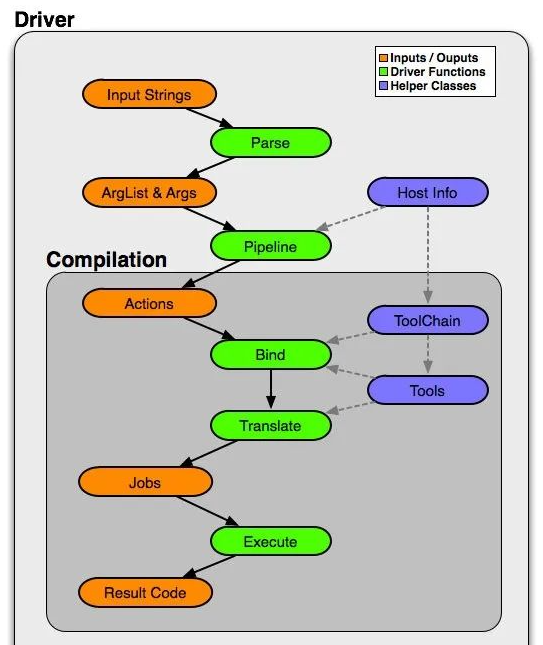
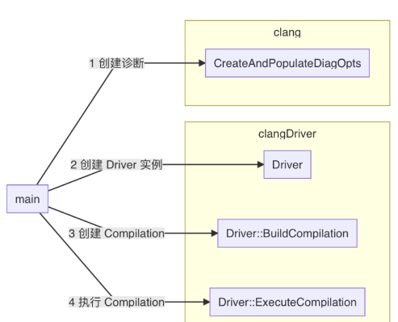

# clang driver流程简介

clang driver负责调用编译命令和ld命令, 注意其自身不会对源码进行编译.

clang dirver的处理逻辑分为以下几步:

(1) Parse: Option Parsing: 解析传入参数

(2) Pipeline: Compilation Action Construction: 根据每个输入的文件和类型, 组建`action`(比如`PreprocerssJobAction`)

可通过`clang -ccc-print-phases`查看需要处理的`action`:

```shell
../clang -ccc-print-phases -o main main.c test.c
            +- 0: input, "main.c", c
         +- 1: preprocessor, {0}, cpp-output
      +- 2: compiler, {1}, ir
   +- 3: backend, {2}, assembler
+- 4: assembler, {3}, object
|           +- 5: input, "test.c", c
|        +- 6: preprocessor, {5}, cpp-output
|     +- 7: compiler, {6}, ir
|  +- 8: backend, {7}, assembler
|- 9: assembler, {8}, object
10: linker, {4, 9}, image

```

可以看到`action`是对应编译阶段的, 对每个输入的文件都执行预处理、编译、汇编、链接等.

(3) Bind: Tool & Filename Selection: 根据`action`选择对应的工具和文件名信息: 

可以通过`clang -ccc-print-bindings`查看对应的工具和文件名信息:

```shell
../clang -ccc-print-bindings -o mian main.c test.c
# "x86_64-unknown-linux-gnu" - "clang", inputs: ["main.c"], output: "/tmp/main-e03dea.o"
# "x86_64-unknown-linux-gnu" - "clang", inputs: ["test.c"], output: "/tmp/test-6e96f8.o"
# "x86_64-unknown-linux-gnu" - "GNU::Linker", inputs: ["/tmp/main-e03dea.o", "/tmp/test-6e96f8.o"], output: "mian"
```

(4) Translate: Tool Specific Arugment Translation: 根据输入的参数转换为不同工具的参数.

可以通过`-v`选项查看各个工具的详细参数:

```shell
../clang -v -o mian main.c test.cclang version 16.0.4 (https://xxx@github.com/qaqcatz/ifbuild-explore.git 134755251deec6c7134e579c79bdc8b5172653cf)
...
 "/home/hzy/hzydata/projects/ifbuild-explore/llvm-project-llvmorg-16.0.4/llvm/cmake-build-debug/bin/clang-16" -cc1 -triple x86_64-unknown-linux-gnu ... main.c
...
End of search list.
 "/home/hzy/hzydata/projects/ifbuild-explore/llvm-project-llvmorg-16.0.4/llvm/cmake-build-debug/bin/clang-16" -cc1 -triple x86_64-unknown-linux-gnu ... test.c
...
 "/usr/bin/ld" -pie ... -o mian ... /tmp/main-eb7562.o /tmp/test-5dd66a.o ...
```

(5) Execute: 调用不同的工具执行任务

该步骤会通过创建子进程的方式调用不同工具, 比如上述任务中会创建两个`clang -cc1`进程和一个`ld`进程, 分别负责编译`test.c`、`main.c`以及链接相应的`.o`文件.

上述流程可以用这张图来表示:



# clang driver源码概览

entry point: `clang/tools/driver/driver.cpp#372, int clang_main(int Argc, char **Argv)`

以`clang -o main main.c test.c`为例, clang执行的流程如下:

1. clang会以driver模式被调用
2. clang driver会构建3个`Job`s:
   * 前两个`Job`是两个`cc1`任务，负责编译`main.c`与`test.c`
   * 第三个`Job`是`ld`任务
3. 最后, clang会创建3个进程执行上述3个`Job`

具体而言, clang会先进行一些参数处理, 主要如下:

* 判断当前执行的是否是clang-cl. clang-cl是为了兼容Visual C++而设计的, 这里我们并不关注, 忽略和clang-cl以及windows相关的设置.
* 判断clang是以cc1模式执行还是driver模式执行
   ```c++
   // Handle -cc1 integrated tools, even if -cc1 was expanded from a response
   // file.
   auto FirstArg = llvm::find_if(llvm::drop_begin(Args),
                                   [](const char *A) { return A != nullptr; });
   if (FirstArg != Args.end() && StringRef(*FirstArg).startswith("-cc1")) {
   // If -cc1 came from a response file, remove the EOL sentinels.
   if (MarkEOLs) {
      auto newEnd = std::remove(Args.begin(), Args.end(), nullptr);
      Args.resize(newEnd - Args.begin());
   }
   return ExecuteCC1Tool(Args);
   }
   ```
* Handle options that need handling before the real command line parsing in Driver::BuildCompilation() (i.e., "-canonical-prefixes", "-no-canonical-prefixes").
* Handle CCC_OVERRIDE_OPTIONS, used for editing a command line behind the scenes.
* 获取clang executable path: `std::string Path = GetExecutablePath(Args[0], CanonicalPrefixes);`, 这里是bin下的clang-16.
* 判断是以新进程的方式启动cc1, 还是在当前进程中运行cc1. 在windows, 在当前进程中运行cc1可以提升效率, 且方便调试.
   ```c++
   // Whether the cc1 tool should be called inside the current process, or if we
   // should spawn a new clang subprocess (old behavior).
   // Not having an additional process saves some execution time of Windows,
   // and makes debugging and profiling easier.
   bool UseNewCC1Process = CLANG_SPAWN_CC1;
   for (const char *Arg : Args)
       UseNewCC1Process = llvm::StringSwitch<bool>(Arg)
                           .Case("-fno-integrated-cc1", true)
                           .Case("-fintegrated-cc1", false)
                           .Default(UseNewCC1Process);
   
   // # 534
   if (!UseNewCC1Process) {
      TheDriver.CC1Main = &ExecuteCC1Tool;
      // Ensure the CC1Command actually catches cc1 crashes
      llvm::CrashRecoveryContext::Enable();
   }
   ```

处理完参数后, 接下来的流程可以总结为下图:



(1) main函数会先创建诊断实例(`DiagnosticsEngine`)

诊断是编译器与开发者进行交互的重要部分。编译器通过诊断可以提供错误、警告或建议。

```c++
DiagnosticsEngine Diags(DiagID, &*DiagOpts, DiagClient);
```

比如`clang/include/clang/Basic/DiagnosticDriverKinds.td`下就维护了`Driver`的诊断信息:

```shell
let Component = "Driver" in {

def err_drv_no_such_file : Error<"no such file or directory: '%0'">;
def err_drv_no_such_file_with_suggestion : Error<
  "no such file or directory: '%0'; did you mean '%1'?">;
def err_drv_unsupported_opt : Error<"unsupported option '%0'">;
...
```

(2) 接着, main函数会创建`Driver`实例`TheDriver`, `TheDriver`负责后续的driver相关业务.

```c++
Driver TheDriver(Path, llvm::sys::getDefaultTargetTriple(), Diags);
```

(3) 通过`Driver`的`BuildCompilation`方法生成需要执行的命令

```c++
std::unique_ptr<Compilation> C(TheDriver.BuildCompilation(Args));
```
`BuildCompilation`中:

(3.1) 调用`ParseArgStrings`函数处理参数, 以及解析配置文件. 另外, `BuildCompilation`也会处理`OPT_canonical_prefixes`、`OPT_no_canonical_prefixes`、`OPT_fintegrated_cc1`、`OPT_fno_integrated_cc1`等选项以及`OPT_ccc_print_phases`、`OPT_ccc_print_bindings`、`OPT_ccc_gcc_name`等ccc选项. 另外, 也会处理`CLMode`、`DXCMode`等特殊的Driver mode, 处理`offload`选项，处理LTO选项，处理C++20选项，这里不讨论.

(3.2) 调用`TranslateInputArgs`进行参数转换, 原始参数和转换后的参数会对应`Compilation`的`Args`和`TranslatedArgs`. 注意toolchains可能还会有自己的参数转换函数, 做进一步的转换.

(3.3) 通过`computeTargetTriple`函数获取triple并通过`getToolChain`函数获取对应的`ToolChain`:

```c++
// Owned by the host.
const ToolChain &TC = getToolChain(
   *UArgs, computeTargetTriple(*this, TargetTriple, *UArgs));
```

`Triple`记录了一些体系结构、OS信息, 如arm、x86、Linux、Win32等. 详细信息可以查看`llvm/include/llvm/TargetParser/Triple.h`. 另外, Triple加这个名字是历史遗留原因, 当时这些信息还只是个三元组. 很多命令行参数都可能影响`Triplp`的生成, 比如`-arch arm64`、 `-target -target arm64-apple-ios11.1`等.

`ToolChain`可以理解为编译工具; GNU的MinGW, 微软的MSVC都属于工具链. 详细信息可以查看`clang/include/clang/Driver/ToolChain.h`. 

这里`ToolChain`的实现是`clang::driver::toolchains::linux`. 详细信息可以查看`clang/lib/Driver/ToolChains/Linux.h`, 继承自`Generic_ELF`, `Generic_ELF`继承自`Generic_GCC`, 都在`clang/lib/Driver/ToolChains/Gnu.h`中

(3.4) 创建`Compilation`, 这里为其填充参数:

```c++
Compilation *C = new Compilation(*this, TC, UArgs.release(), TranslatedArgs,
                                 ContainsError);
```

(3.5) 通过`BuildInputs`获取输入文件:

```c++
// Construct the list of inputs.
InputList Inputs;
BuildInputs(C->getDefaultToolChain(), *TranslatedArgs, Inputs);
```

结果保存在`Inputs`中.

`BuildInputs`方法会遍历所有的参数, 并筛选`Option::InputClass`类型的参数. 最后会调用函数 `types::ID types::lookupTypeForExtension(llvm::StringRef Ext)`获取对应的`types::ID`. `types::ID types::lookupTypeForExtension(llvm::StringRef Ext)`函数会根据输入文件的扩展名获取该文件的类型`TY_OBJC`

(3.6) 调用`BuildActions`构建`Action`

```c++
// Construct the list of abstract actions to perform for this compilation. On
// MachO targets this uses the driver-driver and universal actions.
if (TC.getTriple().isOSBinFormatMachO())
   BuildUniversalActions(*C, C->getDefaultToolChain(), Inputs);
else
   BuildActions(*C, C->getArgs(), Inputs, C->getActions());
```

结果保存在`C->getActions()`中. 

这是一个`ActionsList`, 其实就是个`SmallVector`, 里面存储的元素类型是`Action*`. `Action`以树状结构组织, 每个`Action`中还会套一个`ActionList`类型的`Inputs`, 详细信息在`clang/include/clang/Driver/Action.h`中. 可以递归查看每个`Action`的`Kind`来判断这个`Action`做的是什么任务, 比如链接、汇编或预处理. 最终效果和`clang -ccc-print-phases`是相同的.

关于`Kind`, 我们可以看到`Action.h`下面有一个继承`Action`的`JobAction`, `JobAction`又可以分为`PreprocessJobAction`、`PrecompileJobAction`、`ExtractAPIJobAction`、`AnalyzeJobAction`、`MigrateJobAction`、`CompileJobAction`、`BackendJobAction`、`AssembleJobAction`、`IfsMergeJobAction`、`LinkJobAction`... , 其`Kind`分别为`PreprocessJobClass`、`PrecompileJobClass`、`ExtractAPIJobClass`、`AnalyzeJobClass`、`MigrateJobClass`、`CompileJobClass`、`BackendJobClass`、`AssembleJobClass`、`IfsMergeJobClass`、`LinkJobClass`... .

(3.7) 调用`BuildJobs`函数构建`Jobs`:

```c++
BuildJobs(*C);
```

结果保存在`C->Jobs`中. 

这是一个`JobList`, 定义在`clang/include/clang/Driver/Job.h`中. 其成员中有一项`Jobs`, 是一个`SmallVector`, 元素类型为`Command*`. `Command`中, 我们可以通过`Executable`获取执行命令的程序路径, 用`Arguments`获取命令参数. 另外, `Job`也帮我们做了一些参数处理, 我们可以通过`OutputFilenames`获取目标文件名. 这部分对应driver的`Bind`和`Translate`阶段.

这里`Jobs`中共有3项, 可以用gdb查看:

```c++
(gdb) print (*(C->Jobs.getJobs().begin()))->Executable
$15 = 0x16d24f40 "/home/hzy/hzydata/projects/ifbuild-explore/llvm-project-llvmorg-16.0.4/llvm/cmake-build-debug/bin/clang-16"

(gdb) print (*(C->Jobs.getJobs().begin()))->OutputFilenames
$16 = std::vector of length 1, capacity 1 = {"/tmp/main-d30327.o"}

(gdb) print (*(C->Jobs.getJobs().begin() + 1))->OutputFilenames
$17 = std::vector of length 1, capacity 1 = {"/tmp/test-1072a5.o"}

(gdb) print (*(C->Jobs.getJobs().begin() + 1))->Arguments[0]
$19 = (const char *&) @0x16d2a870: 0x6e94d61 "-cc1"

(gdb) print (*(C->Jobs.getJobs().begin() + 2))->Executable
$21 = 0x16d2b1b0 "/usr/bin/ld"
```

这些命令和我们用`-v`查看是一致的.

(4) 当`Driver`构造完`Jobs`后, 会通过`Driver`的`ExecuteCompilation`方法执行命令:

```c++
Res = TheDriver.ExecuteCompilation(*C, FailingCommands);
```

(4.1) 调用`Compilation`的`ExecuteJobs`方法:

```c++
C.ExecuteJobs(C.getJobs(), FailingCommands);
```

(4.2) 遍历每个`Job`, 调用`Compilation`的`ExecuteCommand`方法:

```c++
void Compilation::ExecuteJobs(const JobList &Jobs,
                              FailingCommandList &FailingCommands,
                              bool LogOnly) const {
  // According to UNIX standard, driver need to continue compiling all the
  // inputs on the command line even one of them failed.
  // In all but CLMode, execute all the jobs unless the necessary inputs for the
  // job is missing due to previous failures.
  for (const auto &Job : Jobs) {
    if (!InputsOk(Job, FailingCommands))
      continue;
    const Command *FailingCommand = nullptr;
    if (int Res = ExecuteCommand(Job, FailingCommand, LogOnly)) {
      FailingCommands.push_back(std::make_pair(Res, FailingCommand));
      // Bail as soon as one command fails in cl driver mode.
      if (TheDriver.IsCLMode())
        return;
    }
  }
}
```

(4.3) 调用`Command`的`Execute`方法. (记得每个`Job`就是一个`Command`)

```c++
int Res = C.Execute(Redirects, &Error, &ExecutionFailed);
```

这里有3个`Job`, 我们分开讨论. 

首先是前两个`Job`, 其`Command`为`CC1Command`, 会调用`CC1Command`的`Execute`方法:

```c++
int CC1Command::Execute(ArrayRef<std::optional<StringRef>> Redirects,
                        std::string *ErrMsg, bool *ExecutionFailed) const {
  // FIXME: Currently, if there're more than one job, we disable
  // -fintegrate-cc1. If we're no longer a integrated-cc1 job, fallback to
  // out-of-process execution. See discussion in https://reviews.llvm.org/D74447
  if (!InProcess)
    return Command::Execute(Redirects, ErrMsg, ExecutionFailed);
```

这里`InProcess`告诉我们命令需要在新进程内执行. 

第三个`Job`是做链接的, 不需要像cc1那样判断是否要在新进程中执行, 链接是一定要在新进程中执行的. `C`的类型就是`Command`, 会直接调用`Command`的`Execute`方法.

(4.4) 调用`Command`的`Execute`方法:

```c++
return llvm::sys::ExecuteAndWait(Executable, Args, Env, Redirects,
                                 /*secondsToWait*/ 0, /*memoryLimit*/ 0,
                                 ErrMsg, ExecutionFailed, &ProcStat);
```

`ExecuteAndWait`是`llvm-project-llvmorg-16.0.4/llvm/lib/Support/Program.cpp`中的方法, 会调用`fork`+`exec`族(或`posix_spawn`), `wait`等方法实现创建外部进行执行命令, 并等待外部进程结束. 具体的执行流程我们就不关心了. 到此为止Driver的工作机制就清晰了.

# cc1各编译阶段

现在我们来调试预处理, 词法分析, 语法分析, 语义分析, IR生成, IR优化, 代码生成, 汇编等阶段. 主要是为了初步认识各个阶段对应clang/llvm中的哪部分代码.

**time-trace**

我们沿着time-trace进行分析. 该功能负责统计各编译阶段的执行时间. 我们可以通过time-trace的名字来判断当前在执行哪个阶段.

time-trace对应的类是`llvm::TimeTraceScope`, 位于`llvm/include/llvm/Support/TimeProfiler.h`. 我们无需了解其细节, 只需知道`TimeTraceScope`用的是RAII机制进行时间统计即可. 例如之前提到过的cc1_main中的ExecuteCompilerInvocation:

```c++
  // Execute the frontend actions.
  {
    llvm::TimeTraceScope TimeScope("ExecuteCompiler");
    Success = ExecuteCompilerInvocation(Clang.get());
  }
```

可以看到最外层套了一个大括号, 大括号中的第一行是TimeScope对象的创建, 此时将开启计时器. 当离开大括号时, 根据RAII机制会自动调用TimeScope对象的析构函数, 关闭计时器.

根据TimeScope的名字, 我们可以知道当前计时器统计的是整个编译过程的时间.

**delta-debugging**

注意, 如果time-trace无法细粒度区分各个阶段, 我们会配合clang单独编译各阶段的指令进行delta-debugging, 例如:

```shell
# 只进行预处理
clang -E main.c
# 只进行词法分析:
clang -Xclang -tokens -fsyntax-only main.c
# 查看AST(语法分析+语义分析):
clang -Xclang -ast-print main.c
# 只生成IR
clang -S -emit-llvm main.c
# 只生成汇编代码
clang -S main.c
```

通过将这些单独的阶段与完整的编译进行delta-debugging, 我们就能知道哪个阶段对应哪块代码了.

接下来我们继续分析上一节留下的ParseAST(), 各编译阶段也会在这个函数中开展.

(1) Frontend

进入ParseAST()后, 我们会看到一个TimeScope("Frontend"), 编译前端将在这个代码块中开展:

```c++
  if (HaveLexer) {
    llvm::TimeTraceScope TimeScope("Frontend");
    P.Initialize();
    Parser::DeclGroupPtrTy ADecl;
    Sema::ModuleImportState ImportState;
    EnterExpressionEvaluationContext PotentiallyEvaluated(
        S, Sema::ExpressionEvaluationContext::PotentiallyEvaluated);

    for (bool AtEOF = P.ParseFirstTopLevelDecl(ADecl, ImportState); !AtEOF;
         AtEOF = P.ParseTopLevelDecl(ADecl, ImportState)) {
      // If we got a null return and something *was* parsed, ignore it.  This
      // is due to a top-level semicolon, an action override, or a parse error
      // skipping something.
      if (ADecl && !Consumer->HandleTopLevelDecl(ADecl.get()))
        return;
    }
  }
```

(1.1) 预处理与词法分析

接下来通过delta debugging分析预处理和词法分析对应的代码. 注意预处理器和词法分析是协作进行的.

> 注意用-E时cc1会在当前进程执行, 因此不用捕获cc1的编译命令开一个新进程调试, 直接在当前进程调试即可

注意加-E后, 当前的FrontendAction就不是EmitObjAction了(EmitObjAction会进一步调用CodeGenAction::ExecuteAction), 而是PrintPreprocessedAction, 会继续调用PrintPreprocessedAction::ExecuteAction(), 然后调用DoPrintPreprocessedInput:

```c++
  DoPrintPreprocessedInput(CI.getPreprocessor(), OS.get(),
                           CI.getPreprocessorOutputOpts());
```

在DoPrintPreprocessedInput中(`llvm-project-llvmorg-16.0.4/clang/lib/Frontend/PrintPreprocessedOutput.cpp`), 经过一系列的配置, 最终来到了预处理器和词法分析的主要代码:

```c++
// After we have configured the preprocessor, enter the main file.
  PP.EnterMainSourceFile();
  if (Opts.DirectivesOnly)
    PP.SetMacroExpansionOnlyInDirectives();

  // Consume all of the tokens that come from the predefines buffer.  Those
  // should not be emitted into the output and are guaranteed to be at the
  // start.
  const SourceManager &SourceMgr = PP.getSourceManager();
  Token Tok;
  do {
    PP.Lex(Tok);
    if (Tok.is(tok::eof) || !Tok.getLocation().isFileID())
      break;

    PresumedLoc PLoc = SourceMgr.getPresumedLoc(Tok.getLocation());
    if (PLoc.isInvalid())
      break;

    if (strcmp(PLoc.getFilename(), "<built-in>"))
      break;
  } while (true);

  // Read all the preprocessed tokens, printing them out to the stream.
  PrintPreprocessedTokens(PP, Tok, Callbacks, *OS);
```

可以看到预处理器和词法分析的代码主要是一个EnterMainSourceFile和一个循环PP.Lex()的过程. 根据代码注释, EnterMainSourceFile负责初始化预处理器, PP.Lex()负责解析每个Token, 如果该Token来自外部, 则调用预处理器进行外部解析. 

回到ParseAST, 可以看到开启前端分析前确实有代码`S.getPreprocessor().EnterMainSourceFile();`负责初始化预处理器. 接着来看`P.Initialize();`, 这里负责实际的预处理和词法分析:

```c++
if (HaveLexer) {
    llvm::TimeTraceScope TimeScope("Frontend");
    P.Initialize();
    Parser::DeclGroupPtrTy ADecl;
    ...
```

`Parse::initialize()`会调用`ConsumeToken()`处理各个Token:

```c++
  // Prime the lexer look-ahead.
  ConsumeToken();
```

`ConsumeToken()`会调用`PP.Lex()`进行预处理+词法分析:

```c++
  /// ConsumeToken - Consume the current 'peek token' and lex the next one.
  /// This does not work with special tokens: string literals, code completion,
  /// annotation tokens and balanced tokens must be handled using the specific
  /// consume methods.
  /// Returns the location of the consumed token.
  SourceLocation ConsumeToken() {
    assert(!isTokenSpecial() &&
           "Should consume special tokens with Consume*Token");
    PrevTokLocation = Tok.getLocation();
    PP.Lex(Tok);
    return PrevTokLocation;
  }
```

(1.2) 语法分析, 语义分析, IR生成

语法分析和语义分析主要对应ParseAST的P.ParseFirstTopLevelDecl和P.ParseTopLevelDecl:

```c++
    for (bool AtEOF = P.ParseFirstTopLevelDecl(ADecl, ImportState); !AtEOF;
         AtEOF = P.ParseTopLevelDecl(ADecl, ImportState)) {
      // If we got a null return and something *was* parsed, ignore it.  This
      // is due to a top-level semicolon, an action override, or a parse error
      // skipping something.
      if (ADecl && !Consumer->HandleTopLevelDecl(ADecl.get()))
        return;
    }
```

`Consumer->HandleTopLevelDecl`会这里会实例化成`CodenGenAction::HandleTopLevelDecl`, 为各个声明创建IR:

```c++
bool HandleTopLevelDecl(DeclGroupRef D) override {
      PrettyStackTraceDecl CrashInfo(*D.begin(), SourceLocation(),
                                     Context->getSourceManager(),
                                     "LLVM IR generation of declaration");

      // Recurse.
      if (TimerIsEnabled) {
        LLVMIRGenerationRefCount += 1;
        if (LLVMIRGenerationRefCount == 1)
          LLVMIRGeneration.startTimer();
      }

      Gen->HandleTopLevelDecl(D);

      if (TimerIsEnabled) {
        LLVMIRGenerationRefCount -= 1;
        if (LLVMIRGenerationRefCount == 0)
          LLVMIRGeneration.stopTimer();
      }

      return true;
    }
```

接着来看ParseAST中的`Consumer->HandleTranslationUnit(S.getASTContext());`, 这里会实例化调用`CodeGenAction::HandleTranslationUnit`:

```c++
    void HandleTranslationUnit(ASTContext &C) override {
      {
        llvm::TimeTraceScope TimeScope("Frontend");
        PrettyStackTraceString CrashInfo("Per-file LLVM IR generation");
        if (TimerIsEnabled) {
          LLVMIRGenerationRefCount += 1;
          if (LLVMIRGenerationRefCount == 1)
            LLVMIRGeneration.startTimer();
        }

        Gen->HandleTranslationUnit(C);

        if (TimerIsEnabled) {
          LLVMIRGenerationRefCount -= 1;
          if (LLVMIRGenerationRefCount == 0)
            LLVMIRGeneration.stopTimer();
        }

        IRGenFinished = true;
      }

      ...

      EmitBackendOutput(Diags, HeaderSearchOpts, CodeGenOpts, TargetOpts,
                        LangOpts, C.getTargetInfo().getDataLayoutString(),
                        getModule(), Action, std::move(AsmOutStream));

      Ctx.setDiagnosticHandler(std::move(OldDiagnosticHandler));

      if (OptRecordFile)
        OptRecordFile->keep();
    }
```

`HandleTranslationUnit`会通过`Gen->HandleTranslationUnit(C);`将每个文件的AST转换成IR.

这里的Gen会被实例化成`CodeGeneratorImpl`, 位于`clang/lib/CodeGen/ModuleBuilder.cpp`, `HandleTranslationUnit`会调用`Builder->Release();`:

```c++
    void HandleTranslationUnit(ASTContext &Ctx) override {
      // Release the Builder when there is no error.
      if (!Diags.hasErrorOccurred() && Builder)
        Builder->Release();

      // If there are errors before or when releasing the Builder, reset
      // the module to stop here before invoking the backend.
      if (Diags.hasErrorOccurred()) {
        if (Builder)
          Builder->clear();
        M.reset();
        return;
      }
    }
```

(1.3) IR优化

继续分析`HandleTranslationUnit`, 在函数结尾时会调用`EmitBackendOutput()`开启后端分析, 这个函数位于`clang/lib/CodeGen/BackendUtil.cpp`:

```c++
void clang::EmitBackendOutput(DiagnosticsEngine &Diags,
                              const HeaderSearchOptions &HeaderOpts,
                              const CodeGenOptions &CGOpts,
                              const clang::TargetOptions &TOpts,
                              const LangOptions &LOpts,
                              StringRef TDesc, Module *M,
                              BackendAction Action,
                              std::unique_ptr<raw_pwrite_stream> OS) {

  llvm::TimeTraceScope TimeScope("Backend");

  ...

  EmitAssemblyHelper AsmHelper(Diags, HeaderOpts, CGOpts, TOpts, LOpts, M);
  AsmHelper.EmitAssembly(Action, std::move(OS));

  ...
}
```

`EmitBackendOutput()`会进一步调用`AsmHelper.EmitAssembly`, 该函数同样位于`clang/lib/CodeGen/BackendUtil.cpp` 中:

```c++
void EmitAssemblyHelper::EmitAssembly(BackendAction Action,
                                      std::unique_ptr<raw_pwrite_stream> OS) {
  ...
  RunOptimizationPipeline(Action, OS, ThinLinkOS);
  RunCodegenPipeline(Action, OS, DwoOS);
  ...
}
```

可以看到这里有两个重要的函数, `RunOptimizationPipeline`与`RunCodegenPipeline`, 分别负责IR优化和代码生成. 先来看`RunOptimizationPipeline`:

```c++
void EmitAssemblyHelper::RunOptimizationPipeline(
    BackendAction Action, std::unique_ptr<raw_pwrite_stream> &OS,
    std::unique_ptr<llvm::ToolOutputFile> &ThinLinkOS) {
  std::optional<PGOOptions> PGOOpt;

  ...
      
  // Now that we have all of the passes ready, run them.
  {
    PrettyStackTraceString CrashInfo("Optimizer");
    llvm::TimeTraceScope TimeScope("Optimizer");
    MPM.run(*TheModule, MAM);
  }
}
```

这个函数很长, 不过我们只关心其尾部即可. 这里`RunOptimizationPipeline`调用了`MPM.run(*TheModule, MAM);`启动了`PassManager`, 之后就是我们熟悉的Pass处理流程了.

(1.4) 代码生成

代码生成对应`RunCodegenPipeline`:

```c++
void EmitAssemblyHelper::RunCodegenPipeline(
    BackendAction Action, std::unique_ptr<raw_pwrite_stream> &OS,
    std::unique_ptr<llvm::ToolOutputFile> &DwoOS) {
  // We still use the legacy PM to run the codegen pipeline since the new PM
  // does not work with the codegen pipeline.
  // FIXME: make the new PM work with the codegen pipeline.
  legacy::PassManager CodeGenPasses;

  // Append any output we need to the pass manager.
  switch (Action) {
  case Backend_EmitAssembly:
  case Backend_EmitMCNull:
  case Backend_EmitObj:
    CodeGenPasses.add(
        createTargetTransformInfoWrapperPass(getTargetIRAnalysis()));
    if (!CodeGenOpts.SplitDwarfOutput.empty()) {
      DwoOS = openOutputFile(CodeGenOpts.SplitDwarfOutput);
      if (!DwoOS)
        return;
    }
    if (!AddEmitPasses(CodeGenPasses, Action, *OS,
                       DwoOS ? &DwoOS->os() : nullptr))
      // FIXME: Should we handle this error differently?
      return;
    break;
  default:
    return;
  }

  {
    PrettyStackTraceString CrashInfo("Code generation");
    llvm::TimeTraceScope TimeScope("CodeGenPasses");
    CodeGenPasses.run(*TheModule);
  }
}
```

代码生成也是个Pass, 目前还是使用的传统的PassManager(`llvm-project-llvmorg-16.0.4/llvm/lib/IR/LegacyPassManager.cpp`), 未来可能会换成新的:

```c++
/// run - Execute all of the passes scheduled for execution.  Keep track of
/// whether any of the passes modifies the module, and if so, return true.
bool PassManager::run(Module &M) {
  return PM->run(M);
```

接着调用`PassManagerImpl::run()`:

```c++
//
/// run - Execute all of the passes scheduled for execution.  Keep track of
/// whether any of the passes modifies the module, and if so, return true.
bool PassManagerImpl::run(Module &M) {
  bool Changed = false;

  dumpArguments();
  dumpPasses();

  for (ImmutablePass *ImPass : getImmutablePasses())
    Changed |= ImPass->doInitialization(M);

  initializeAllAnalysisInfo();
  for (unsigned Index = 0; Index < getNumContainedManagers(); ++Index) {
    Changed |= getContainedManager(Index)->runOnModule(M);
    M.getContext().yield();
  }

  for (ImmutablePass *ImPass : getImmutablePasses())
    Changed |= ImPass->doFinalization(M);

  return Changed;
}
```

首先调用`runOnModule`, 注意这里只有1个Module, 就是我们编译的main.c:

```c++
/// Execute all of the passes scheduled for execution by invoking
/// runOnModule method.  Keep track of whether any of the passes modifies
/// the module, and if so, return true.
bool
MPPassManager::runOnModule(Module &M) {
  llvm::TimeTraceScope TimeScope("OptModule", M.getName());

  ...

  // Initialize module passes
  for (unsigned Index = 0; Index < getNumContainedPasses(); ++Index)
    ...

      LocalChanged |= MP->runOnModule(M);

	...

  return Changed;
}
```

在当前module上运行所有代码生成相关的ModulePass, 这里有两个Pass, 分别是`PreISelIntrinsicLoweringLegacyPass`和`FPPassManager`

`PreISelIntrinsicLoweringLegacyPass`与Intrinsics函数有关, 可以参考:https://zhuanlan.zhihu.com/p/53659330

`FPPassManager`管理着所有FunctionPasses, 这里相当于在接着在Module的所有Funtions上执行FunctionsPasses, 其定义在`llvm/include/llvm/IR/LegacyPassManagers.h`:

```c++
//===----------------------------------------------------------------------===//
// FPPassManager
//
/// FPPassManager manages BBPassManagers and FunctionPasses.
/// It batches all function passes and basic block pass managers together and
/// sequence them to process one function at a time before processing next
/// function.
class FPPassManager : public ModulePass, public PMDataManager {
public:
```

继续, 进入`FPPassManager::runOnModule`:

```c++
bool FPPassManager::runOnModule(Module &M) {
  bool Changed = false;

  for (Function &F : M)
    Changed |= runOnFunction(F);

  return Changed;
}
```

这里会遍历Module中的所有Funtions, 执行runOnFunction:

```c++
/// Execute all of the passes scheduled for execution by invoking
/// runOnFunction method.  Keep track of whether any of the passes modifies
/// the function, and if so, return true.
bool FPPassManager::runOnFunction(Function &F) {
  ...

  llvm::TimeTraceScope FunctionScope("OptFunction", F.getName());

  for (unsigned Index = 0; Index < getNumContainedPasses(); ++Index) {
    FunctionPass *FP = getContainedPass(Index);
    bool LocalChanged = false;

    llvm::TimeTraceScope PassScope("RunPass", FP->getPassName());

    ...
        
      LocalChanged |= FP->runOnFunction(F);

	...

  return Changed;
}
```

`FPPassManager::runOnFunction`这里会调用71个Pass, 分别是:

```shell
ExpandLargeDivRemLegacyPass
ExpandLargeFpConvertLegacyPass
AtomicExpand
X86LowerAMXIntrinsicsLegacyPass
X86LowerAMXTypeLegacyPass
VerifierLegacyPass
LowerIntrinsics
ShadowStackGCLowering
LowerConstantIntrinsics
UnreachableBlockElimLegacyPass
ExpandVectorPredication
...
MachineOptimizationRemarkEmitterPass
X86AsmPrinter
FreeMachineFunction
```

可以参考https://juejin.cn/post/6973562336200097799查看上述Pass的含义

重点关注`X86AsmPrinter`, 定义在`llvm/lib/Target/X86/X86AsmPrinter.cpp`中, 根据其文件注释可以判断出`X86AsmPrinter`的功能是将LLVM IR转换成X86机器码:

```c++
//===----------------------------------------------------------------------===//
//
// This file contains a printer that converts from our internal representation
// of machine-dependent LLVM code to X86 machine code.
//
//===----------------------------------------------------------------------===//
```

至此我们已经了解了LLVM将源码编译成机器码的整体流程.

# clang编译前端简介

重要的库:

* clangLex ：负责词法分析和预处理，处理宏、令牌和 pragma 构造
* clangAST：负责提供了构建、操作和遍历 AST 相关的功能
* clangParse：负责从词法分析的结果进行处理
* clangSema：负责语义分析
* clangCodeGen：负责生成 LLVM IR 代码


流程:

(1) main函数进入, 判断是否为cc1模式, 调用`ExecuteCC1Tool`:

```c++
  // Handle -cc1 integrated tools, even if -cc1 was expanded from a response
  // file.
  auto FirstArg = llvm::find_if(llvm::drop_begin(Args),
                                [](const char *A) { return A != nullptr; });
  if (FirstArg != Args.end() && StringRef(*FirstArg).startswith("-cc1")) {
    // If -cc1 came from a response file, remove the EOL sentinels.
    if (MarkEOLs) {
      auto newEnd = std::remove(Args.begin(), Args.end(), nullptr);
      Args.resize(newEnd - Args.begin());
    }
    return ExecuteCC1Tool(Args);
  }
```

(2) 通过`ExecuteCC1Tool`判断不同的cc1类型, 这里为`-cc1`类型, 因此调用`cc1_main`:

```c++
  if (Tool == "-cc1")
    return cc1_main(ArrayRef(ArgV).slice(1), ArgV[0], GetExecutablePathVP);
  if (Tool == "-cc1as")
    return cc1as_main(ArrayRef(ArgV).slice(2), ArgV[0], GetExecutablePathVP);
  if (Tool == "-cc1gen-reproducer")
    return cc1gen_reproducer_main(ArrayRef(ArgV).slice(2), ArgV[0],
                                  GetExecutablePathVP);
```

* cc1: LLVM 'Clang' Compiler
* cc1as: Clang Integrated Assembler
* cc1gen-reproducer: Generate Libclang invocation reproducers

`cc1_main`位于`clang/tools/driver/cc1_main.cpp`

(3) 调用`CompilerInvocation::CreateFromArgs`解析参数.

```c++
bool Success = CompilerInvocation::CreateFromArgs(Clang->getInvocation(),
                                                    Argv, Diags, Argv0);
```

(4) 调用`ExecuteCompilerInvocation`执行编译任务:

```c++
   // Execute the frontend actions.
  {
    llvm::TimeTraceScope TimeScope("ExecuteCompiler");
    Success = ExecuteCompilerInvocation(Clang.get());
  }
```

(5) `ExecuteCompilerInvocation`位于`clang/lib/FrontendTool/ExecuteCompilerInvocation.cpp`, 先判断是否打印help或version, 并尝试加载插件:

```c++
Clang->LoadRequestedPlugins();
```

经过一系列的判断后，比如-llvm, -analyzer-*, 才会通过`CreateFrontendAction`创建需要执行的编译器前端任务:

```c++
// Create and execute the frontend action.
std::unique_ptr<FrontendAction> Act(CreateFrontendAction(*Clang));
```

(6) 调用`CreateFrontendBaseAction`:

```c++
// Create the underlying action.
std::unique_ptr<FrontendAction> Act = CreateFrontendBaseAction(CI);
```

这里的分支会走到`EmitObj`, 相应地创建`EmitObjAction`:

```c++
switch (CI.getFrontendOpts().ProgramAction) {
  case ASTDeclList:            return std::make_unique<ASTDeclListAction>();
  case ASTDump:                return std::make_unique<ASTDumpAction>();
  case ASTPrint:               return std::make_unique<ASTPrintAction>();
  case ASTView:                return std::make_unique<ASTViewAction>();
  case DumpCompilerOptions:
    return std::make_unique<DumpCompilerOptionsAction>();
  case DumpRawTokens:          return std::make_unique<DumpRawTokensAction>();
  case DumpTokens:             return std::make_unique<DumpTokensAction>();
  case EmitAssembly:           return std::make_unique<EmitAssemblyAction>();
  case EmitBC:                 return std::make_unique<EmitBCAction>();
  case EmitHTML:               return std::make_unique<HTMLPrintAction>();
  case EmitLLVM:               return std::make_unique<EmitLLVMAction>();
  case EmitLLVMOnly:           return std::make_unique<EmitLLVMOnlyAction>();
  case EmitCodeGenOnly:        return std::make_unique<EmitCodeGenOnlyAction>();
  case EmitObj:                return std::make_unique<EmitObjAction>();
```

(7) 返回`ExecuteCompilerInvocation`, 调用`ExecuteAction`执行编译任务:

```c++
bool Success = Clang->ExecuteAction(*Act);
```

在进一步分析`ExecuteAction`前, 我们先来看一下`CompilerInstance`这个类. `CompilerInstance`是`clang/include/clang/Frontend/CompilerInstance.h`下一个非常重要的类, 它持有了诸如`preprocessor`、`AST`、`Sema`等属性:

```c++
/// The preprocessor.
  std::shared_ptr<Preprocessor> PP;

  /// The AST context.
  IntrusiveRefCntPtr<ASTContext> Context;

  /// An optional sema source that will be attached to sema.
  IntrusiveRefCntPtr<ExternalSemaSource> ExternalSemaSrc;

  /// The AST consumer.
  std::unique_ptr<ASTConsumer> Consumer;

  /// The code completion consumer.
  std::unique_ptr<CodeCompleteConsumer> CompletionConsumer;

  /// The semantic analysis object.
  std::unique_ptr<Sema> TheSema;
```

接下来我们继续来分析`CompilerInstance::ExecuteAction`的执行过程. 这个函数会用过`Inputs`获取输入文件, 并依次调用以下方法:

* `Act.BeginSourceFile()`
* `Act.Execute()`
* `Act.EndSourceFile()`

这里的`Act`就是前面提到的`EmitObjAction`.

```c++
  for (const FrontendInputFile &FIF : getFrontendOpts().Inputs) {
    // Reset the ID tables if we are reusing the SourceManager and parsing
    // regular files.
    if (hasSourceManager() && !Act.isModelParsingAction())
      getSourceManager().clearIDTables();

    if (Act.BeginSourceFile(*this, FIF)) {
      if (llvm::Error Err = Act.Execute()) {
        consumeError(std::move(Err)); // FIXME this drops errors on the floor.
      }
      Act.EndSourceFile();
    }
  }
```

(1) `Act.BeginSourceFile()`

(1.1) 创建`FileManager`和`SourceManager`

```c++
  // Set up the file and source managers, if needed.
  if (!CI.hasFileManager()) {
    if (!CI.createFileManager()) {
      return false;
    }
  }
  if (!CI.hasSourceManager()) {
    CI.createSourceManager(CI.getFileManager());
    if (CI.getDiagnosticOpts().getFormat() == DiagnosticOptions::SARIF) {
      static_cast<SARIFDiagnosticPrinter *>(&CI.getDiagnosticClient())
          ->setSarifWriter(
              std::make_unique<SarifDocumentWriter>(CI.getSourceManager()));
    }
  }
```

`FileManager`负责和文件系统交互，文件缓存、目录查找等任务

`SourceManager`负责查找并将文件缓存到内存

(1.2) 通过`createPreprocessor`函数创建预处理器

```c++
  // Set up the preprocessor if needed. When parsing model files the
  // preprocessor of the original source is reused.
  if (!isModelParsingAction())
    CI.createPreprocessor(getTranslationUnitKind());
```

(1.3) 通过`createASTContext`创建`ASTContext`

```c++
  // Create the AST context and consumer unless this is a preprocessor only
  // action.
  if (!usesPreprocessorOnly()) {
    // Parsing a model file should reuse the existing ASTContext.
    if (!isModelParsingAction())
      CI.createASTContext();
```

可以在`clang/include/clang/AST/ASTContext.h`中查看更多有关`ASTContext`的信息:

```c++
/// Holds long-lived AST nodes (such as types and decls) that can be
/// referred to throughout the semantic analysis of a file.
class ASTContext : public RefCountedBase<ASTContext> {
```

(1.4) 通过`FrontendAction::CreateWrappedASTConsumer`创建`ASTConsumer`:

```c++
    std::unique_ptr<ASTConsumer> Consumer =
        CreateWrappedASTConsumer(CI, PresumedInputFile);
```

可以在`clang/include/clang/AST/ASTConsumer.h`中查看更多有关`ASTConsumer`的信息:

```c++
/// ASTConsumer - This is an abstract interface that should be implemented by
/// clients that read ASTs.  This abstraction layer allows the client to be
/// independent of the AST producer (e.g. parser vs AST dump file reader, etc).
class ASTConsumer {
```

(2) `Act.Execute()`

`Act.Execute()`实际上是执行`EmitObjAction`继承自`FrontendAction`的`Execute`函数

(2.1) `FrontendAction:Execute`随后会调用`CodeGenAction::ExecuteAction`函数:

```c++
else ExecuteAction();
```
(2.2) 调用`ASTFrontendAction::ExecuteAction()`:

```c++
  if (getCurrentFileKind().getLanguage() != Language::LLVM_IR) {
    this->ASTFrontendAction::ExecuteAction();
    return;
  }
```

(2.3) `ASTFrontendAction::ExecuteAction`会调用`CompilerInstance`的`createSema`函数创建`Sema`:

```c++
  if (!CI.hasSema())
    CI.createSema(getTranslationUnitKind(), CompletionConsumer);
```

`Sema`会用于后续语义分析.

(2.4) 调用`clangParse`模块的`clang::ParseAST`构建abstract syntax tree.

```c++
  ParseAST(CI.getSema(), CI.getFrontendOpts().ShowStats,
           CI.getFrontendOpts().SkipFunctionBodies);
```

这里涉及编译前端的主要流程, 我们将在下一节重点分析.


(3) `Act.EndSourceFile()`

执行一些清理操作, 如关闭文件, 清空输出流等.

# Preprocesser and Lex

Important classes:

* `Token`: represents a token after Lexcial analysis.
* `Lexer`: converts text to `Token`.
* `Preprocessor`: responsible for Preprocessing, collaborate with `Lexer`.
* `IdentifierTable`: maps `string` to `IdentifierInfo`.
* `IdentifierInfo`: you can consider it as a identifier kind `Token`.

## Simple Lexcial Analysis Example

```cpp
void test() {
}
```

Debug command:

```shell
clang++ -cc1 -dump-tokens test.cpp
```

We start with `Preprocessor::Initialize`

Stack trace:

```shell
clang::Preprocessor::Initialize Preprocessor.cpp:186
clang::CompilerInstance::createPreprocessor CompilerInstance.cpp:470
clang::FrontendAction::BeginSourceFile FrontendAction.cpp:804
clang::CompilerInstance::ExecuteAction CompilerInstance.cpp:1045
clang::ExecuteCompilerInvocation ExecuteCompilerInvocation.cpp:264
cc1_main cc1_main.cpp:251
```

`Preprocessor::Initialize` will call `IdentifierTable::AddKeyWords` to initialize the language keywords (save in `IdentifierTable`):

```cpp
void Preprocessor::Initialize(const TargetInfo &Target,
                              const TargetInfo *AuxTarget) {
  ...
  // Populate the identifier table with info about keywords for the current language.
  Identifiers.AddKeywords(LangOpts);
  ...
}
```

You can find all the language keywords in `clang/include/clang/Basic/TokenKinds.def`:

```cpp
//===----------------------------------------------------------------------===//
// Preprocessor keywords.
//===----------------------------------------------------------------------===//

// These have meaning after a '#' at the start of a line. These define enums in
// the tok::pp_* namespace.  Note that IdentifierInfo::getPPKeywordID must be
// manually updated if something is added here.
PPKEYWORD(not_keyword)

// C99 6.10.1 - Conditional Inclusion.
PPKEYWORD(if)
PPKEYWORD(ifdef)
PPKEYWORD(ifndef)
PPKEYWORD(elif)
PPKEYWORD(elifdef)
PPKEYWORD(elifndef)
PPKEYWORD(else)
PPKEYWORD(endif)
PPKEYWORD(defined)

// C99 6.10.2 - Source File Inclusion.
PPKEYWORD(include)
PPKEYWORD(__include_macros)

// C99 6.10.3 - Macro Replacement.
PPKEYWORD(define)
PPKEYWORD(undef)

// C99 6.10.4 - Line Control.
PPKEYWORD(line)

...

//===----------------------------------------------------------------------===//
// Language keywords.
//===----------------------------------------------------------------------===//

...

KEYWORD(union                       , KEYALL)
KEYWORD(unsigned                    , KEYALL)
KEYWORD(void                        , KEYALL)
KEYWORD(volatile                    , KEYALL)
KEYWORD(while                       , KEYALL)
    
...
```

Then, clang will call `Preprocessor::Lex` to process each `Token` (fill this `Token`).

Stack trace:

```shell
clang::Preprocessor::Lex Preprocessor.cpp:879
clang::DumpTokensAction::ExecuteAction FrontendActions.cpp:934
clang::FrontendAction::Execute FrontendAction.cpp:1058
clang::CompilerInstance::ExecuteAction CompilerInstance.cpp:1046
clang::ExecuteCompilerInvocation ExecuteCompilerInvocation.cpp:264
cc1_main cc1_main.cpp:251
```

`Preprocessor::Lex` will call `Lexer::Lex` to process a `Token`. `Lexer::Lex` will first call `Result.startToken` to initialize (clean up) a new `Token`, then call `Lexer::LexTokenInternal`:

```cpp
bool Lexer::Lex(Token &Result) {
  assert(!isDependencyDirectivesLexer());

  // Start a new token.
  Result.startToken();
  ...
  bool returnedToken = LexTokenInternal(Result, atPhysicalStartOfLine);
  // (After the LexTokenInternal call, the lexer might be destroyed.)
  assert((returnedToken || !isRawLex) && "Raw lex must succeed");
  return returnedToken;
}
```

`Lexer::LexTokenInternal` will process each charactor one by one:

```cpp
bool Lexer::LexTokenInternal(Token &Result, bool TokAtPhysicalStartOfLine) {
LexStart:
  ...
  // Read a character, advancing over it.
  char Char = getAndAdvanceChar(CurPtr, Result);
  ...
  switch (Char) {
  ...
  case '\n':
    ...
    goto LexNextToken;
  case ' ':
  case '\t':
  case '\f':
  case '\v':
  	...
    goto LexNextToken;
  case '0': case '1': case '2': case '3': case '4':
  case '5': case '6': case '7': case '8': case '9':
    ...
  case 'u':
    ...
}
```

There are very, very many preprocessing statements before `void test() {\n}`. It is recommended to set a conditional breakpoint with condition `Char=='v'` to capture the first character `v` of `void`.

When meeting `v`, `Lexer::LexTokenInternal` will call `Lexer::LexIdentifierContinue` to process a identifier:

```cpp
  // C99 6.4.2: Identifiers.
  case 'A': case 'B': case 'C': case 'D': case 'E': case 'F': case 'G':
  case 'H': case 'I': case 'J': case 'K':    /*'L'*/case 'M': case 'N':
  case 'O': case 'P': case 'Q':    /*'R'*/case 'S': case 'T':    /*'U'*/
  case 'V': case 'W': case 'X': case 'Y': case 'Z':
  case 'a': case 'b': case 'c': case 'd': case 'e': case 'f': case 'g':
  case 'h': case 'i': case 'j': case 'k': case 'l': case 'm': case 'n':
  case 'o': case 'p': case 'q': case 'r': case 's': case 't':    /*'u'*/
  case 'v': case 'w': case 'x': case 'y': case 'z':
  case '_':
    // Notify MIOpt that we read a non-whitespace/non-comment token.
    MIOpt.ReadToken();
    return LexIdentifierContinue(Result, CurPtr);
```

`Lexer::LexIdentifier` will first use a while loop to read an identifier (`void`):

```cpp
  // Match [_A-Za-z0-9]*, we have already matched an identifier start.
  while (true) {
    unsigned char C = *CurPtr;
    // Fast path.
    if (isAsciiIdentifierContinue(C)) {
      ++CurPtr;
      continue;
    }
    ...
  }
```

Then, `Lex::LexIdentifierContinue` will call `Lexer::FromTokenWithChars` to update the `Token` (The token kind is `tok::raw_identifier`):

```cpp
  const char *IdStart = BufferPtr;
  FormTokenWithChars(Result, CurPtr, tok::raw_identifier);
```

`Lexer::FromTokenWithChars` will update the length / location / kind of the `Token`:

``` cpp
  /// FormTokenWithChars - When we lex a token, we have identified a span
  /// starting at BufferPtr, going to TokEnd that forms the token.  This method
  /// takes that range and assigns it to the token as its location and size.  In
  /// addition, since tokens cannot overlap, this also updates BufferPtr to be
  /// TokEnd.
  void FormTokenWithChars(Token &Result, const char *TokEnd,
                          tok::TokenKind Kind) {
    unsigned TokLen = TokEnd-BufferPtr;
    Result.setLength(TokLen);
    Result.setLocation(getSourceLocation(BufferPtr, TokLen));
    Result.setKind(Kind);
    BufferPtr = TokEnd;
  }
```

Next, `Lexer::LexIdentifierContinue` will call `Token::setRawIdentifierData` to update the `PtrData` of the `Token`:

```cpp
	Result.setRawIdentifierData(IdStart);
```

> Now, we can use `Result.getRawIdentifier().str()` to get the original text of the `Token`:
>
> ```shell
> (gdb) p Result.getRawIdentifier().str()
> $1 = "void"
> ```

Next, `Lexer::LexIdentifierContinue` will call `Preprocessor::LookUpIdentifierInfo` to further update the kind of the `Token`:

```cpp
  // Fill in Result.IdentifierInfo and update the token kind,
  // looking up the identifier in the identifier table.
  IdentifierInfo *II = PP->LookUpIdentifierInfo(Result);
```

`Preprocessor::LookUpIdentifierInfo` will call `Preprcessor::getIdentifierInfo` to check whether the current `Token` is a language keyword:

```cpp
  // Look up this token, see if it is a macro, or if it is a language keyword.
  IdentifierInfo *II;
  if (!Identifier.needsCleaning() && !Identifier.hasUCN()) {
    // No cleaning needed, just use the characters from the lexed buffer.
    II = getIdentifierInfo(Identifier.getRawIdentifier());
  } else {
  	...
  }
```

`Preprcessor::getIdentifierInfo` will call `IdentifierTable::get` to search the corresponding `IdentifierInfo`, which represents the language keyword `void ` here.

Next, `Preprocessor::LookUpIdentifierInfo` will update the kind of the `Token` according to the search result above:

```cpp
  // Update the token info (identifier info and appropriate token kind).
  // FIXME: the raw_identifier may contain leading whitespace which is removed
  // from the cleaned identifier token. The SourceLocation should be updated to
  // refer to the non-whitespace character. For instance, the text "\\\nB" (a
  // line continuation before 'B') is parsed as a single tok::raw_identifier and
  // is cleaned to tok::identifier "B". After cleaning the token's length is
  // still 3 and the SourceLocation refers to the location of the backslash.
  Identifier.setIdentifierInfo(II);
  Identifier.setKind(II->getTokenID());
```

Now, `Lexer::LexIdentifierContinue` convert the text "void" to a `Token` successfully.

## Lexcial Analysis with Preprocessing

```cpp
#define T(x) x
int test() {
    return T(0);
}
```

During initialization,  `Preprocessor::Preprocessor` will call `RegisterBuiltinMacros` to initialize some buildin macros, like `__LINE__`:

```cpp
Preprocessor::Preprocessor(std::shared_ptr<PreprocessorOptions> PPOpts,
                           DiagnosticsEngine &diags, LangOptions &opts,
                           SourceManager &SM, HeaderSearch &Headers,
                           ModuleLoader &TheModuleLoader,
                           IdentifierInfoLookup *IILookup, bool OwnsHeaders,
                           TranslationUnitKind TUKind)
    : PPOpts(std::move(PPOpts)), Diags(&diags), LangOpts(opts),
      FileMgr(Headers.getFileMgr()), SourceMgr(SM),
      ScratchBuf(new ScratchBuffer(SourceMgr)), HeaderInfo(Headers),
      TheModuleLoader(TheModuleLoader), ExternalSource(nullptr),
      // As the language options may have not been loaded yet (when
      // deserializing an ASTUnit), adding keywords to the identifier table is
      // deferred to Preprocessor::Initialize().
      Identifiers(IILookup), PragmaHandlers(new PragmaNamespace(StringRef())),
      TUKind(TUKind), SkipMainFilePreamble(0, true),
      CurSubmoduleState(&NullSubmoduleState) {
  OwnsHeaderSearch = OwnsHeaders;

  ...
  // Initialize the pragma handlers.
  RegisterBuiltinPragmas();

  // Initialize builtin macros like __LINE__ and friends.
  RegisterBuiltinMacros();
  ...
} 

/// RegisterBuiltinMacros - Register builtin macros, such as __LINE__ with the
/// identifier table.
void Preprocessor::RegisterBuiltinMacros() {
  Ident__LINE__ = RegisterBuiltinMacro(*this, "__LINE__");
  Ident__FILE__ = RegisterBuiltinMacro(*this, "__FILE__");
  Ident__DATE__ = RegisterBuiltinMacro(*this, "__DATE__");
  Ident__TIME__ = RegisterBuiltinMacro(*this, "__TIME__");
  Ident__COUNTER__ = RegisterBuiltinMacro(*this, "__COUNTER__");
  Ident_Pragma  = RegisterBuiltinMacro(*this, "_Pragma");
  Ident__FLT_EVAL_METHOD__ = RegisterBuiltinMacro(*this, "__FLT_EVAL_METHOD__");

  // C++ Standing Document Extensions.
  if (getLangOpts().CPlusPlus)
    Ident__has_cpp_attribute =
        RegisterBuiltinMacro(*this, "__has_cpp_attribute");
  else
    Ident__has_cpp_attribute = nullptr;

  ...
}
```

Now, we start with `Lexer::LexInternal`. When meeting a '#', it will goto the label `HandleDirective`, and call `Preprocessor::HandleDirective`.

```cpp
  case '#':
    Char = getCharAndSize(CurPtr, SizeTmp);
    if (Char == '#') {
      Kind = tok::hashhash;
      CurPtr = ConsumeChar(CurPtr, SizeTmp, Result);
    } else if (Char == '@' && LangOpts.MicrosoftExt) {  // #@ -> Charize
      Kind = tok::hashat;
      if (!isLexingRawMode())
        Diag(BufferPtr, diag::ext_charize_microsoft);
      CurPtr = ConsumeChar(CurPtr, SizeTmp, Result);
    } else {
      // We parsed a # character.  If this occurs at the start of the line,
      // it's actually the start of a preprocessing directive.  Callback to
      // the preprocessor to handle it.
      // TODO: -fpreprocessed mode??
      if (TokAtPhysicalStartOfLine && !LexingRawMode && !Is_PragmaLexer)
        goto HandleDirective;

      Kind = tok::hash;
    }
    break;
    
    ...

HandleDirective:
  // We parsed a # character and it's the start of a preprocessing directive.

  FormTokenWithChars(Result, CurPtr, tok::hash);
  PP->HandleDirective(Result);

  if (PP->hadModuleLoaderFatalFailure()) {
    // With a fatal failure in the module loader, we abort parsing.
    assert(Result.is(tok::eof) && "Preprocessor did not set tok:eof");
    return true;
  }

  // We parsed the directive; lex a token with the new state.
  return false;
```

`Preprocessor::HandleDirective` will call `Preprocessor::LexUnexpandedToken` to handle the next `Token` (the preprocessing directive):

```cpp
  // Read the next token, the directive flavor.  This isn't expanded due to
  // C99 6.10.3p8.
  LexUnexpandedToken(Result);
```

`Preprocessor::LexUnexpandedToken` will call `Preprocessor::Lex`...

```cpp
  /// Just like Lex, but disables macro expansion of identifier tokens.
  void LexUnexpandedToken(Token &Result) {
    // Disable macro expansion.
    bool OldVal = DisableMacroExpansion;
    DisableMacroExpansion = true;
    // Lex the token.
    Lex(Result);

    // Reenable it.
    DisableMacroExpansion = OldVal;
  }
```

Then, `Preprocessor::HandleDirective` will choose the corresponding branch according to the preprocessing directive:

```cpp
  switch (Result.getKind()) {
  case tok::eod:
    return;   // null directive.
  case tok::code_completion:
    ...
    return;
  case tok::numeric_constant:  // # 7  GNU line marker directive.
    ...
    return HandleDigitDirective(Result);
  default:
    IdentifierInfo *II = Result.getIdentifierInfo();
    if (!II) break; // Not an identifier.

    // Ask what the preprocessor keyword ID is.
    switch (II->getPPKeywordID()) {
    default: break;
    // C99 6.10.1 - Conditional Inclusion.
    case tok::pp_if:
      return HandleIfDirective(Result, SavedHash, ReadAnyTokensBeforeDirective);
    case tok::pp_ifdef:
      return HandleIfdefDirective(Result, SavedHash, false,
                                  true /*not valid for miopt*/);
    case tok::pp_ifndef:
      return HandleIfdefDirective(Result, SavedHash, true,
                                  ReadAnyTokensBeforeDirective);
    case tok::pp_elif:
    case tok::pp_elifdef:
    case tok::pp_elifndef:
      return HandleElifFamilyDirective(Result, SavedHash, II->getPPKeywordID());

    case tok::pp_else:
      return HandleElseDirective(Result, SavedHash);
    case tok::pp_endif:
      return HandleEndifDirective(Result);

    // C99 6.10.2 - Source File Inclusion.
    case tok::pp_include:
      // Handle #include.
      return HandleIncludeDirective(SavedHash.getLocation(), Result);
    case tok::pp___include_macros:
      // Handle -imacros.
      return HandleIncludeMacrosDirective(SavedHash.getLocation(), Result);

    // C99 6.10.3 - Macro Replacement.
    case tok::pp_define:
      return HandleDefineDirective(Result, ImmediatelyAfterTopLevelIfndef);
    case tok::pp_undef:
      return HandleUndefDirective();

    // C99 6.10.4 - Line Control.
    case tok::pp_line:
      return HandleLineDirective();

    // C99 6.10.5 - Error Directive.
    case tok::pp_error:
      return HandleUserDiagnosticDirective(Result, false);

    // C99 6.10.6 - Pragma Directive.
    case tok::pp_pragma:
      return HandlePragmaDirective({PIK_HashPragma, SavedHash.getLocation()});

    ...
    }
    break;
  }

```

Here we focus on `#define` (add a breakpoint to the case `tok::pp_define`), it will call `Preprocessor::HandleDefineDirective`. 

`Preprocessor::HandleDefineDirective` will call `Preprocessor::ReadMacroName` first to process the macro name:

```cpp
/// HandleDefineDirective - Implements \#define.  This consumes the entire macro
/// line then lets the caller lex the next real token.
void Preprocessor::HandleDefineDirective(
    Token &DefineTok, const bool ImmediatelyAfterHeaderGuard) {
  ++NumDefined;

  Token MacroNameTok;
  bool MacroShadowsKeyword;
  ReadMacroName(MacroNameTok, MU_Define, &MacroShadowsKeyword);
  ...
}
```

`Preprocessor::ReadMacroName` will call `Preprocessor::LexUnexpandedToken` to process the next `Token`:

```cpp
/// Lex and validate a macro name, which occurs after a
/// \#define or \#undef.
///
/// This sets the token kind to eod and discards the rest of the macro line if
/// the macro name is invalid.
///
/// \param MacroNameTok Token that is expected to be a macro name.
/// \param isDefineUndef Context in which macro is used.
/// \param ShadowFlag Points to a flag that is set if macro shadows a keyword.
void Preprocessor::ReadMacroName(Token &MacroNameTok, MacroUse isDefineUndef,
                                 bool *ShadowFlag) {
  // Read the token, don't allow macro expansion on it.
  LexUnexpandedToken(MacroNameTok);

  if (MacroNameTok.is(tok::code_completion)) {
    if (CodeComplete)
      CodeComplete->CodeCompleteMacroName(isDefineUndef == MU_Define);
    setCodeCompletionReached();
    LexUnexpandedToken(MacroNameTok);
  }

  if (!CheckMacroName(MacroNameTok, isDefineUndef, ShadowFlag))
    return;

  // Invalid macro name, read and discard the rest of the line and set the
  // token kind to tok::eod if necessary.
  if (MacroNameTok.isNot(tok::eod)) {
    MacroNameTok.setKind(tok::eod);
    DiscardUntilEndOfDirective();
  }
}
```

We can use `Token::getIdentifier()->getName()` to get the name of a `clang::tok::identifier` kind `Token`:

```shell
p MacroNameTok.getIdentifierInfo()->getName()
$7 = {static npos = 18446744073709551615, Data = 0x560b92f61a68 "__llvm__", Length = 8}
```

Here we only focus on `#define TEST(x) x` , so we set a conditional breakpoint `MacroNameTok.getIdentifier->getName().str().compare("TEST") == 0`.

After getting the `#define` name, `Preprocessor::HandleDefineDirective` will call `Preprocessor::ReadOptionalMacroParameterListAndBody` to read the entrie line:

```cpp
MacroInfo *const MI = ReadOptionalMacroParameterListAndBody(
      MacroNameTok, ImmediatelyAfterHeaderGuard);
```

```cpp
// ReadOptionalMacroParameterListAndBody - This consumes all (i.e. the
// entire line) of the macro's tokens and adds them to MacroInfo, and while
// doing so performs certain validity checks including (but not limited to):
//   - # (stringization) is followed by a macro parameter
//
//  Returns a nullptr if an invalid sequence of tokens is encountered or returns
//  a pointer to a MacroInfo object.

MacroInfo *Preprocessor::ReadOptionalMacroParameterListAndBody(
    const Token &MacroNameTok, const bool ImmediatelyAfterHeaderGuard) {

  Token LastTok = MacroNameTok;
  // Create the new macro.
  MacroInfo *const MI = AllocateMacroInfo(MacroNameTok.getLocation());

  Token Tok;
  LexUnexpandedToken(Tok);

  ...
      
  else if (Tok.is(tok::l_paren)) {
    // This is a function-like macro definition.  Read the argument list.
    MI->setIsFunctionLike();
    if (ReadMacroParameterList(MI, LastTok))
      return nullptr;

    // If this is a definition of an ISO C/C++ variadic function-like macro (not
    // using the GNU named varargs extension) inform our variadic scope guard
    // which un-poisons and re-poisons certain identifiers (e.g. __VA_ARGS__)
    // allowed only within the definition of a variadic macro.

    if (MI->isC99Varargs()) {
      VariadicMacroScopeGuard.enterScope();
    }

    // Read the first token after the arg list for down below.
    LexUnexpandedToken(Tok);
  }
  
  ...

  if (!Tok.is(tok::eod))
    LastTok = Tok;

  SmallVector<Token, 16> Tokens;

  // Read the rest of the macro body.
  if (MI->isObjectLike()) {
    // Object-like macros are very simple, just read their body.
    while (Tok.isNot(tok::eod)) {
      LastTok = Tok;
      Tokens.push_back(Tok);
      // Get the next token of the macro.
      LexUnexpandedToken(Tok);
    }
  } else {
    // Otherwise, read the body of a function-like macro.  While we are at it,
    // check C99 6.10.3.2p1: ensure that # operators are followed by macro
    // parameters in function-like macro expansions.

    VAOptDefinitionContext VAOCtx(*this);

    while (Tok.isNot(tok::eod)) {
      LastTok = Tok;

      ...

      // Things look ok, add the '#' and param name tokens to the macro.
      Tokens.push_back(LastTok);

      // If the token following '#' is VAOPT, let the next iteration handle it
      // and check it for correctness, otherwise add the token and prime the
      // loop with the next one.
      if (!VAOCtx.isVAOptToken(Tok)) {
        Tokens.push_back(Tok);
        LastTok = Tok;

        // Get the next token of the macro.
        LexUnexpandedToken(Tok);
      }
    }
    ...
  }
  MI->setDefinitionEndLoc(LastTok.getLocation());

  MI->setTokens(Tokens, BP);
  return MI;
}
```

Now you can use `clang/include/clang/Lex/MacroInfo.h` to get  the full message of this `#define`.

Next, let's analyze how to use this `#define` in the following lexcial analysis.

When processing a identifier, `Lexer::LexIdentifierContinue` will check whether it should be macro expanded. If so, it will call `Preprocessor::HandleIdentifier`:

```cpp
  // Finally, now that we know we have an identifier, pass this off to the
  // preprocessor, which may macro expand it or something.
  if (II->isHandleIdentifierCase())
    return PP->HandleIdentifier(Result);
```

`Preprocessor::HandleIdentifier` will call `Preprocessor::HandleMacroExpandedIdentifier` to expand the macro identifier:

```cpp
/// HandleIdentifier - This callback is invoked when the lexer reads an
/// identifier.  This callback looks up the identifier in the map and/or
/// potentially macro expands it or turns it into a named token (like 'for').
///
/// Note that callers of this method are guarded by checking the
/// IdentifierInfo's 'isHandleIdentifierCase' bit.  If this method changes, the
/// IdentifierInfo methods that compute these properties will need to change to
/// match.
bool Preprocessor::HandleIdentifier(Token &Identifier) {
  assert(Identifier.getIdentifierInfo() &&
         "Can't handle identifiers without identifier info!");

  IdentifierInfo &II = *Identifier.getIdentifierInfo();

  ...
      
  // If this is a macro to be expanded, do it.
  if (MacroDefinition MD = getMacroDefinition(&II)) {
    auto *MI = MD.getMacroInfo();
    assert(MI && "macro definition with no macro info?");
    if (!DisableMacroExpansion) {
      if (!Identifier.isExpandDisabled() && MI->isEnabled()) {
        // C99 6.10.3p10: If the preprocessing token immediately after the
        // macro name isn't a '(', this macro should not be expanded.
        if (!MI->isFunctionLike() || isNextPPTokenLParen())
          return HandleMacroExpandedIdentifier(Identifier, MD);
      } else {
        // C99 6.10.3.4p2 says that a disabled macro may never again be
        // expanded, even if it's in a context where it could be expanded in the
        // future.
        Identifier.setFlag(Token::DisableExpand);
        if (MI->isObjectLike() || isNextPPTokenLParen())
          Diag(Identifier, diag::pp_disabled_macro_expansion);
      }
    }
  }

  ...
}
```

`Preprocessor::HandleMacroExpandedIdentifier` will initialize the macro (e.g., read the arg list), then call `Preprocessor::EnterMacro` to expand the macro.

```cpp
/// HandleMacroExpandedIdentifier - If an identifier token is read that is to be
/// expanded as a macro, handle it and return the next token as 'Identifier'.
bool Preprocessor::HandleMacroExpandedIdentifier(Token &Identifier,
                                                 const MacroDefinition &M) {
  emitMacroExpansionWarnings(Identifier);

  MacroInfo *MI = M.getMacroInfo();

  // If this is a macro expansion in the "#if !defined(x)" line for the file,
  // then the macro could expand to different things in other contexts, we need
  // to disable the optimization in this case.
  if (CurPPLexer) CurPPLexer->MIOpt.ExpandedMacro();

  // If this is a builtin macro, like __LINE__ or _Pragma, handle it specially.
  if (MI->isBuiltinMacro()) {
    if (Callbacks)
      Callbacks->MacroExpands(Identifier, M, Identifier.getLocation(),
                              /*Args=*/nullptr);
    ExpandBuiltinMacro(Identifier);
    return true;
  }

  /// Args - If this is a function-like macro expansion, this contains,
  /// for each macro argument, the list of tokens that were provided to the
  /// invocation.
  MacroArgs *Args = nullptr;

  // Remember where the end of the expansion occurred.  For an object-like
  // macro, this is the identifier.  For a function-like macro, this is the ')'.
  SourceLocation ExpansionEnd = Identifier.getLocation();

  // If this is a function-like macro, read the arguments.
  if (MI->isFunctionLike()) {
    // Remember that we are now parsing the arguments to a macro invocation.
    // Preprocessor directives used inside macro arguments are not portable, and
    // this enables the warning.
    InMacroArgs = true;
    ArgMacro = &Identifier;

    Args = ReadMacroCallArgumentList(Identifier, MI, ExpansionEnd);

    // Finished parsing args.
    InMacroArgs = false;
    ArgMacro = nullptr;

    // If there was an error parsing the arguments, bail out.
    if (!Args) return true;

    ++NumFnMacroExpanded;
  } else {
    ++NumMacroExpanded;
  }

  ...

  // Start expanding the macro.
  EnterMacro(Identifier, ExpansionEnd, MI, Args);
  return false;
}
```

`Preprocessor::EnterMacro`  will change the current `CurTokenLexer`, and in the following lexcial analysis, the `Lexer` will exapnd the macro body:

```cpp
/// EnterMacro - Add a Macro to the top of the include stack and start lexing
/// tokens from it instead of the current buffer.
void Preprocessor::EnterMacro(Token &Tok, SourceLocation ILEnd,
                              MacroInfo *Macro, MacroArgs *Args) {
  std::unique_ptr<TokenLexer> TokLexer;
  if (NumCachedTokenLexers == 0) {
    TokLexer = std::make_unique<TokenLexer>(Tok, ILEnd, Macro, Args, *this);
  } else {
    TokLexer = std::move(TokenLexerCache[--NumCachedTokenLexers]);
    TokLexer->Init(Tok, ILEnd, Macro, Args);
  }

  PushIncludeMacroStack();
  CurDirLookup = nullptr;
  CurTokenLexer = std::move(TokLexer);
  if (CurLexerKind != CLK_LexAfterModuleImport)
    CurLexerKind = CLK_TokenLexer;
}
```

# AST to IR

## AST symbol name to IR symbol name

```cpp
int test() {
  return 1;
}

int main() {
  return test();
}
```

First we should know where is IR symbol name stored. Set a breakpoint to `PrintModulePass::run`.

Stack trace:

```shell
llvm::PrintModulePass::run IRPrintingPasses.cpp:34
llvm::detail::PassModel<llvm::Module, llvm::PrintModulePass, llvm::PreservedAnalyses, llvm::AnalysisManager<llvm::Module>>::run(llvm::Module&, llvm::AnalysisManager<llvm::Module>&) PassManagerInternal.h:89
llvm::PassManager<llvm::Module, llvm::AnalysisManager<llvm::Module>>::run(llvm::Module&, llvm::AnalysisManager<llvm::Module>&) PassManager.h:517
(anonymous namespace)::EmitAssemblyHelper::RunOptimizationPipeline BackendUtil.cpp:1049
(anonymous namespace)::EmitAssemblyHelper::EmitAssembly BackendUtil.cpp:1106
clang::EmitBackendOutput BackendUtil.cpp:1268
clang::BackendConsumer::HandleTranslationUnit CodeGenAction.cpp:382
clang::ParseAST ParseAST.cpp:196
clang::ASTFrontendAction::ExecuteAction FrontendAction.cpp:1165
clang::CodeGenAction::ExecuteAction CodeGenAction.cpp:1171
clang::FrontendAction::Execute FrontendAction.cpp:1058
clang::CompilerInstance::ExecuteAction CompilerInstance.cpp:1046
clang::ExecuteCompilerInvocation ExecuteCompilerInvocation.cpp:264
cc1_main cc1_main.cpp:251
ExecuteCC1Tool driver.cpp:360
operator() Job.cpp:428
llvm::function_ref<void()>::callback_fn<clang::driver::CC1Command::Execute(llvm::ArrayRef<std::optional<llvm::StringRef> >, std::string*, bool*) const::<lambda()> >(intptr_t) STLFunctionalExtras.h:45
llvm::function_ref<void ()>::operator()() const STLFunctionalExtras.h:68
llvm::CrashRecoveryContext::RunSafely(llvm::function_ref<void ()>) CrashRecoveryContext.cpp:426
clang::driver::CC1Command::Execute Job.cpp:428
clang::driver::Compilation::ExecuteCommand Compilation.cpp:199
clang::driver::Compilation::ExecuteJobs Compilation.cpp:253
clang::driver::Driver::ExecuteCompilation Driver.cpp:1853
clang_main driver.cpp:570
main clang-driver.cpp:11
__libc_start_call_main 0x00007f8eb8315d90
__libc_start_main_impl 0x00007f8eb8315e40
_start 0x00005626e40de365
```

`PrintModulePass::run` will call `Module::print` to print the whole module:

```cpp
PreservedAnalyses PrintModulePass::run(Module &M, ModuleAnalysisManager &AM) {
  if (llvm::isFunctionInPrintList("*")) {
    if (!Banner.empty())
      OS << Banner << "\n";
    M.print(OS, nullptr, ShouldPreserveUseListOrder);
    ...
}
```

`Module::print` will call `AssemblyWriter::printModule`:

```cpp
void Module::print(raw_ostream &ROS, AssemblyAnnotationWriter *AAW,
                   bool ShouldPreserveUseListOrder, bool IsForDebug) const {
  SlotTracker SlotTable(this);
  formatted_raw_ostream OS(ROS);
  AssemblyWriter W(OS, SlotTable, this, AAW, IsForDebug,
                   ShouldPreserveUseListOrder);
  W.printModule(this);
}
```

Print module id and source filename:

```cpp
void AssemblyWriter::printModule(const Module *M) {
  Machine.initializeIfNeeded();

  if (ShouldPreserveUseListOrder)
    UseListOrders = predictUseListOrder(M);

  if (!M->getModuleIdentifier().empty() &&
      // Don't print the ID if it will start a new line (which would
      // require a comment char before it).
      M->getModuleIdentifier().find('\n') == std::string::npos)
    Out << "; ModuleID = '" << M->getModuleIdentifier() << "'\n";

  if (!M->getSourceFileName().empty()) {
    Out << "source_filename = \"";
    printEscapedString(M->getSourceFileName(), Out);
    Out << "\"\n";
  }
```

Print all of the functions:

```cpp
  // Output all of the functions.
  for (const Function &F : *M) {
    Out << '\n';
    printFunction(&F);
  }
```

Let's see `AssemblyWriter::printFunction`.

Print function attribute:

```cpp
  const AttributeList &Attrs = F->getAttributes();
  if (Attrs.hasFnAttrs()) {
    AttributeSet AS = Attrs.getFnAttrs();
    std::string AttrStr;

    for (const Attribute &Attr : AS) {
      if (!Attr.isStringAttribute()) {
        if (!AttrStr.empty()) AttrStr += ' ';
        AttrStr += Attr.getAsString();
      }
    }

    if (!AttrStr.empty())
      Out << "; Function Attrs: " << AttrStr << '\n';
  }
```

Decl or Define?

```cpp
  if (F->isDeclaration()) {
    Out << "declare";
    SmallVector<std::pair<unsigned, MDNode *>, 4> MDs;
    F->getAllMetadata(MDs);
    printMetadataAttachments(MDs, " ");
    Out << ' ';
  } else
    Out << "define ";
```

Print return type:

```cpp
  FunctionType *FT = F->getFunctionType();
  if (Attrs.hasRetAttrs())
    Out << Attrs.getAsString(AttributeList::ReturnIndex) << ' ';
  TypePrinter.print(F->getReturnType(), Out);
```

Print function name:

```cpp
  Out << ' ';
  WriteAsOperandInternal(Out, F, WriterCtx);
  Out << '(';
```

Print arguments:

```cpp
else {
    // The arguments are meaningful here, print them in detail.
    for (const Argument &Arg : F->args()) {
      // Insert commas as we go... the first arg doesn't get a comma
      if (Arg.getArgNo() != 0)
        Out << ", ";
      printArgument(&Arg, Attrs.getParamAttrs(Arg.getArgNo()));
    }
  }

  // Finish printing arguments...
  if (FT->isVarArg()) {
    if (FT->getNumParams()) Out << ", ";
    Out << "...";  // Output varargs portion of signature!
  }
  Out << ')';
```

Print function body (basic blocks):

```cpp
    Out << " {";
    // Output all of the function's basic blocks.
    for (const BasicBlock &BB : *F)
      printBasicBlock(&BB);
```

Now we find that the IR symbol name is printed by `AsmWriter::WriteAsOperandInternal`, let's debug it.

`AsmWriter::WriteAsOperandInternal` will treate the input `Function` as a `Value`, and call `AsmWritter::PrintLLVMName` to print its name:

```cpp
// Full implementation of printing a Value as an operand with support for
// TypePrinting, etc.
static void WriteAsOperandInternal(raw_ostream &Out, const Value *V,
                                   AsmWriterContext &WriterCtx) {
  if (V->hasName()) {
    PrintLLVMName(Out, V);
    return;
  }
```

`AsmWritter::PrintLLVMName` will call `Value::getName()` to get the name of this `Value`, then call `AsmWritter::PrintLLVMName(raw_ostream, StringRef, PrefixType)` to print the name with prefix:

```cpp
/// Turn the specified name into an 'LLVM name', which is either prefixed with %
/// (if the string only contains simple characters) or is surrounded with ""'s
/// (if it has special chars in it). Print it out.
static void PrintLLVMName(raw_ostream &OS, const Value *V) {
  PrintLLVMName(OS, V->getName(),
                isa<GlobalValue>(V) ? GlobalPrefix : LocalPrefix);
}
```

`AsmWritter::PrintLLVMName(raw_ostream, StringRef, PrefixType)`:

```cpp
/// Turn the specified name into an 'LLVM name', which is either prefixed with %
/// (if the string only contains simple characters) or is surrounded with ""'s
/// (if it has special chars in it). Print it out.
static void PrintLLVMName(raw_ostream &OS, StringRef Name, PrefixType Prefix) {
  switch (Prefix) {
  case NoPrefix:
    break;
  case GlobalPrefix:
    OS << '@';
    break;
  case ComdatPrefix:
    OS << '$';
    break;
  case LabelPrefix:
    break;
  case LocalPrefix:
    OS << '%';
    break;
  }
  printLLVMNameWithoutPrefix(OS, Name);
}
```

`llvm::PrintLLVMNameWithoutPrefix`:

```cpp
void llvm::printLLVMNameWithoutPrefix(raw_ostream &OS, StringRef Name) {
  assert(!Name.empty() && "Cannot get empty name!");

  // Scan the name to see if it needs quotes first.
  bool NeedsQuotes = isdigit(static_cast<unsigned char>(Name[0]));
  if (!NeedsQuotes) {
    for (unsigned char C : Name) {
      // By making this unsigned, the value passed in to isalnum will always be
      // in the range 0-255.  This is important when building with MSVC because
      // its implementation will assert.  This situation can arise when dealing
      // with UTF-8 multibyte characters.
      if (!isalnum(static_cast<unsigned char>(C)) && C != '-' && C != '.' &&
          C != '_') {
        NeedsQuotes = true;
        break;
      }
    }
  }

  // If we didn't need any quotes, just write out the name in one blast.
  if (!NeedsQuotes) {
    OS << Name;
    return;
  }

  // Okay, we need quotes.  Output the quotes and escape any scary characters as
  // needed.
  OS << '"';
  printEscapedString(Name, OS);
  OS << '"';
}
```

Now, we should know how is `Value::Name` generated.

Key functions of `Value`:

```cpp
  /// Return a constant reference to the value's name.
  ///
  /// This guaranteed to return the same reference as long as the value is not
  /// modified.  If the value has a name, this does a hashtable lookup, so it's
  /// not free.
  StringRef getName() const;

  /// Change the name of the value.
  ///
  /// Choose a new unique name if the provided name is taken.
  ///
  /// \param Name The new name; or "" if the value's name should be removed.
  void setName(const Twine &Name);
```

Set a conditional breakpoint to the implementation of `Value::setName`:

```cpp
void Value::setName(const Twine &NewName) {
  setNameImpl(NewName);
  if (Function *F = dyn_cast<Function>(this))
    F->recalculateIntrinsicID();
}
```

The condition is `NewName.str() == "_Z4testv"`.

Stack trace:

```shell
llvm::Value::setName Value.cpp:376
llvm::GlobalValue::GlobalValue GlobalValue.h:85
llvm::GlobalObject::GlobalObject GlobalObject.h:46
llvm::Function::Function Function.cpp:400
llvm::Function::Create Function.h:145
clang::CodeGen::CodeGenModule::GetOrCreateLLVMFunction CodeGenModule.cpp:4092
clang::CodeGen::CodeGenModule::GetAddrOfFunction CodeGenModule.cpp:4211
clang::CodeGen::CodeGenModule::EmitGlobalFunctionDefinition CodeGenModule.cpp:5377
clang::CodeGen::CodeGenModule::EmitGlobalDefinition CodeGenModule.cpp:3646
clang::CodeGen::CodeGenModule::EmitGlobal CodeGenModule.cpp:3386
clang::CodeGen::CodeGenModule::EmitTopLevelDecl CodeGenModule.cpp:6294
(anonymous namespace)::CodeGeneratorImpl::HandleTopLevelDecl ModuleBuilder.cpp:190
clang::BackendConsumer::HandleTopLevelDecl CodeGenAction.cpp:233
clang::ParseAST ParseAST.cpp:166
clang::ASTFrontendAction::ExecuteAction FrontendAction.cpp:1165
clang::CodeGenAction::ExecuteAction CodeGenAction.cpp:1171
clang::FrontendAction::Execute FrontendAction.cpp:1058
clang::CompilerInstance::ExecuteAction CompilerInstance.cpp:1046
clang::ExecuteCompilerInvocation ExecuteCompilerInvocation.cpp:264
cc1_main cc1_main.cpp:251
ExecuteCC1Tool driver.cpp:360
operator() Job.cpp:428
llvm::function_ref<void()>::callback_fn<clang::driver::CC1Command::Execute(llvm::ArrayRef<std::optional<llvm::StringRef> >, std::string*, bool*) const::<lambda()> >(intptr_t) STLFunctionalExtras.h:45
llvm::function_ref<void ()>::operator()() const STLFunctionalExtras.h:68
llvm::CrashRecoveryContext::RunSafely(llvm::function_ref<void ()>) CrashRecoveryContext.cpp:426
clang::driver::CC1Command::Execute Job.cpp:428
clang::driver::Compilation::ExecuteCommand Compilation.cpp:199
clang::driver::Compilation::ExecuteJobs Compilation.cpp:253
clang::driver::Driver::ExecuteCompilation Driver.cpp:1853
clang_main driver.cpp:570
main clang-driver.cpp:11
__libc_start_call_main 0x00007f0ba9606d90
__libc_start_main_impl 0x00007f0ba9606e40
_start 0x0000559ff1e1b365
```

Let's backtrack the source of `NewName` along the stack trace.

The source of `NewName` is located in `CodeGenModule::GetAddrOfFunction`:

```cpp
/// GetAddrOfFunction - Return the address of the given function.  If Ty is
/// non-null, then this function will use the specified type if it has to
/// create it (this occurs when we see a definition of the function).
llvm::Constant *CodeGenModule::GetAddrOfFunction(GlobalDecl GD,
                                                 llvm::Type *Ty,
                                                 bool ForVTable,
                                                 bool DontDefer,
                                              ForDefinition_t IsForDefinition) {
  ...

  StringRef MangledName = getMangledName(GD);
  auto *F = GetOrCreateLLVMFunction(MangledName, Ty, GD, ForVTable, DontDefer,
                                    /*IsThunk=*/false, llvm::AttributeList(),
                                    IsForDefinition);
  ...
}
```

`CodeGenModule::GetAddrOfFunction` will call `CodeGenModule::getMangledName` to calculate the symbol name. 

`CodeGenModule::getMangledName`:

```cpp
StringRef CodeGenModule::getMangledName(GlobalDecl GD) {
  GlobalDecl CanonicalGD = GD.getCanonicalDecl();

  // Some ABIs don't have constructor variants.  Make sure that base and
  // complete constructors get mangled the same.
  if (const auto *CD = dyn_cast<CXXConstructorDecl>(CanonicalGD.getDecl())) {
    if (!getTarget().getCXXABI().hasConstructorVariants()) {
      CXXCtorType OrigCtorType = GD.getCtorType();
      assert(OrigCtorType == Ctor_Base || OrigCtorType == Ctor_Complete);
      if (OrigCtorType == Ctor_Base)
        CanonicalGD = GlobalDecl(CD, Ctor_Complete);
    }
  }

  // In CUDA/HIP device compilation with -fgpu-rdc, the mangled name of a
  // static device variable depends on whether the variable is referenced by
  // a host or device host function. Therefore the mangled name cannot be
  // cached.
  if (!LangOpts.CUDAIsDevice || !getContext().mayExternalize(GD.getDecl())) {
    auto FoundName = MangledDeclNames.find(CanonicalGD);
    if (FoundName != MangledDeclNames.end())
      return FoundName->second;
  }

  // Keep the first result in the case of a mangling collision.
  const auto *ND = cast<NamedDecl>(GD.getDecl());
  std::string MangledName = getMangledNameImpl(*this, GD, ND);

  // Ensure either we have different ABIs between host and device compilations,
  // says host compilation following MSVC ABI but device compilation follows
  // Itanium C++ ABI or, if they follow the same ABI, kernel names after
  // mangling should be the same after name stubbing. The later checking is
  // very important as the device kernel name being mangled in host-compilation
  // is used to resolve the device binaries to be executed. Inconsistent naming
  // result in undefined behavior. Even though we cannot check that naming
  // directly between host- and device-compilations, the host- and
  // device-mangling in host compilation could help catching certain ones.
  assert(!isa<FunctionDecl>(ND) || !ND->hasAttr<CUDAGlobalAttr>() ||
         getContext().shouldExternalize(ND) || getLangOpts().CUDAIsDevice ||
         (getContext().getAuxTargetInfo() &&
          (getContext().getAuxTargetInfo()->getCXXABI() !=
           getContext().getTargetInfo().getCXXABI())) ||
         getCUDARuntime().getDeviceSideName(ND) ==
             getMangledNameImpl(
                 *this,
                 GD.getWithKernelReferenceKind(KernelReferenceKind::Kernel),
                 ND));

  auto Result = Manglings.insert(std::make_pair(MangledName, GD));
  return MangledDeclNames[CanonicalGD] = Result.first->first();
}
```

`CodeGenModule::getMangledNameImpl`:

```cpp
static std::string getMangledNameImpl(CodeGenModule &CGM, GlobalDecl GD,
                                      const NamedDecl *ND,
                                      bool OmitMultiVersionMangling = false) {
  SmallString<256> Buffer;
  llvm::raw_svector_ostream Out(Buffer);
  MangleContext &MC = CGM.getCXXABI().getMangleContext();
  if (!CGM.getModuleNameHash().empty())
    MC.needsUniqueInternalLinkageNames();
  bool ShouldMangle = MC.shouldMangleDeclName(ND);
  if (ShouldMangle)
    MC.mangleName(GD.getWithDecl(ND), Out);
  else {
    IdentifierInfo *II = ND->getIdentifier();
    assert(II && "Attempt to mangle unnamed decl.");
    const auto *FD = dyn_cast<FunctionDecl>(ND);

    if (FD &&
        FD->getType()->castAs<FunctionType>()->getCallConv() == CC_X86RegCall) {
      Out << "__regcall3__" << II->getName();
    } else if (FD && FD->hasAttr<CUDAGlobalAttr>() &&
               GD.getKernelReferenceKind() == KernelReferenceKind::Stub) {
      Out << "__device_stub__" << II->getName();
    } else {
      Out << II->getName();
    }
  }

  // Check if the module name hash should be appended for internal linkage
  // symbols.   This should come before multi-version target suffixes are
  // appended. This is to keep the name and module hash suffix of the
  // internal linkage function together.  The unique suffix should only be
  // added when name mangling is done to make sure that the final name can
  // be properly demangled.  For example, for C functions without prototypes,
  // name mangling is not done and the unique suffix should not be appeneded
  // then.
  if (ShouldMangle && isUniqueInternalLinkageDecl(GD, CGM)) {
    assert(CGM.getCodeGenOpts().UniqueInternalLinkageNames &&
           "Hash computed when not explicitly requested");
    Out << CGM.getModuleNameHash();
  }

  if (const auto *FD = dyn_cast<FunctionDecl>(ND))
    if (FD->isMultiVersion() && !OmitMultiVersionMangling) {
      switch (FD->getMultiVersionKind()) {
      case MultiVersionKind::CPUDispatch:
      case MultiVersionKind::CPUSpecific:
        AppendCPUSpecificCPUDispatchMangling(CGM,
                                             FD->getAttr<CPUSpecificAttr>(),
                                             GD.getMultiVersionIndex(), Out);
        break;
      case MultiVersionKind::Target:
        AppendTargetMangling(CGM, FD->getAttr<TargetAttr>(), Out);
        break;
      case MultiVersionKind::TargetVersion:
        AppendTargetVersionMangling(CGM, FD->getAttr<TargetVersionAttr>(), Out);
        break;
      case MultiVersionKind::TargetClones:
        AppendTargetClonesMangling(CGM, FD->getAttr<TargetClonesAttr>(),
                                   GD.getMultiVersionIndex(), Out);
        break;
      case MultiVersionKind::None:
        llvm_unreachable("None multiversion type isn't valid here");
      }
    }

  // Make unique name for device side static file-scope variable for HIP.
  if (CGM.getContext().shouldExternalize(ND) &&
      CGM.getLangOpts().GPURelocatableDeviceCode &&
      CGM.getLangOpts().CUDAIsDevice)
    CGM.printPostfixForExternalizedDecl(Out, ND);

  return std::string(Out.str());
}
```

> About name mangling, see https://en.wikipedia.org/wiki/Name_mangling
>
> llvm mangle: https://ai-chan.top/code/llvm-demangle/
>
> demangle tool:
>
> * https://llvm.org/docs/CommandGuide/llvm-cxxmap.html
>
> * https://llvm.org/docs/CommandGuide/llvm-cxxfilt.html

clang ast mangling: https://stackoverflow.com/questions/40740604/how-do-i-get-the-mangled-name-of-a-nameddecl-in-clang

# References

[1] LLVM tutorial: https://llvm.org/docs/tutorial/

[2] libclang: https://shaharmike.com/cpp/libclang/

[3] Getting Started with LLVM Core Libraries: https://getting-started-with-llvm-core-libraries-zh-cn.readthedocs.io/zh_CN/latest/ch04.html

[4] Clang源码导读: https://ai-chan.top/code/clang-code-guide-8-%E8%AF%8D%E6%B3%95%E5%88%86%E6%9E%90%E5%92%8C%E9%A2%84%E5%A4%84%E7%90%86/
