# Enabling Fine-Grained Incremental Builds by Making Compiler Stateful

https://ieeexplore.ieee.org/abstract/document/10444865

Ruobing Han[1], Jisheng Zhao[1], Hyesoon Kim[1]

[1] Georgia Institute of Technology Atlanta, USA

CGO 24

不开源

## 摘要

设计了一种有状态编译方法, 可以复用历史编译产物, 从而加速增量编译. 

具体而言, 有状态编译器将保留上次编译时pass的休眠信息, 并在后续编译中绕过休眠的pass.

作者在Clang上扩展了本文的有状态编译方法, 相比Clang加速了6.72%.

## 动机

不是所有pass都会改变程序代码. 

将不会导致程序修改的pass称为dormant pass, 即休眠pass, 将导致程序修改的pass称为active pass, 即活跃pass.

> 例如, 如果一个程序中没有循环, 所有和循环有关的pass都将休眠.

下面是编译Lua时各pass的休眠率:

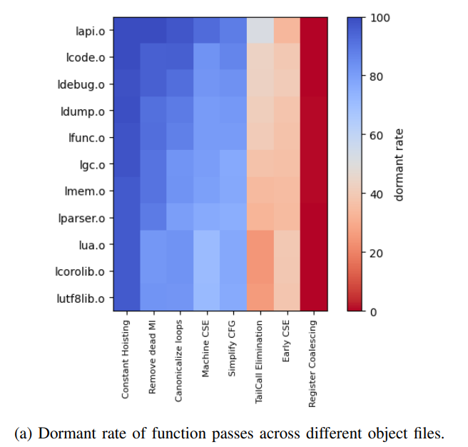

可以看到像是Constant Hoisting pass几乎总是在休眠.

另外, 尽管一个pass在休眠, 其仍会占用一定的计算资源, 下面是编译Lua, Git, CPython时(单线程)休眠pass所占总时间的比例:

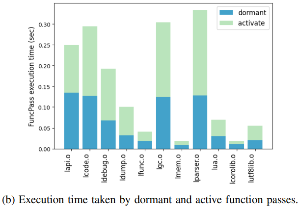

在Lua, Git, CPython的编译过程中, 休眠pass分别占总编译时间的27.2%, 13.27%, 以及21.02%.

因此, 通过复用休眠pass, 我们可以节省大约25%的编译时间.

Motivation example:

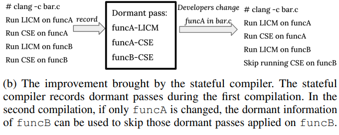

Clang会对函数A/B运行LICM pass和CSE pass, 其中函数A的LICM pass, CSE pass, 以及函数B的CSE pass是休眠的.

当开发者更新函数A时, 如果预测出函数A的更新不会影响函数B的CSE pass的状态, 那么就可以直接复用上次编译中函数B的CSE pass的状态, 降低编译开销.

## 挑战

正如早期工作中所指出的, 由于程序特性和pass特性的影响, 预测哪些pass将会休眠是十分困难的.

> Jayatilaka, Tarindu, et al. "Towards compile-time-reducing compiler optimization selection via machine learning." *50th International Conference on Parallel Processing Workshop*. 2021.
>
> Kulkarni, Prasad, et al. "Fast searches for effective optimization phase sequences." *ACM SIGPLAN Notices* 39.6 (2004): 171-182.
>
> Kulkarni, Prasad A., et al. "Practical exhaustive optimization phase order exploration and evaluation." *ACM Transactions on Architecture and Code Optimization (TACO)* 6.1 (2009): 1-36.

Q1: 如何处理任意代码更新对函数状态的影响? 比如增加/删除函数会影响其他函数的重载解析, 进一步影响函数的控制流.

## 方法

本文只关心过程内优化pass, 只关注函数pass和循环pass.

A1: 本文只关注过程内优化Pass, 不关注复杂的过程间优化带来的影响, 相应的也不需要进行休眠预测了, 只需要检查pass的输入有没有变化即可. 

### 正确性讨论

在正确性验证时, 作者定义了两个等价性:

* 二进制等价性: 对于相同的输入, 经过pass优化后可生成相同的二进制代码.
* 语义等价性: 弱于二进制等价性, 对于相同的输入, 经pass优化后可生成语义相同的二进制代码.

LLVM所有pass都能确保语义等价, 但不能严格确保二进制等价. 本文将在讨论章节介绍影响二进制代码的相关特性.

**不过, 绝大多数情况下LLVM还是可以确保二进制等价性的, 在本文的实验评估中, 所有test case均能通过二进制等价性验证.**

### Workflow

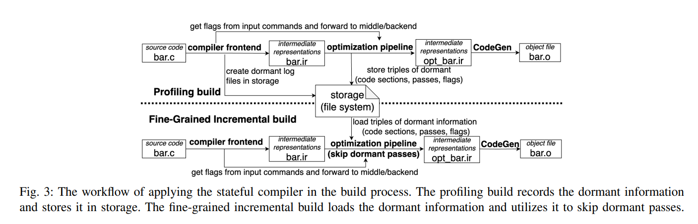

分为profiling build和细粒度增量编译两个阶段:

* profiling build: 和传统编译器流程相同, 不过会额外记录休眠pass的信息. 该阶段只需要在第一次编译时执行一次.
* 细粒度增量编译: 接下来的编译会复用profiling build中保存的休眠pass信息. 不过当代码更新时, 作者并不会更新相应的休眠数据, 会导致可用的休眠数据越来越少, 原因将在讨论章节介绍.

### 编译器无关的休眠数据格式

本质是一个三元组: (pass, 代码片段, 编译选项), 例如:

`(LICM, FuncA, ’licm-control-flow-hoisting=false’)` 表示在设置编译选项`licm-control-flow-hoisting=false`的前提下, `LICM` pass在处理函数A时是休眠的.

一个技术挑战是将代码片段进行高效哈希编码, 这里作者采用的方法和CHash中介绍的AST Hash差不多, 只不过是在IR上进行的, 属于技术细节.

### 休眠数据的存储

基于相应的可重定位文件单独存储. ~~感觉作者在这里是实在没什么可说的了, 凑一下字数.~~

## 实现

基于Clang-14.

前端: Clang plugin, 拦命令, 拿编译选项.

优化pipeline: 修改FuncPassManager和LoopPassManager, 实现方法主体. (兼容LTO)

> 注意分析Pass本质是休眠的, 但不能被跳过. 应只关注转换Pass.

## 评估

### 实验设置

LUA, Git, CPython, PostgreSQL, OpenCV, LLVM.

Make构建.

相关设置:

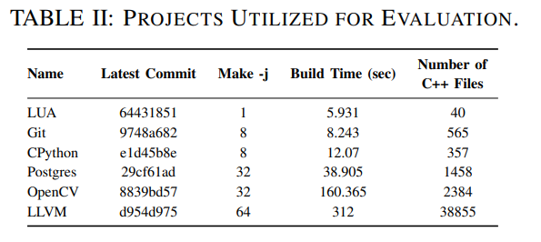

### 加速比评估

两类加速比:

* 编译时间: 串行编译中编译器消耗的总时间. 不包括链接, 构建脚本处理时间.
* 端到端: 运行make脚本并行编译的时间.

这个实验只考虑了LUA, Cpython, Git和Postgres.

每个项目选了20个有代码变更的commits.

重复运行20次取平局.

O1, O2, O3选项均有考虑.

结果如下:

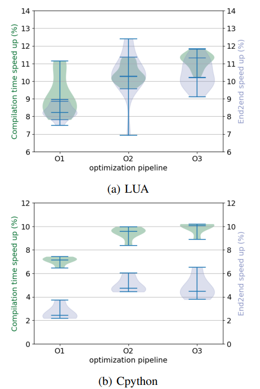

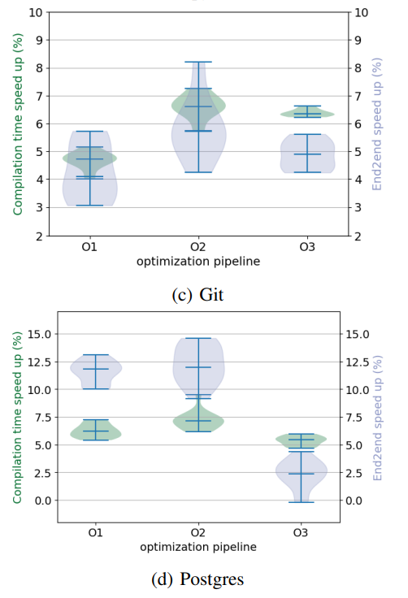

结论:

| 项目/效率提升(中位数,看图目测) | C-O1 | C-O2  | C-O3  | E-O1 | E-O2  | E-O3  |
| ------------------------------ | ---- | ----- | ----- | ---- | ----- | ----- |
| LUA                            | 9%   | 10.2% | 11.2% | 8.2% | 10.2% | 10.1% |
| CPython                        | 7.2% | 9.8%  | 10%   | 2.2% | 5%    | 5.8%  |
| Git                            | 4.8% | 6.8%  | 6.5%  | 4%   | 5.8%  | 5%    |
| Postgres                       | 6.2% | 7.5%  | 5.2%  | 12%  | 12%   | 2.5%  |

> 假设a是优化后时间, b是优化前时间, c是固有make开销, 在a<b时, (a+c)/(b+c)一定大于a/b, 也就是说端到端的加速效果一定会弱于编译加速效果, Postgres的结果看起来有点异常.
>
> 这个地方要这样考虑, C是串行的, E是并行的, 假设在串行编译场景下有两个文件, 编译时间分别为100s与50s, 本文把其中一个100s加速到50s, 另一个不变(不在处理范围内), 那么加速比为(100+50)/(50+50)=1.5x. 在并行编译场景下, 两个文件并行编译, 总时间取决于慢的那个, 所以加速前的总编译时间为100s, 加速后的总编译时间为50s, 加速比为2x. 可以看到端到端的加速比是可能高于编译加速比的.

作者在论文中描述的最终效果: 端到端平均加速了6.72%.

没有解释这个实验为什么不评估OpenCV和LLVM. 不过后面拿着CCahce去单独评估了, 这里就放过吧. 

以LUA为例调研休眠率与加速比之间的关系, 可以看到呈正比关系:

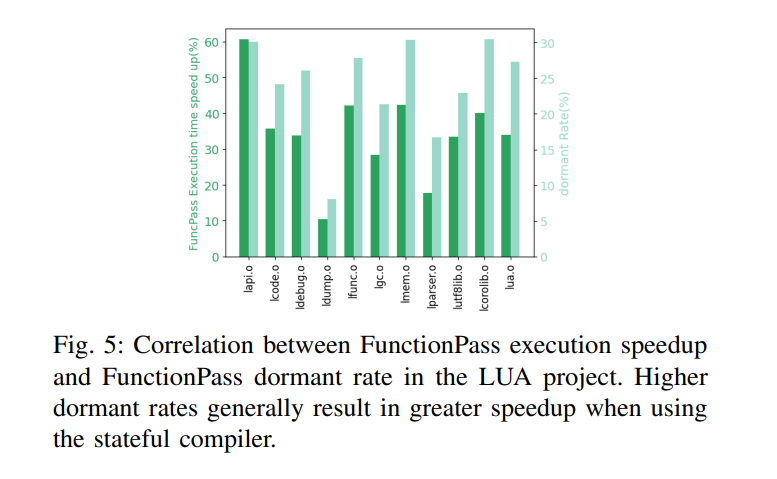

### 开销评估

#### Profiling Build

相差不多, 差别最大是LLVM, 也就是从313.46s减慢到了315.78s.

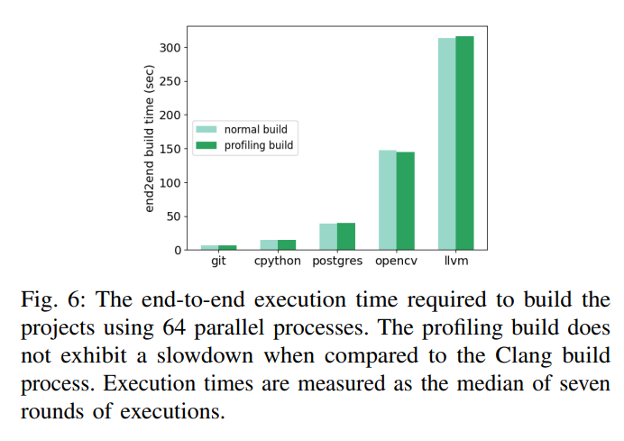

#### 细粒度构建

开销平均仅占10%.

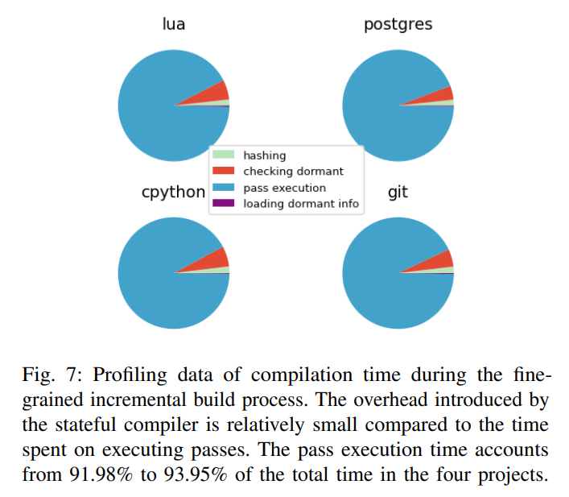

### CCache + 有状态编译器

评估项目: OpenCV, LLVM.

统计端到端时间.

每个项目18个commits.

在OpenCV和LLVM上相比CCache分别带来了3.5%和3.45%的提升.

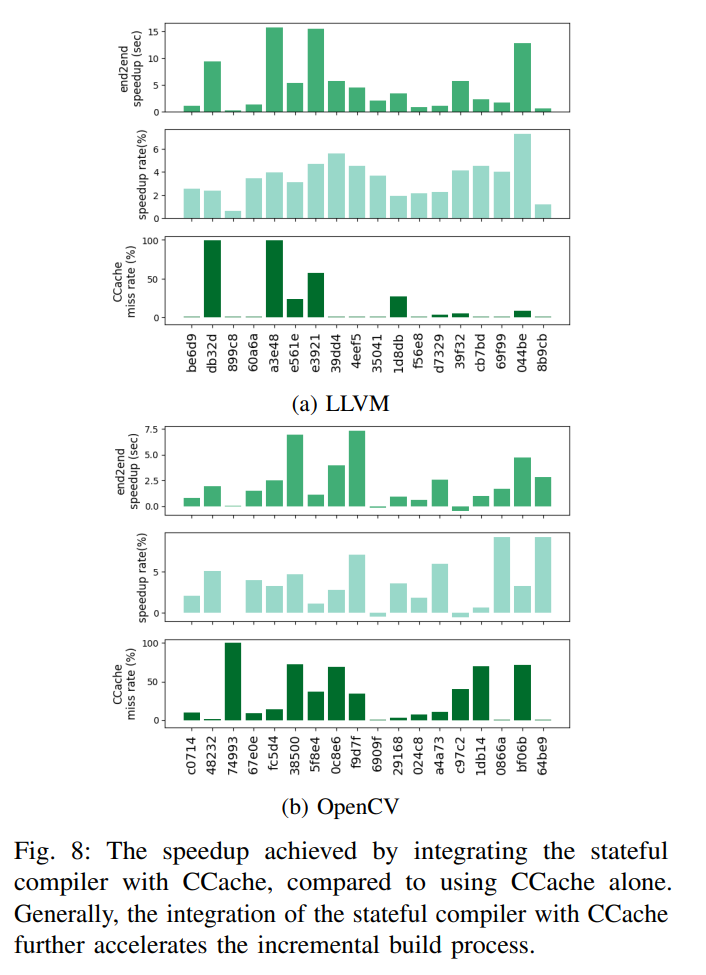

## 相关工作

(1) Montana将一个大文件拆分成多个小文件, 从而实现更细粒度的增量编译. 比如如果每个函数一个文件的话就能实现函数粒度的增量编译 (不过这篇工作没有沿用C++标准, 对C++标准标准做了很多激进的修改).

> Karasick, Michael. "The architecture of Montana: An open and extensible programming environment with an incremental C++ compiler." *ACM SIGSOFT Software Engineering Notes* 23.6 (1998): 131-142.
>
> Soroker, Danny, et al. "Extension mechanisms in Montana." *Proceedings of the Eighth Israeli Conference on Computer Systems and Software Engineering*. IEEE, 1997.

(2) Zapcc: 同样是一款有状态的编译器, 采用编译服务器的设计架构, 对Clang进行了重量级修改.

> https://github.com/yrnkrn/zapcc
>
> 18年就停止了维护.
>
> 轻量级的修改是至关重要的!

## 讨论

### 休眠数据的更新

休眠数据大小会随着每次更新不断累加, 从而减缓查询效率.

为了降低空间开销, 每次更新后需要将废弃的休眠数据清除, 即垃圾回收, 但这个过程也会引入额外的开销.

> 可能是垃圾回收方面有些技术上的挑战

### 休眠数据的有效性

编译器中的一些额外因素会影响休眠数据的有效性:

* 优化流水线会隐式的设置一些参数, 比如在O3下会给`LoopUnswitch` pass自动设置`NoTrivial`这个flag.
* PGO文件可能会影响优化结果. 例如PGO文件中会将一些代码片段标记为`hot`或`cold`, 从而影响pass的优化决策.
* LLVM允许一个pass受其外层pass的影响. 例如, 一些函数pass依赖于module pass, 假设一个module中包含两个函数A和B, 改变B可能会影响module的分析, 进一步经由module影响到A的分析. 处理这种依赖需要花费大量人力去调试LLVM源码.

# 