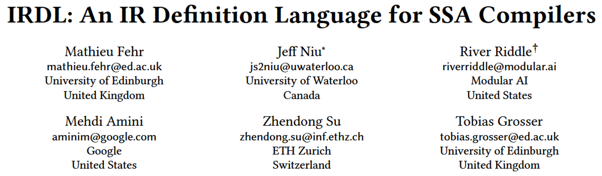

# PLDI'22

# 背景和动机

以往的IR的通常深度嵌入到各自的编译器中，因此，修改它们需要详细的编译器特定知识，即使是专家也很不愿意修改现有的IR。这让IR的创新和探索变得困难。

MLIR[1]在促进IR实现方面迈出了重要的一步，提出方言。如今已经有28种特定领域上的MLIR方言。

虽然已经有生成编译器部分（如解析器、后端、代码生成器）的方案，但我们缺乏一种可以简化IR设计过程并围绕它们建立强大库和工具生态系统的解决方案。

[1]  Chris Lattner, Mehdi Amini, Uday Bondhugula, Albert Cohen, Andy Davis, Jacques Pienaar, River Riddle, Tatiana Shpeisman, Nicolas Vasilache, and Oleksandr Zinenko. 2021. Mlir: Scaling compiler infrastructure for domain specific computation. In 2021 IEEE/ACM International Symposium on Code Generation and Optimization (CGO). IEEE, 2ś14. https://doi.org/10.1109/CGO51591.2021.9370308

# 相关工作

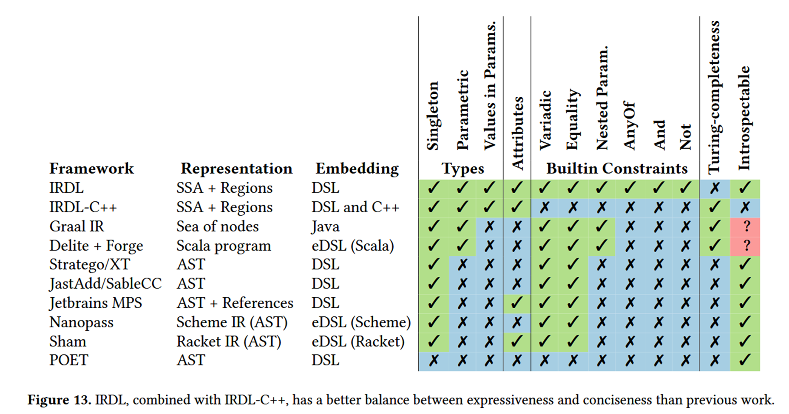

# 方法

## IRDL在MLIR生态中的位置

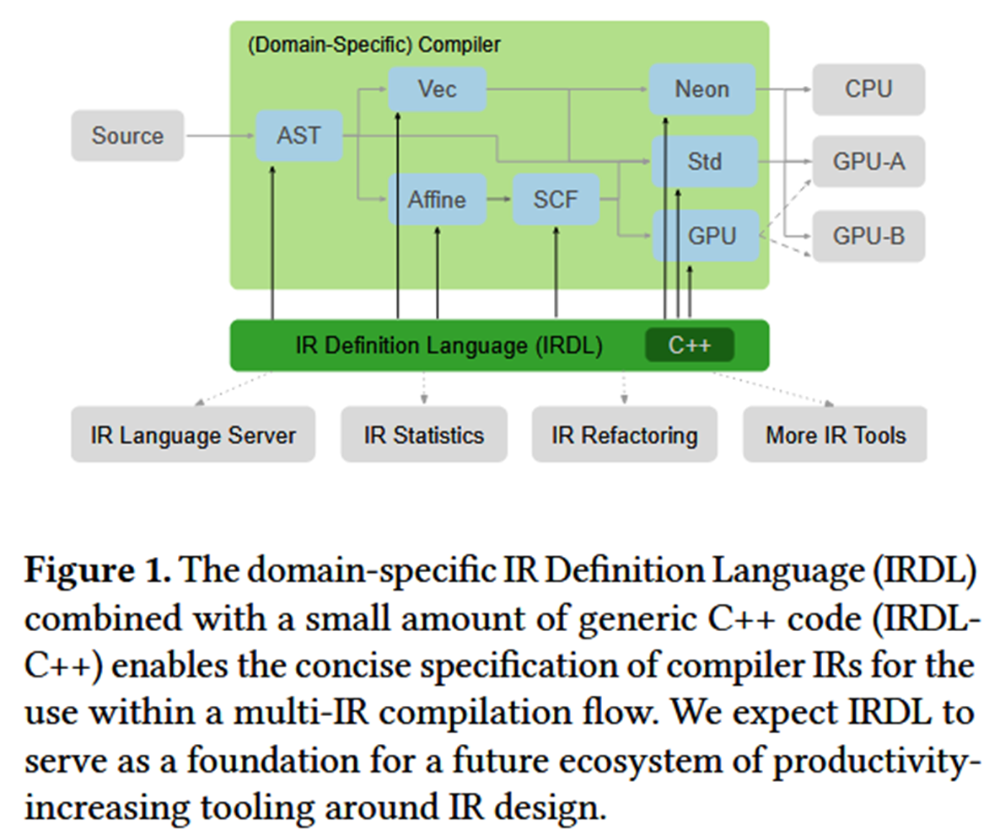

## IRDL提供的语法

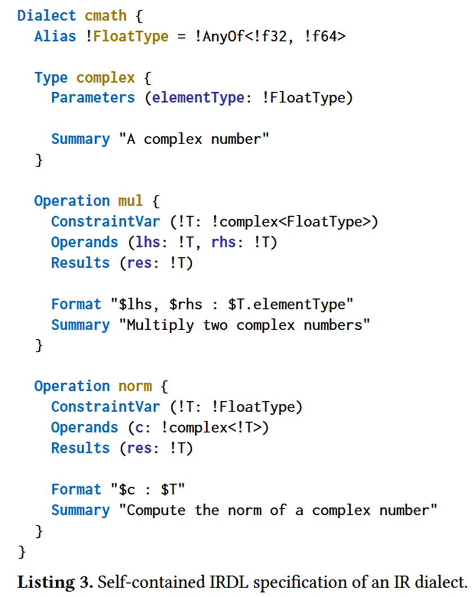

- IRDL中的方言定义以顶层的Dialect语句开始，其主体包含类型、属性、别名和操作的定义。

- IRDL通过名称标识方言及其组件。方言定义创建一个命名空间，因此从方言外部引用方言组件时，必须加上方言名称的前缀。

- IRDL中通过名称定义类型和属性，可以选择性地指定一个命名参数列表，允许类型或属性携带静态信息。每个参数都与一个参数约束相关联，表示该参数的不变量。

- IRDL允许定义别名，这些别名是现有类型、属性、参数及其约束的简写。

- IRDL支持为每个定义的类型、属性和操作指定解析器和打印器，使用MLIR的通用IR语法

  上面例子中mul操作解析的结果：

  %res = cmath.mul %p, %q : f32

- IRDL中的约束定义了类型、属性或类型和属性参数的不变量，还可以用于定义区域参数的不变量。

    - 类型和属性约束
    
     - 参数约束
    
    - 组合约束

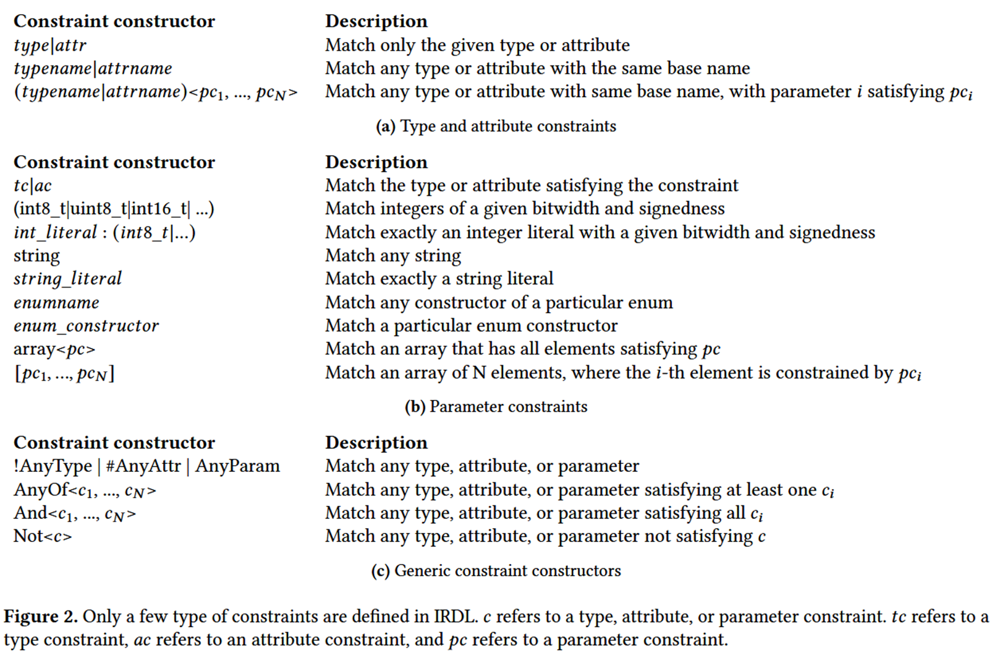

- 操作通过Operation指令和名称定义，可以指定操作数、结果和属性。

    - 变参操作数和结果。可以指定操作数或结果的数量是可变的， Variadic约束和Optional约束。如listing 6

    - 约束变量。 ConstraintVars指令允许用户自定义约束变量

    - 区域。操作可以定义多个区域。如listing 7

    - 后继者。可以通过Successors指定后继名称的列表，表示终结操作可能将控制权传递给的基本块列表。如listing 8

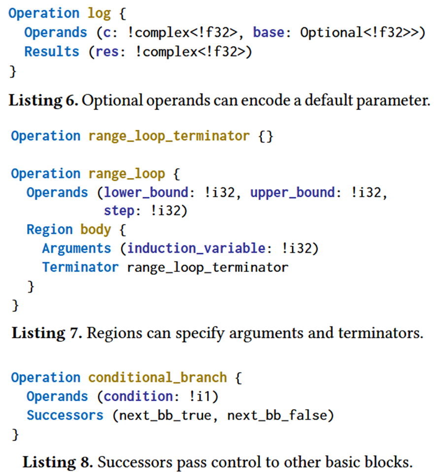

- IRDL还支持枚举类型，可以作为属性和类型的参数。枚举通过Enum指令定义，并期望提供一个名称列表，用以定义不同的枚举构造函数。

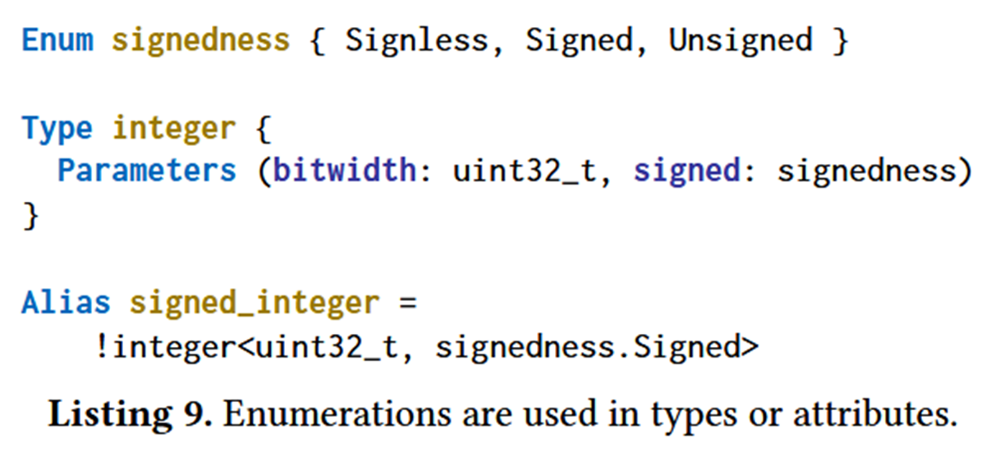

## IRDL-C++扩展

为了定义更复杂的结构，IRDL通过IRDL-C++进行了扩展，用于将不变量表示为通用C++代码。

Constraint指令可以从C++规范中定义任意约束。Constraint由一个必须满足的基本约束和一个CppConstraint指令组成，后者使用通用C++表达式定义任何附加约束。CppConstraint指令也可以在操作、类型和属性定义中使用，以定义在C++中指定的附加约束。

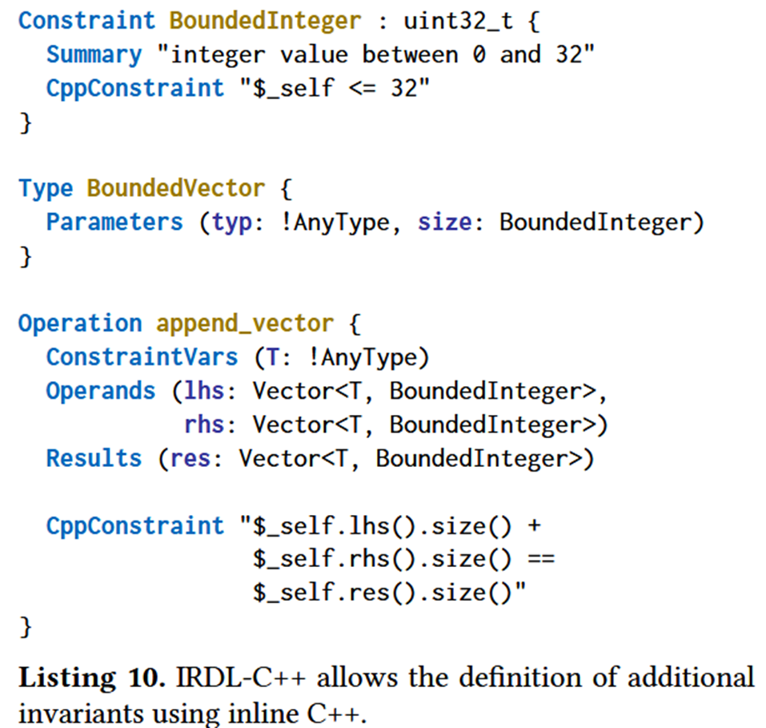

IRDL不像MLIR那样直接用C++的复杂类型做参数，需要通过IRDL-C++来辅助实现。

通过TypeOrAttrParam指令允许定义新的参数，方法是给C++类型定义包装器。

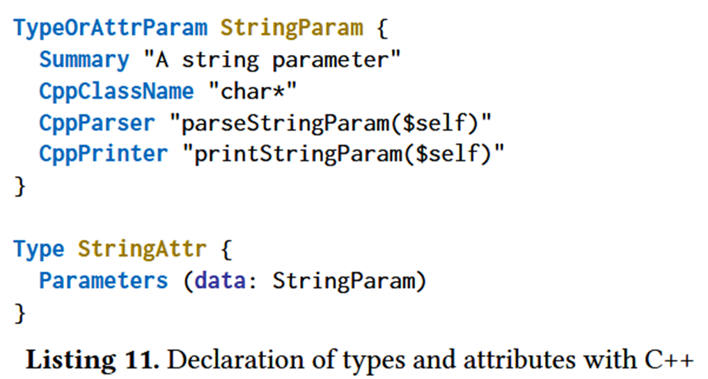

# 评估

## MLIR中的IR有哪些特征？  

MLIR有28种方言

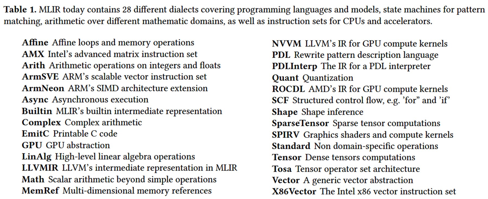

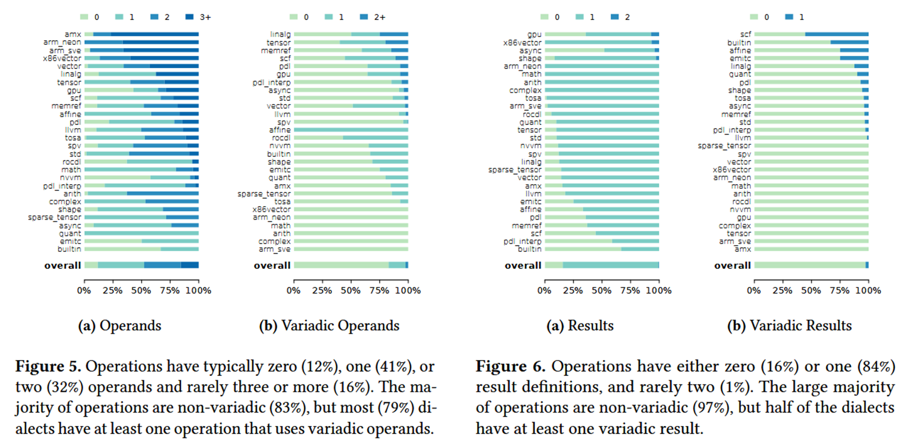

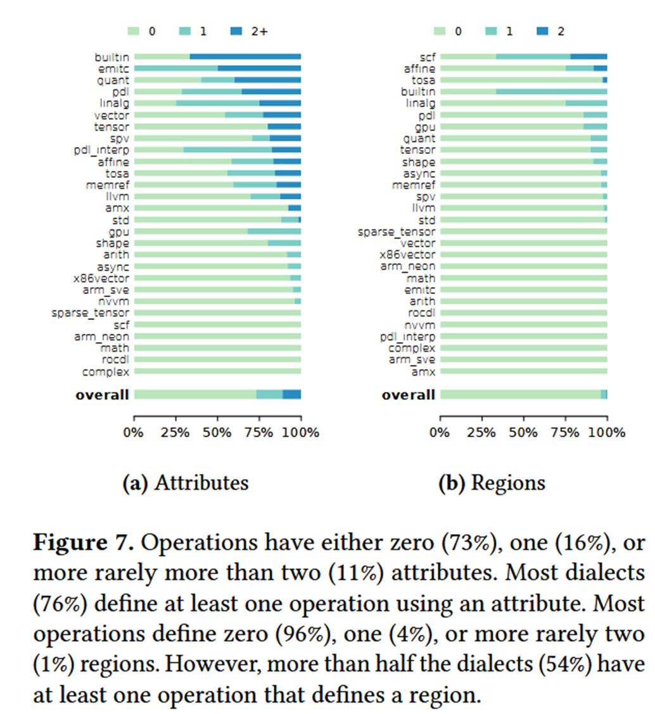

总体就是说MLIR中操作数、结果、属性和区域中简单的用法很常见，一些复杂的用法多数方言都有，但是每个方言用到的不多。

## 哪些IR特性可以仅用IRDL表示，定义IR时仍然需要多少通用C++代码？

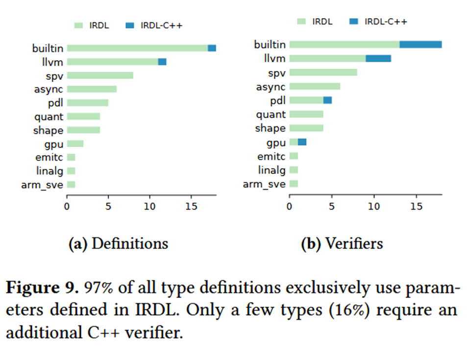

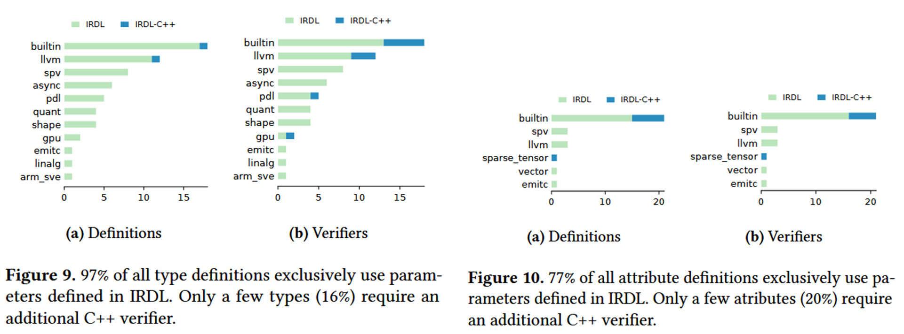

- 28个方言中有14个定义了类型或属性，总共定义了62种类型和30个属性。

- 除了llvm、builtin和sparse_tensor方言外，所有方言都可以在IRDL中定义其类型和属性的参数，前面提到的3个方言需要使用IRDL-C++来定义参数。

- 16%的类型和20%的属性定义了C++验证器，在定义类型或属性的14个方言中，只有5个方言在至少一个类型或属性上的验证器需要使用IRDL-C++。

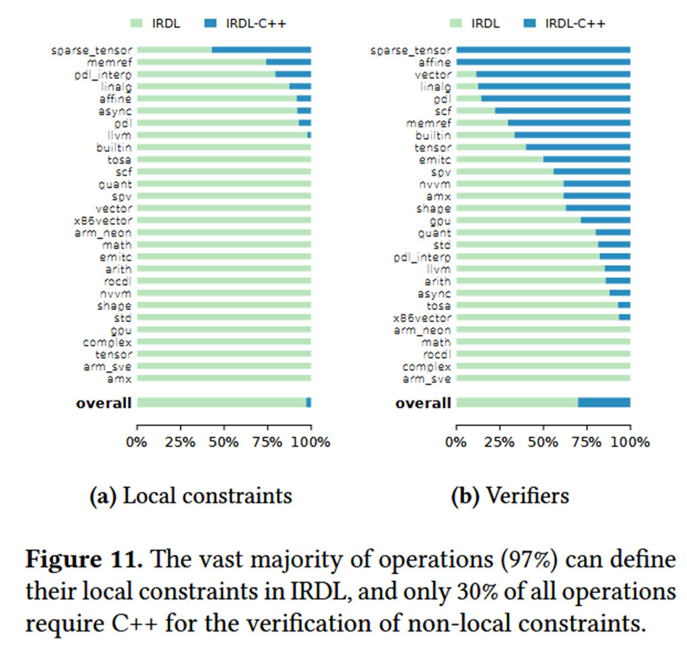

- MLIR在其28个方言中总共定义了942个操作。MLIR中的操作定义基本上由验证器组成。验证器通常分为局部约束和全局约束。

- IRDL使用Operands、Result和Attribute指令定义局部约束。97%的操作可以在IRDL中表示所有局部约束。按方言查看，28个方言中的20个可以在IRDL中表示它们所有的操作局部约束。

- MLIR操作定义中的全局约束在IRDL-C++中通过CppConstraint指令定义，在IRDL中通过ConstraintVars指令定义。总体而言，MLIR中30%的操作需要使用IRDL-C++定义全局约束。

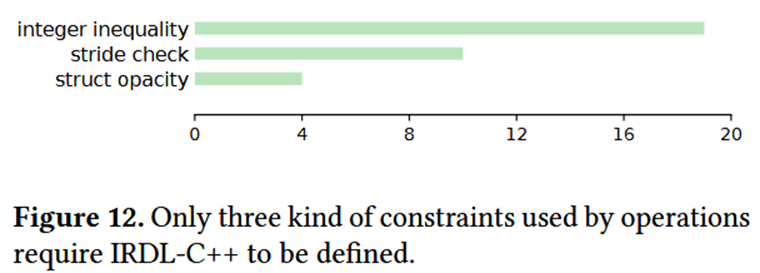

- MLIR操作中不能在IRDL中表示的局部约束类型的数据分为3个不同类别（图12）。第一组约束将整数属性的值限制在某个范围内，第二组约束内存访问为步长访问，第三组约束LLVM结构为opaque类型。总体而言，为了定义所有MLIR操作，只有少量约束需要在IRDL-C++中定义。