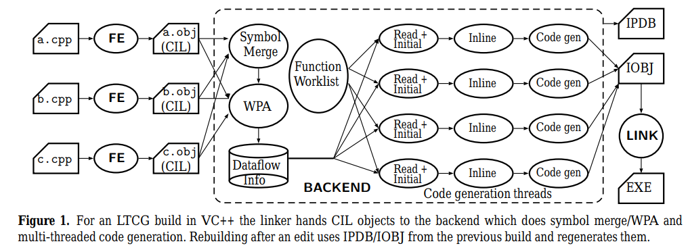
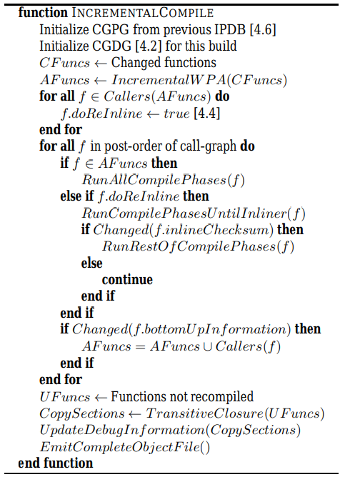
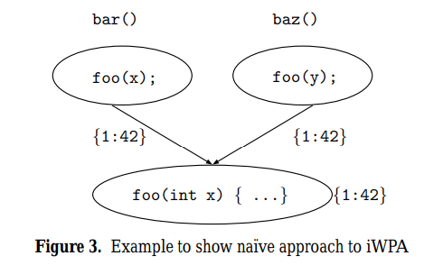
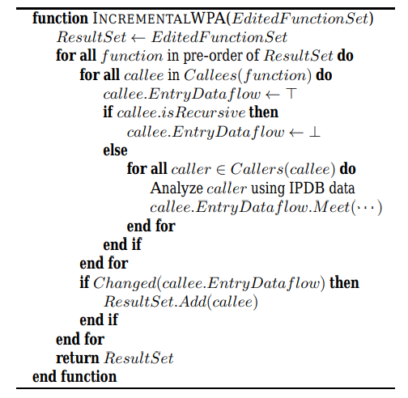
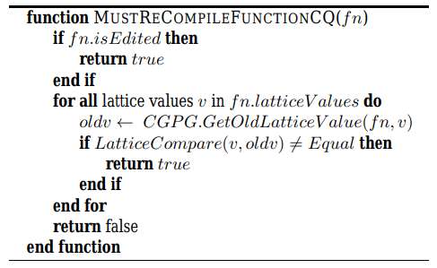
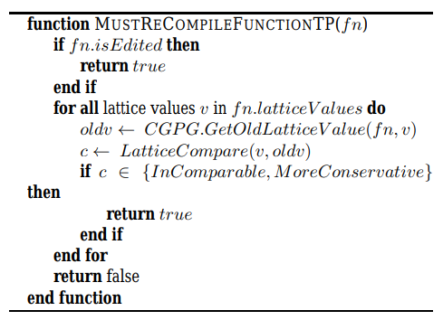
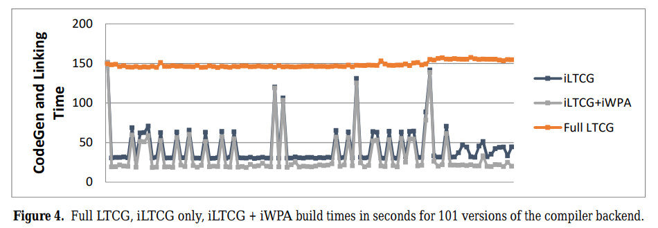
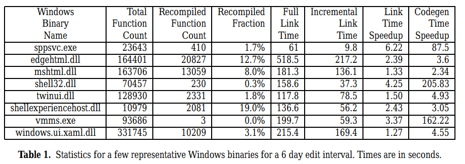

# Incremental Whole Program Optimization and Compilation

https://ieeexplore.ieee.org/abstract/document/7863742

Patrick W. Sathyanathan[1], Wenlei He[1], and Ten H. Tzen[1] 

[1]Microsoft Corp, USA

CGO 17

不开源

## 摘要

面向全程序的增量编译优化.

关键技术: 

* 描述符号之间依赖关系的依赖图, 数据流格, 用于最小化需要重新分析/编译的代码数量.
* 轻量级checksum, 用于检测函数和变量的修改.
* 在多级内敛展开下仍能确保无差异的代码生成. (Binary等价)

相比Visual C/C++ compiler达到了7倍的加速比.

## 背景

编译吞吐量(compiler throughput)对开发者日常的edit-compile-test cycle十分重要.

由于WPO会带来高额的构建开销, 开发者一般不会将其整合到edit-compile-test cycle中, 这将导致优化后的二进制代码测试频率较低, 其隐含的错误只有在上线前测试时才会暴露出来.

像是Windows这种包含千万行源码的大项目, 其完成一轮edit-compile-test需要的时间可能会超过24小时, 无法满足项目的每日测试需求.

为了满足每次测试的需求, Windows内部, 以及Google的bazel, distcc等框架会采用分布式编译以缓解高额的编译时长, 不过相应的也会耗费更多的机器资源.

因此本文将设计面向WPO的增量编译加速框架.

## 动机

持久化object code和依赖信息.

<font color="red">Q1. 增量IR还是Binary?</font>

<font color="green">Binary. 既然是MS自家的编译器, 只考虑Windows系统即可, 不用支持ELF, MachO等, 就没必要在IR上增量了.</font>

通过尽可能少地重编译函数实现加速, 函数粒度.

> 不关注编译前端, 关注编译后端. 

已整合到2015 Visual C/C++ compiler中, 首次在商业编译器中成功实现增量特性. 可实现对Windows的增量编译.

实现了7x的加速比.

## 挑战

确保binary完全等价.

一个函数的IR不变不代表其binary不变, 需要考虑依赖关系, 在WPA中正确维护依赖关系是十分有挑战的.

以下情况中, caller的binary可能会受calle影响:

(1) ReInline information: 对于函数调用bar->foo, foo可能一开始不会内联到bar中, 因为foo此时的体积较大. 但代码更新后, foo的体积减小, 此时编译器会将foo内联到bar中. 如果直接复用foo的二进制代码会破坏binary等价性, 也会影响程序执行效率.

(2) BottomUp information: callee的寄存器使用, 内存读写等因素都会影响caller的Binary生成.

另外, 为了确保binary完全等价, 还需正确更新程序的调试信息.

## 方法

### workflow



上述是MSVC的整体框架, 以及本文在此基础上所做的改进.

MSVC整体和ThinLTO挺像的, 都是将源码编译成IR(CIL), 然后合并各个IR的summary进行WPA, 将分析信息再传递给单个IR的优化pipeline和codegen(各个IR间的优化和codegen是并行的), 生成各个COFF可重定向文件. 最后, 由链接器将各个可重定向文件链接为可执行文件, 最终实现WPO.

 作者仅在架构中添加了两个文件, IPDB与IOBJ:

* IPDB: 数据库, 维护整个系统所需的增量信息.
* 将历史binary代码保存到一个大的二进制文件中, 供后续增量编译复用.

### 整体算法



IncrementalWPA: 分析变化函数是否会进一步影响其他函数.

注意, 如果callee的bottomUp information改变, 即data-flow value改变, caller的binary也可能发生变化, 所以要加入AFuncs.

在复用函数的过程中, 需要综合考虑其衍生的代码段, 数据段, 异常表等等, 因此调用TransitiveClosure求其传递闭包.

更新debug表. 注意一个函数的二进制代码就算完全不变, 其行号信息也可能会受到其他代码增删的影响.

二进制代码合并是在链接前做的, 相关拷贝代码提供给链接器, 由链接器生成完整的binary.

### CGDG

Code Generation Dependence Graph.

另外, 我们将IPDB中持久化保存的CGDG称为Code Generation Persistent Graph(CGPG).

CGDG包含三类节点:

* Function Nodes: 每个函数定义对应一个节点.
* Variable Nodes: 每个非栈变量对应一个节点.
* External Function Nodes: 每个UND函数对应一个节点.

每个节点包含以下基本信息:

Name, ModuleId, source attributes (例如dllimport, dllexport, static, ...), compiler computed attributes (例如addressTaken), ...

函数节点包含一些函数特定属性, 按类别划分:

* source attributes: calling convention, nothrow, noexcept, start line numbar, types of local variables, ...
* **compiler computed attributes**: IR checksum, WPA data-flow information, bottom-up information, ...

> 注意, 除了compiler computed attributes,  source attributes也可能会影响calller的代码生成, 比如calling convention会改变函数的调用规范. 一旦检测到这些attributes有变化, 需要重新编译函数.

变量节点包含一些变量特定属性, 比如initial value checksum, size, volatile-ness, constant-ness, has dynamic initializer, ...

> 变量的修改可能会影响常量传播优化, 因此变量修改时, 使用该变量的函数也要重新编译.

最后, 节点之间的边表示节点之间的代码依赖.

### Diff

用checksum识别函数, 变量的变化.

所用到的checksum是Daniel J Bernstein (DJB)的变体. 大概是将IR树状表示, 然后求树的哈希.

> O. Yigit. String hash functions, 2001. URL http://www.cse.yorku.ca/~oz/hash.html.

### Inline, ReInline

**inline机制**

常用方法: 启发式inline.

> W. Y. Chen, P. P. Chang, T. M. Conte, and W. M. Hwu. The effect of code expanding optimizations on instruction cache design. IEEE Transactions on Computers, 42(9):1045–1057, Sept. 1993.
>
> W. mei W. Hwu and P. P. Chang. Inline function expansion for compiling c programs. In Proceedings of the ACM SIGPLAN 1989 conference on Programming language design and implementation, pages 246–257. ACM, 1989.

**reInline机制**

挑战: 对于函数调用bar->foo, foo可能一开始不会内联到bar中, 因为foo此时的体积较大. 但代码更新后, foo的体积减小, 此时编译器会将foo内联到bar中. 如果直接复用foo的二进制代码会破坏binary等价性, 也会影响程序执行效率.

考虑到inline分析带来的挑战, 以及inline pass通常是在整个流水线起始部分运行, 作者会重新执行inline pass, 接着在inline之后检测checksum判断函数是否可复用上一次的二进制代码.

<font color="red">在inline pass之后, 为了避免对所有函数进行checksum检查, 作者会按需的从变更函数出发进行反向传播, 只检查反向传播路径上的函数的checksum. 但是这在路径敏感的inline分析中会有问题.</font>

**路径敏感问题**

一个函数是否会被内敛到其他函数, 不单取决于该函数本身, 还取决于caller到该函数的路径, 不同路径下inline决策可能不同.

```c++
void bar() { for { baz(); }; }
void bar2() { baz(); }
void baz() { foo(); }
void foo() { ... }
```

在这个例子中, 由于bar中会循环调用baz, 启发式inline算法会认为这个地方需要内联(假设此时baz和foo的体积都不是很大), 因此将baz和foo的代码都内联到bar中.

然而, 对于bar2, baz并未循环调用, 假设编译器认为这个地方没必要内联, 不会将baz和foo内联到bar2中.

另外, 对于baz, 假设编译器也认为没必要将foo内联进来.

接下来, foo的代码更新, 体积变得很大, 编译器会断定任何情况下都不能内联foo.

现在我们开始反向传播更新, 首先foo的变更会反向传递到baz, 由于上次编译中baz并未内联foo, 这里编译中baz也未内联foo, baz的checksum不会变化, 传播到这里就终止了. 增量编译算法会认为baz, bar2和bar的二进制代码都可以被复用.

然而, 这次编译中, foo已经不可以被内联到bar, bar的二进制代码必然会发生变化, 直接复用bar之前的二进制代码会破坏二进制等价性.

为了解决这个问题, 作者关闭了所有路径敏感的inline优化, 并在SPEC2006上验证表明这样仅会损失小于0.5%的程序执行性能.

<font color="yellow">解决这个问题可能要定制inline分析, 汇报有inline决策变化的点. 或者在inline之后进行全函数的checksum验证.</font>

### iWPA

Incremental Whole Program Analysis.

在MSVC中, WPA是串行的, 占据30%的编译时间. 因此作者提出了一种demand driven的增量WPA框架, 用于最小化重分析函数的数量.

挑战: 函数不变, 其数据流值也可能发生变化, 从而影响编译优化和代码生成.



这个例子中, 如果x的值不再是42, 相应的在常量传播meet时结果将变成非常量(⊥).

一种传统的做法是在IPDB中保存每个call-site的data-flow value. 但这种方法还是建立在全程序分析的框架下的, 需要迭代全部函数, 效率不高. 且为每个call-site都保存data-flow value将造成大量的空间浪费.



本文选择采用demand driven的增量分析技术, 仅迭代那些有修改的函数. 且为了权衡时间和空间, 仅保留每个函数入口的data-flow value. 

这样, 当一个函数变化时, 算法会遍历其调用的全部callee, 将每个callee的entry data-flow value置为上界T以准备更新. 

注意, 为了确保算法是保守的, 即MFP<=MOP, 在发生递归调用时算法会将递归函数的entry data-flow value保守地置为下界⊥. 

对于非递归调用的callee, 算法会找到其全部caller, 根据IPDB data对caller所在的函数进行重新分析, 以获取caller的data-flow value, 然后将所有caller的data-flow value进行meet操作, 更新callee的entry data-flow value.

如果callee的entry data-flow value相比IPDB中的值有变化, 那么算法会将该callee视为变化函数加入ResultSet继续迭代.

<font color="red">上述算法少了一步, 当前函数更新时, 其exit data-flow value也会更新, 因此还要更新当前函数的caller所在的函数.</font>

### 权衡代码质量与编译吞吐量



根据上述分析, 当一个函数的lattice value变化时, 为了满足二进制等价性, 我们需要重新编译该函数.

> 检测lattice value变化可以用entry data-flow value + 所有callsite返回的data-flow value + 一些全局变量相关的data-flow value

然而, 在实际中, 我们可以选择破坏binary等价性, 只确保语义等价性, 来换取更高的编译吞吐率.



具体而言, 如果一个函数本次的lattice value>=上次的lattice value, 我们仍然可以确保MFP<=MOP, 即分析结果是安全的. 此时, 直接复用上次的分析结果不会影响代码语义的正确性, 仅仅会错失一些优化机会. 

> 例如, 在常量传播分析时, 如果上次的lattice value是NAC, 本次是一个常量, 那么直接复用上次的结果也不会影响常量传播的正确性, 仅仅会错失一些优化机会. 
>
> 但是反过来, 如果上次是一个常量, 本次是NAC, 那复用上次的分析结果就会出错了.

本文严格满足binary等价. 不过在一些追求编译吞吐量的场景, 可以采用上述策略.

## 评估

本文的评估对象是MSVC编译后端模块, 包含1,000,000+代码. 采用100个commits进行效率评估.

> 本文在实现完MSVC的增量后端模块后, 又反过来用该增量编译器去支持编译后端未来的开发.



> 单位为s, 只统计编译后端, 包含优化, 代码生成和链接, 以下统称为链接时间.
>
> 注意, 在LTO框架下, 尽管构建系统可以采用增量编译, 但也只是增量编译的前端文件, 整个后端仍旧是全程序全量编译, 因此我们后面将普通的LTO称为全量, 本文的工作称为增量.

大部分情况下有7倍左右的加速比(145s->20s). 图中的一些峰值对应大规模代码变化(代码merge, 包含开发人员几周或几个月的代码变更). 另外, 在ILTCG与iLTCG+iWPA的对比中, iWAP大概带来了12s的收益.

> 20s的开销包含: 读CIL, 检测checksum, 执行iWPA, 代码生成, 二进制代码复用, 更新IPDB, 链接.

作者又选取了Windows近两周的commits进行增量编译, 平均而言, iLTCG可以将链接时间从3h缩短为2.2h, 效率提升了22%, 从编译19258936个函数优化为仅编译3157693个函数, 函数缩减率为16.4%.

以下是作者选取了Windows中比较有代表性的一些组件进行的统计:



函数重编译率, 代码生成加速比, 链接加速比之间没有严格的线性关系, 随组件不同而不同, 不过相比全量链接都有加速.

作者采用了一个中等规模的视频编辑程序与gcc/LTO进行对比: MSCV全量构建需要57s, 增量构建需要21s, 3x加速比. gcc/LTO只能全量构建, 需要289s.

Baseline的差异在于gcc没有采用并行代码生成. 不过从加速比可以看出本文工作是优于gcc/LTO的.

另外, 所有实验都满足binary等价. 

> 作者在整个实验过程中仅遇到一次二进制不等价的场景, 相关bug已经修复.

## 相关工作

[1] 增量编译前端

复杂, 仅在解释器/交互式变成环境下得到了实现.

>  H. V. Braden and W. A. Wulf. The implementation of a basic system in a multiprogramming environment. Communications of the ACM, 11(10):688–692, October 1968.
>
>  H. Katzan Jr. Batch, conversational, and incremental compilers. In 1969 Spring Joint Computer Conference, AFIPS Conference Proceedings, volume 34, pages 47–56. AFIPS Press, 1969.
>
>  M. Peccoud, M. Griffiths, and M. Peltier. Incremental interactive compilation. In A. Morrell, editor, Information Processing 68, Proceedings of IFIP Congress 1968, Volume 1 Mathematics, Software, pages 384–387. North-Holland, 1969.
>
>  W. J. Rishel. Incremental compilers. Datamation, 16(1): 129–136, January 1970.

[2] LTO

GCC支持LTO但不支持增量LTO.

LLVM的ThinLTO框架会为链接中的每个编译单元生成一份摘要, 然后将摘要合并, 再提供给每个编译单元进行优化, 从而达到全程序优化的效果. 本文当时强调ThinLTO是不支持增量的.

> ThinLTO同年也在CGO上发表了其增量框架, 目前ThinLTO也已经支持增量了.
