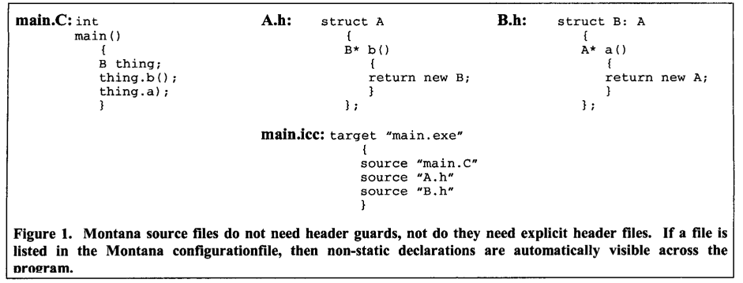

The Architecture of Montana: An Open and Extensible Programming Environment with an Incremental C++ Compiler 

Michael Karasick

Programming Environments and Compilation IBM T.J. Watson Research Center 

ACM SIGSOFT Software Engineering Notes, Volume 23, Issue 6

Montana即包含了构建系统, 也包含了C++编译器. 支持细粒度的增量编译.

最大的问题是其没有采用C++标准, 而是自定义标准, 需要开发者重新学习其自定义标准. 

比如, Montana的会先解析完全部声明再解析定义. 在解析定义时符号表包含整个程序的符号. 有点类似把class的延迟解析机制推广到整个程序.

```c++
const char* f (double)
{
	return "double" ;
}
const char* g()
{
    // in Montana this is f(int);
    // in ANSI C++, f(double)
    //
    return f(5) ;
}
const char* f(int)
{
	return "int";
} 
```

另外, Montana也没有采用传统的头文件/源文件管理方式.

传统方式:


Montana中不处理include指令, 所有符号都是对外可见的:



另外, 宏也可以配置成全局可见的:

