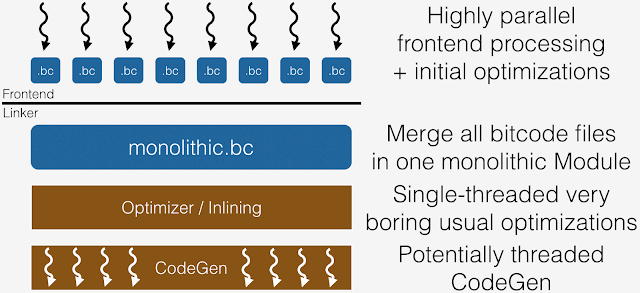
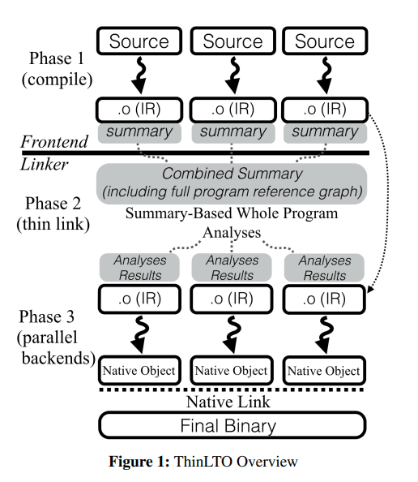
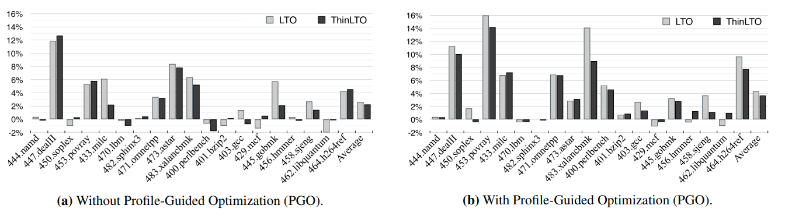
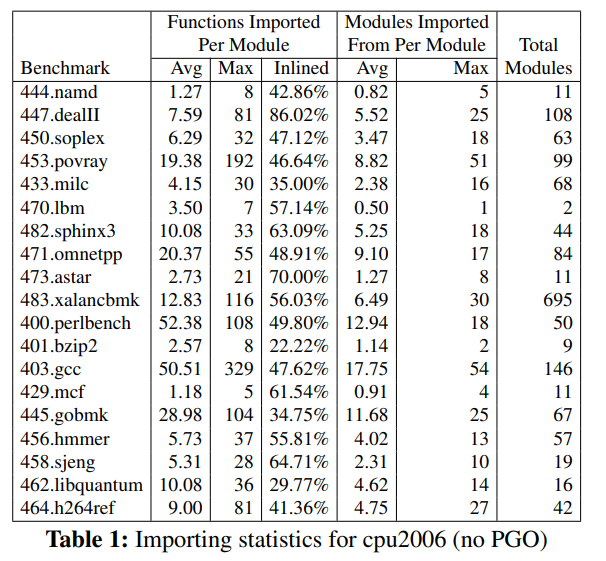
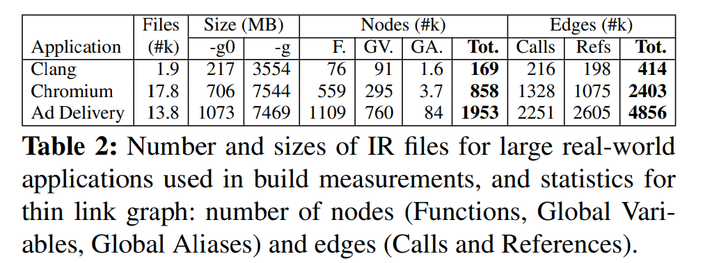
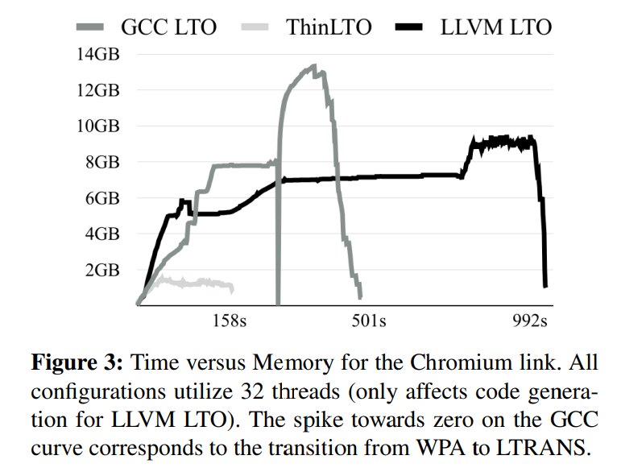
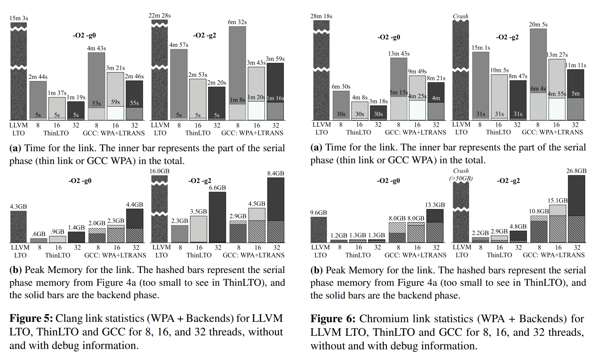
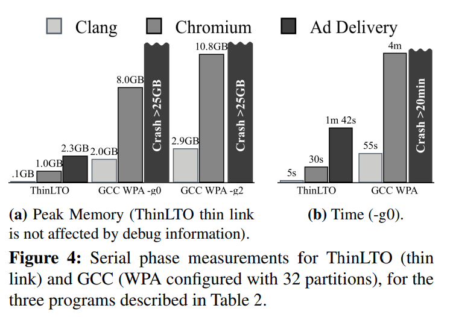
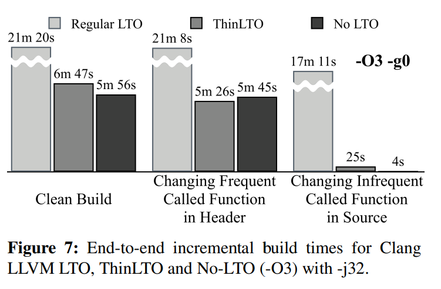
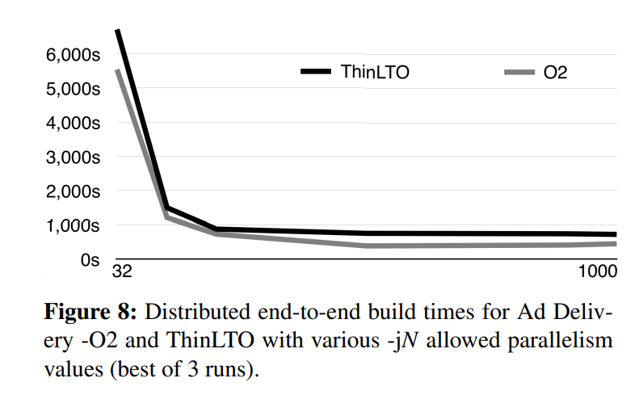

# ThinLTO: Scalable and Incremental LTO

https://ieeexplore.ieee.org/abstract/document/7863733/

Teresa Johnson[1], Mehdi Amini[2], Xinliang David Li[1]

[1] Google, USA

[2] Apple, USA

CGO 17

技术类论文.

开源 (已整合到LLVM中).

相关文档也可以参考LLVM Project Blog: https://blog.llvm.org/2016/06/thinlto-scalable-and-incremental-lto.html

## 摘要

现有LTO框架不scalable, 在大型项目上优化效率较低. 因此本文提出了一种scalable且支持增量的LTO框架: ThinLTO.

## 现有工作

早期的LTO框架依赖反汇编

> R. Muth, S. Debray, S. Watterson, K. D. Bosschere, and V. E. E. Informatiesystemen. Alto: A link-time optimizer for the Compaq Alpha. Software - Practice and Experience, 31: 67–101, 1999.
>
> A. Srivastava and D. W. Wall. A practical system for intermodule code optimization at link-time. Research Report, 1992.
>
> L. Van Put, D. Chanet, B. De Bus, B. De Sutter, and K. De Bosschere. DIABLO: a reliable, retargetable and extensible link-time rewriting framework. In International Symposium on Signal Processing and Information Technology, pages 7–12, 2005.

不过现代编译器一般会生成IR, 然后对IR进行LTO优化, 因此已经不需要反汇编了. 比如LLVM就内置了基于IR的LTO框架.

> https://llvm.org/docs/LinkTimeOptimization.html

其架构如下:

LLVM会将所有bc先链接成一个大的bc, 然后对这个大的bc统一进行优化, 代码生成, 非常重量级, 也无法并行.

此外, 还有一些其他的LTO框架也存在类似的问题:

[1] HP-UX compiler LTO: 同样将所有IR合并成一个大的IR. 虽然提供了IR的按需内存加载机制, 但在实际中还是会造成高额的IO开销, 表现不佳.

>  A. Ayers, S. de Jong, J. Peyton, and R. Schooler. Scalable cross-module optimization. In Proceedings of the ACM SIGPLAN 1998 Conference on Programming Language Design and Implementation, PLDI ’98, pages 301–312, New York, NY, USA, 1998. ACM. URL http://doi.acm.org/ 10.1145/277650.277745.

[2] SYZYGY, 取代HP-UX compiler LTO, 仅合并摘要, 而非所有IR, 然后基于摘要优化各个IR. 不过只有codegen是并行的, 对IR的inline优化重写还是串行的. 

> S. Moon, X. D. Li, R. Hundt, D. R. Chakrabarti, L. A. Lozano, U. Srinivasan, and S.-M. Liu. Syzygy - a framework for scalable cross-module ipo. In Proceedings of the International Symposium on Code Generation and Optimization: Feedbackdirected and Runtime Optimization, CGO ’04, 2004.

[3] Open64, 以及相关的Open Research Compiler和SYZYGY采用相同的架构, 会面临同样的问题.

> AMD. Using the x86 open64 compiler suite. Advanced Micro Devices, 2011. URL http://developer.amd.com/assets/ x86 open64 user guide.pdf.
>
> R. Ju, S. Chan, F. Chow, X. Feng, and W. Chen. Open research compiler (ORC): Beyond version 1.0. In Tutorial presented at the 11th International Conference on Parallel Architectures and Compilation Techniques, Sept. 2002.

[4] GCC的LTO也是基于summary的, 其会将整个call graph划分为多个部分, 每个部分做并行的inline优化. 这个划分的过程会带来额外的IO开销, 需要提前串行地将每个函数的函数体拷贝到相应的分区.

>  T. Glek and J. Hubicka. Optimizing real world applications with GCC link time optimization. CoRR, 2010. URL http://dblp.uni-trier.de/rec/bib/journals/corr/ abs-1010-2196.

[5] MSVC的架构其实比ThinLTO先进, 不过这两个是同年在CGO发的, 因此讨论不周也可以理解.

> Sathyanathan, Patrick W., Wenlei He, and Ten H. Tzen. "Incremental whole program optimization and compilation." *2017 IEEE/ACM International Symposium on Code Generation and Optimization (CGO)*. IEEE, 2017.

[6] LIPO更偏向于PGO, 这里就不展开了.

> X. D. Li, R. Ashok, and R. Hundt. Lightweight feedbackdirected cross-module optimization. In Proceedings of International Symposium on Code Generation and Optimization (CGO), 2010.
>
> X. D. Li, R. Ashok, and R. Hundt. LIPO - profile feedback based lightweight IPO, 2013 (accessed 29-November-2016). URL https://gcc.gnu.org/wiki/LightweightIpo.

总之, 现有工作不scalable, 主要体现在无法进行并行inline优化.

## 本文方法

核心insight是在WPA预测可能被内联的函数. 然后将这些函数提前输入给每个后端的每个moudle, 从而确保各个module的代码优化/生成可以完全并行执行.

> 看MSVC的架构, 好像也采取了类似的方法.

不过由于WPA阶段不能读入IR信息(读入的话就相当于链接成大IR了, 造成高额内存开销),  因此这个分析可能不准确, 最终可能多读入IR, 也可能少读入本身可以被内联的IR. 属于用分析精度和换取Scalable.

workflow

ThinLTO先会先串行合并各个Module的summary, 并串行WPA, 这个过程不会加载或写任何IR信息. 接下来, ThinLTO会对每个Module进行并行的优化和代码生成, 每个并行任务都会共享WPA分析结果, 并按需加载内联所需函数的相关IR.

包含3个阶段:

(1) Compile: 将源码编译成IR, 附带summary信息.

(2) Thin Link: 将summary链接, 进行WPA, 分析每个模块需要导入哪些函数.

支持weak symbol(comdat)和local symbol的处理.

(3) ThinLTO Backends: 使用第二阶段的WPA结果, 并行对各个Module进行优化及codegen.

### 增量编译

文件粒度, 在第一阶段最后为每个IR文件计算一个文件hash, 在第三阶段开始时对比文件hash是否变化, 如果不变就直接复用上次编译生成的native object.

注意计算文件hash时也考虑了IR的命令行输入信息以及PGO的profiling信息, 因此复用是安全的.

### 函数导入

在第三阶段处理每个Module时, 按需导入其需要内联的函数的相关IR.

在第二阶段的WPA过程中, ThinLTO会分析每个模块可能需要内联哪些函数. 

具体而言, ThinLTO会遍历当前模块的每个函数, 从每个函数出发, 遍历函数调用链判断应该将哪些函数内联到当前函数.

每条调用链开始时会设定一个阈值(目前阈值仅与函数大小有关), 该阈值会随着调用链的遍历而递减, 也就是说离当前函数越远的函数越不可能被内联.

当导出函数时, 函数依赖的符号也要导出, 并且要被标记为exported, 对于local符号, 为了避免其命名冲突, 需要为其名字中添加模块路径(hash), 从而实现全局唯一命名.

### 跨模块优化

除了内联优化, ThinLTO还支持其他WPO. 这一节将选其他几个有代表性的WPO进行介绍.

**Internalization**

在LLVM传统LTO中, 会将所有IR连接成一个大的IR. 链接后, 一些符号不需要对外可见, 编译器可以将这部分符号的可见性从global转为local, 这个过程叫做internalized. 好处主要有两点:

(1) 对于internalized symbol, 往往可以直接进行内联优化并丢弃相关的函数定义, 因为它们是local符号, 并不会被外部模块使用.

(2) 局部符号的所有使用点都在该模块内, 方便编译器做更加激进的优化, 例如:

* 局部符号不需要满足calling conventions, 对于未使用的函数参数可以直接丢弃.
* 对于局部变量, 编译器可以判断其地址不会逃逸, 从而可以做更加准确的别名分析.

ThinLTO并没有将所有IR链接成一个大的IR, 而是通过WPA分析哪些符号可能被internalized, 然后通过函数导入将其IR导入相应的Module. 和内联优化的处理方式类似.

**Weak Symbol Resolution**

对于多个模块中同名WEAK symbol, 链接器只会保留最先遇到的那个, 丢弃其他的.

尽管可以在ThinLTO后端模块中保留所有WEAK symbol, 最后交给链接器处理, 但一种更好的策略是在编译后端进行完内联优化后, 直接删除冗余的WEAK symbol, 节省编译和链接时间.

需要注意的是, LLVM中存在两种弱链接类型: 

(1) weak linkage：这种链接类型意味着符号可能会在当前模块之外被引用（即，其他模块可能会用到这个符号）。因此，无论当前模块是否使用了该符号，它的定义都会在编译过程中保留在生成的本地对象文件中，确保链接时这个符号仍然存在。

(2) linkonce linkage：这种链接类型表示该符号的定义可以在编译时被删除，如果在当前模块中没有引用到它。例如，如果符号在本模块内被内联后没有其他引用，编译器可以将其删除。这样可以减少不必要的符号定义，优化最终生成的二进制文件大小。

当一个导出符号用到了linkonce符号时, 需要将linkonce linkage提升为weak linkage, 不然的话这个符号可能因为所在模块的内联优化而被删除, 导致其他模块无法使用其定义. 

这些都是为了后端的并行性以及低IO开销所要做出的妥协.

### 分布式编译

为支持分布式编译, WPA的分析结果都是可以序列化保存并反序列加载的.

同时, ThinLTO中按需函数导入的思想也天然适合分布式编译.

### PGO兼容

ThinLTO不强制要求开启PGO, 但在设计上是兼容PGO的, 可以与PGO互补.

具体而言:

(1) Direct Call Edge Profiles: summary存储的call edges可以标记hot或cold等profile信息, 从而指导后续优化过程.

(2) Indirect Call Profiles: 简介调用主要是指c++中的virtual调用. 在PGO中, 编译器可以将至多两个最频繁的间接调用提升为直接调用, 配合目标地址检查以及fall-through的间接调用. 

在LLVM中, indirect call profiles会附加到IR的metadata中. ThinLTO会根据这些metadata导入相应的函数.

这样看下来LLVM的原有pass是不能直接迁移到ThinLTO的, 需要拆成WPA分析pass与转换pass, 还是需要做一定重构的.

## 评估

作者好多情况下就贴了个图, 然后只是说好与不好, 没有给具体的加速比总结, 读起来很难受...

评测ThinLTO, LLVM LTO以及GCC LTO.

ThinLTO配置为仅导入指令数少于100条的外部函数, 递减因子设为0.7, 也就是说, 假设导入链为a->b->c, 那么它们的限制分别为100, 70, 49. 当开启PGO时, 对于因PGO而导入的函数, ThinLTO将其指令条数限制为300以内, 该限制不随导入链增长而递减(递减因子为1.0).

### 运行时性能

C/C++ SPEC cpu2006 benchmarks

LLVM编译选项: -O2, LTO -O2, and ThinLTO -O2

运行5次, 去掉最高和最低, 其余取平均.

结论: ThinLTO的优化效果基本已经和LTO持平, 一些情况甚至超越了LTO. 

这是因为LTO本身的scalability较差, 不会采用太过激进, 太重量级的优化管道.

ThinLTO和LTO之间的差异可以通过向ThinLTO不断扩展更多优化来弥补.

这是一些具体的统计信息:

主要统计每个项目每个模块平均导入了多少函数(以及导入函数的内联率), 这些函数来自于多少个module, 以及项目本身有多少个module.

对于大部分项目, 每个模块仅依赖10个以内的外部模块, 表明了按需导入相比全IR链接的有效性.

另外, 内联率不高表明未来还有进一步的启发式优化空间, 一些不可能被内联的函数没必要被导入.

作者也调研了函数导入阈值对优化效果的影响, 当把阈值从100升高到200时, 加速比仅提升了2%, 不显著. 当将阈值收缩到50时, 优化下降了5%~6%, 还是比较显著的.

作者还验证了ThinLTO的优化效果有多少是来自函数导入, 即关闭函数导入功能再统计ThinLTO的优化效果, 结果是ThinLTO和无LTO的优化基本无差, 可见函数导入模块对优化而言还是十分重要的, 比单用WPA重要的多.

最后, 作者在clang上验证了ThinLTO的优化效果, 相比无LTO时性能提升了5%~8%, 其优化效果和LLVM LTO十分接近. 

这个实验没对比GCC, 感觉是负面结果.

### 全量编译性能

benchmakr: clang, chromium, Ad Delivery (google内部的定向广告投放服务应用).

ThinLTO编译的各应用的规模, 以及ThinLTO summary的规模.

可以看到ThinLTO的summary非常轻量级.

内存开销(32线程编译chromium):

这张图除了体现ThinLTO占用内存低(纵轴), 也体现了其编译速度快(横轴).

以下Clang, Chromium上, 8, 16, 32核心, 有无debug info等情况下, ThinLTO, LLVM LTO和GCC的对比:

总之ThinLTO在时空方面的表现都是最佳的.

ThinLTO与GCC串行阶段(WPA)的时空对比:

ThinLTO WPA的时空开销都很低, 且不受debug信息的影响.

### 增量编译性能

benchmark: clang.

对比LLVM LTO, ThinLTO, 无LTO. 编译选项为-O3 -g0.

三个场景, 分别是全量编译, 设计大量源文件变化(底层头文件变化)的增量编译, 和涉及少量源文件变化的增量编译.

可以看到ThinLTO和不开LTO效率差不多, 比LLVM LTO快很多.

### 分布式编译性能

使用Bazel构建系统进行分布式编译.

对比ThinLTO和无LTO编译Ad Delivery的效率.

横轴是-j.

和无TLO时编译效率差不多.

### 二进制大小

不开debug的情况下与LLVM LTO的binary大小基本相等.

开了debug的情况下: 622MB LTO vs 2429MB ThinLTO.

作者说这是实现的问题, 理论上经过改进能减少到1335MB, 这和无LTO情况下的1203MB十分接近.

这么来看二进制体积方面还有待改进.

## 未来工作

支持更多种类的分析优化, 一些优化需要对当前的summary进行扩展.

进行更细粒度的增量编译, 参考该文章的技术 (现在24年了, 也还没实现):

> K. D. Cooper, K. Kennedy, and L. Torczon. Interprocedural optimization: Eliminating unnecessary recompilation. In Proceedings of the 1986 SIGPLAN Symposium on Compiler Construction, SIGPLAN ’86, pages 58–67, New York, NY, USA, 1986. ACM. URL http://doi.acm.org/10.1145/ 12276.13317.

优化调试信息的链接带来的内存开销.
